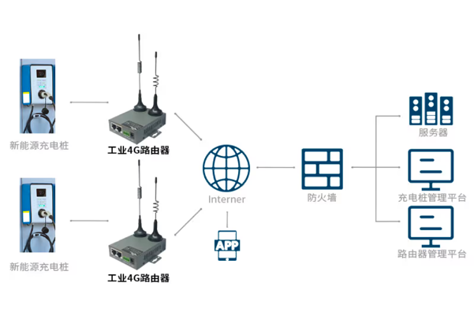
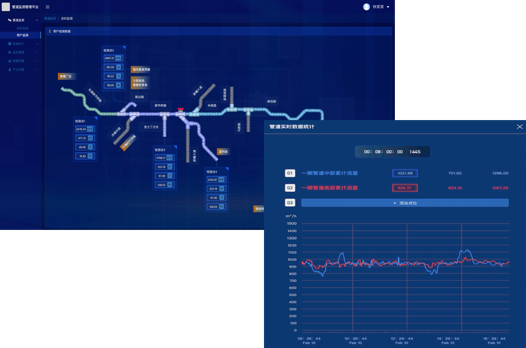

# 智慧城市

某区域，面向全境内的所有企业和个人，提供智慧城市服务。将SagooIOT做为智慧城市的基础设施，为智慧城市提供数据采集、数据存储、数据分析、数据展示等服务。

## 业务场景

### **【案例】某充电桩物联管理平台**

本案例为某地智慧城市充电桩集中物联设备管理平台。在该案例中核心物联网管理采用的是SagooIOT平台系统，对设备进行统一管理，包括充电服务支持。
通过4G网络的数据采集传输和远程监控管理，管理中心可以实时掌握充电桩的运行情况，及时处理故障和异常情况，优化充电桩的运营策略，提高用户的使用体验和经济效益。

### **【案例】某无人售货机物联管理平台**

本案例为某地智慧城市无人售货机集中物联设备管理平台。在该案例中核心物联网管理采用的是SagooIOT平台系统，对设备进行统一管理，包括设备状态监控、设备端购物功能支持，与业务系统联动进行售卖流程支持等。
通过云网关的方式进行全市无人售货机的接入支持。
通过北向接口与售卖业务系统进行联动，对设备进行统一控制与监测。

### **【案例】某区域管道监控平台**

本案例为某地智慧城市区域管道监控平台。在该案例中核心物联网管理采用的是SagooIoT平台系统，对管道设备进行统一管理，包括实时采集监测点数据，阀门状态追溯，设备远程控制，集中监控，历史数据追溯，生产过程实时报警，组态实时数据，数据监测告警等功能。

