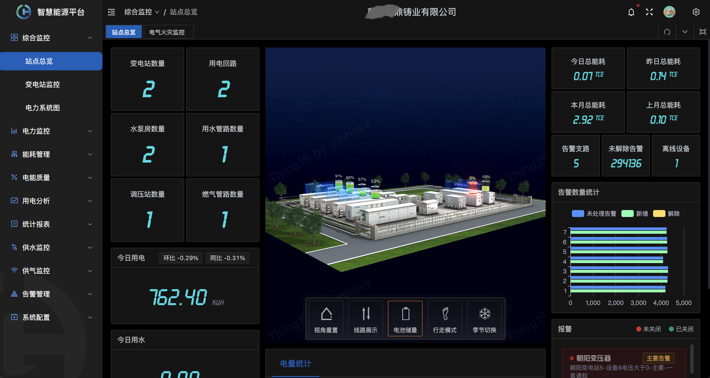
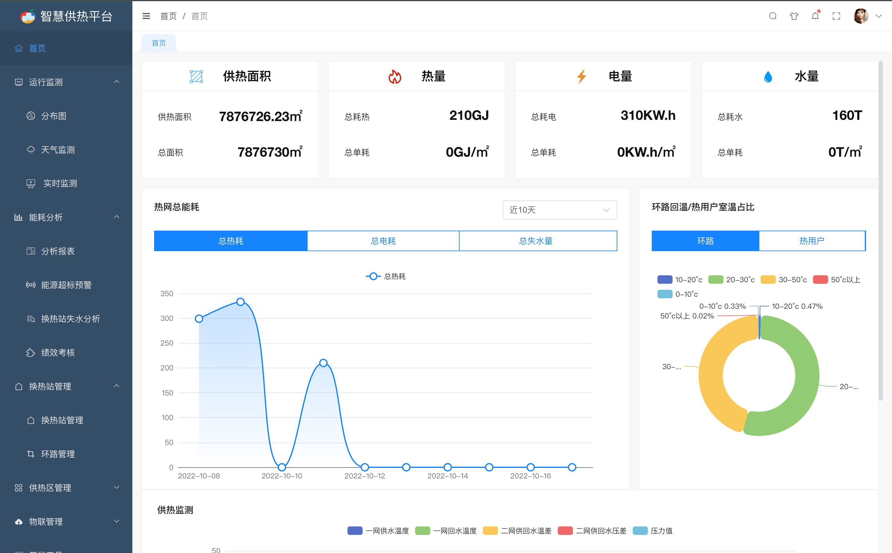

# 项目案例

### 智慧电力运维及运营平台

这个例案是一个云运营类平台，支持多租户使用及管理。平台提供多端入口。

提供统一运营管理，多租户使用，支持实时数据查看，能源分析，报表等。

电气安全实时监控：实时在线监测电气设备电流、电压、漏电、温度及开关状态等信息，发现异常及时告警，有效保障设备的安全可靠运行。。

能效管理：按照电力设备对象分周期（日/周/月/年）统计电能数据及最大需量发生值，并进行同环比分析；按尖、峰、平、谷统计各配电回路的用电量；按小时、天、月自动生成电能集抄报表。

1. 运营管理端系统
2. 企业租租户端系统
3. 物联管理系统

[更多信息...](./power.md)

### 智慧供热

该案例是一个面向区域供热公司进行供热分析管理的平台。通过对换热站及环路管线的监控管理，达到智慧管控的目的。

### 智慧园区

该案例是一个面向工业园区的物联网平台，通过平台建立统一的应急管理与日常管理、对内与对外服务的管理体系，满足“安全、高效、绿色”的现代产业园区建设规划要求
安全监管统一规范，生产数据体系化分析，实现环保平台、智慧化工综合管理平台等数据的接入，实现园区产业
数据互联管理数字化。

### 智慧城市
该案例是某地进行智慧城市建设中采用SagooIOT做为基础服务平台，为智慧城市提供数据采集、数据存储、数据分析、数据展示等服务。
