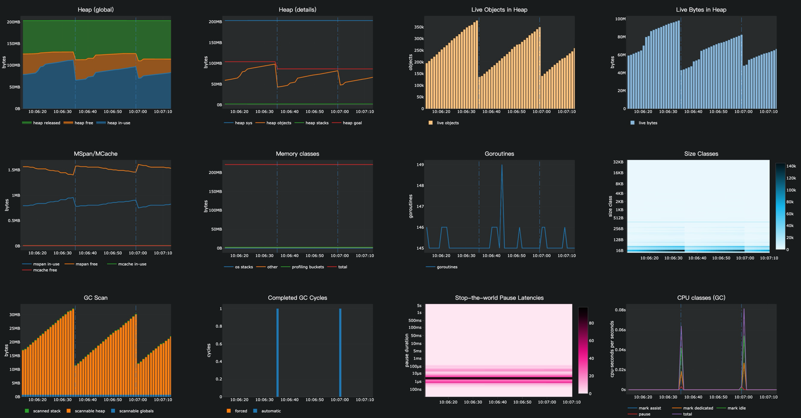

# 性能分析

SagooIOT 提供了非常强大和简便的服务性能分析功能，内部完美集成了pprof性能分析工具。
要进行服务性能分析需要在配置文件中开启性能分析开关。

## 开启pprof

```yaml
# 系统配置
system:
    enablePProf: true # 是否开启pprof
    pprofPort:  "58088" # pprof端口

```

有两种方式开启性能分析：

## 性能采集分析

在开启性能分析支持后，我们可以使用`go tool pprof`命令行工具进行分析：

```shell
  go tool pprof http://127.0.0.1:8000/debug/pprof/profile

```
执行后pprof工具经过约30秒左右的接口信息采集（这30秒期间WebServer应当有流量进入，我们这里不停地访问hello world页面以作测试），然后生成性能分析报告，随后可以通过top10/web等pprof命令查看报告结果，更多命令可使用go tool pprof查看。关于pprof的详细使用介绍，请查看Golang官方：[blog.golang.org/profiling-go-programs](https://blog.golang.org/profiling-go-programs)

示例：

* CPU性能分析: `go tool pprof http://127.0.0.1:8000/debug/pprof/profile`
* 内存性能分析: `go tool pprof  http://127.0.0.1:8000/debug/pprof/heap`
* 协程性能分析: `go tool pprof  http://127.0.0.1:8000/debug/pprof/goroutine`

执行后可以使用 web、top等命令查看分析的内容


**基于WEB查看分析数据**
```shell
go tool pprof -http=:1212  http://127.0.0.1:8199/debug/pprof/heap
```

选项说明：

| Profile项    | 说明         | 详情                                                         |
| ------------ | ------------ | ------------------------------------------------------------ |
| allocs       | **内存分配** | 从程序启动开始，分配的全部内存                               |
| block        | **阻塞分析** | 导致同步原语阻塞的堆栈跟踪                                   |
| cmdline      | 命令行调用   | 当前程序的命令行调用                                         |
| oroutine     | gorouting    | 所有当前 goroutine 的堆栈跟踪                                |
| heap         | 堆           | 活动对象的内存分配抽样。您可以指定 gc 参数以在获取堆样本之前运行 GC |
| mutex        | **互斥锁**   | 争用互斥锁持有者的堆栈跟踪                                   |
| profile      | **CPU分析**  | CPU 使用率分析。可以在url中，通过seconds指定持续时间（默认30s）。获取配置文件后，使用 go tool pprof 命令分析CPU使用情况 |
| threadcreate | 线程创建     | 导致创建新操作系统线程的堆栈跟踪                             |
| trace        | 追踪         | 当前程序的执行轨迹。可以在url中，通过seconds指定持续时间（默认30s）。获取跟踪文件后，使用 go tool trace 命令调查跟踪 |

在性能分析时，使用最多有三种：内存分析(allocs,heap),CPU分析(profile), 阻塞分析(block), 互斥锁分析(mutex)。


## 性能实时监控

SagooIot提供了一个非常方便的性能实时监控工具，可以在浏览器中实时查看服务的性能信息，包括堆、对象、goroutines、GC暂停、调度器等，非常方便。默认端口为：`58089`，可以在配置文件中修改。

访问地址是： `http://localhost:58089/debug/statsviz/`

域名或是IP以实际运行的环境为准。



## Expvar开放性能参数查看

访问地址是： `http://localhost:8000/debug/vars/` 端口为http服务的端口
