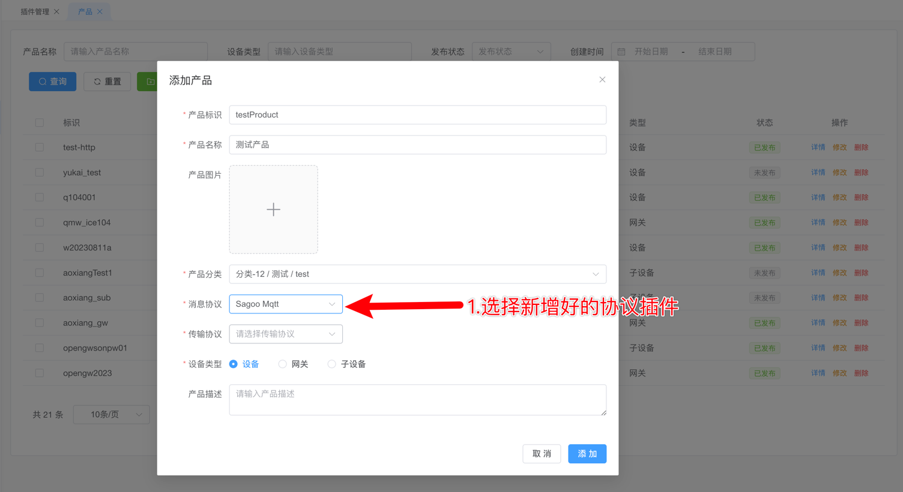

# Sagoo Mqtt协议 

本系统默认的协议是`Sagoo Mqtt协议`,如果设备或者网关消息不满足`Sagoo Mqtt协议`格式要求，可以有以下两种方式处理

1. 按照[插件开发](/develop/plugin/hashicorp)开发好合适的插件，并在`系统管理`->`插件管理` 点击 
   `上传插件ZIP`上传开发好的插件，然后在`物联管理`->`设备管理`->`产品` 新建产品的时候选择对应的消息协议
    
    
2. 开发相应的网关，转换私有协议的消息为标准`Sagoo Mqtt协议`的消息按照[MQTT 设备接入](/guide/device_access/mqtt.md)进行接入


## 协议介绍

`Sagoo Mqtt协议` 默认的mqtt传输的消息协议，也是系统内部其他网络服务使用的默认协议，消息为json格式保存。消息的消息协议如下

| 方法          | 子项目 | topic                                                                           |
|:------------|:----|:--------------------------------------------------------------------------------|
| 设备上报属性      | 请求  | `/sys/${productKey}/${deviceKey}/thing/event/property/post`                     |
|             | 响应  | `/sys/${productKey}/${deviceKey}/thing/event/property/post_reply`               |
| 设备上报事件      | 请求  | `/sys/${productKey}/${deviceKey}/thing/event/${eventIdentifier}/post`           |
|             | 响应  | `/sys/${productKey}/${deviceKey}/thing/event/${eventIdentifier}/post_reply`     |
| 服务调用        | 请求  | `/sys/${productKey}/${deviceKey}/thing/service/${tsl.service.identifier}`       |
|             | 响应  | `/sys/${productKey}/${deviceKey}/thing/service/${tsl.service.identifier}_reply` |
| 网关批量上传事件和属性 | 请求  | `/sys/${productKey}/${deviceKey}/thing/event/property/pack/post`                |
|             | 响应  | `/sys/${productKey}/${deviceKey}/thing/event/property/pack/post`                |

## 设备上报属性

### 请求

1. 请求Topic：`/sys/${productKey}/${deviceKey}/thing/event/property/post`
2. 请求数据格式：
```json
{
    "id": "123",
    "version": "1.0",
    "sys":{
        "ack":0
    },
    "params": {
        "Power": {
            "value": "on",
            "time": 1524448722000
        },
        "WF": {
            "value": 23.6,
            "time": 1524448722000
        }
    },
    "method": "thing.event.property.post"
}
```

字段说明

1. id：消息ID，用于唯一标识一条消息，由设备端生成，必须保证唯一性。
2. version：消息版本号，目前版本为1.0。
3. sys：系统级参数，目前仅支持ack，ack=0表示不需要应答，ack=1表示需要应答。
4. params：消息体，消息体中包含了设备上报的属性值，属性值的格式为JSON格式。
5. method：消息类型，目前仅支持thing.event.property.post。
6. Power：属性名称，必须与物模型中定义的属性名称一致。
7. value：属性值，必须与物模型中定义的属性类型一致。
8. time：属性值的时间戳，单位为秒，可选，如果不携带该字段，则默认为消息发送时间。

### 应答

1. 应答Topic：`/sys/${productKey}/${deviceKey}/thing/event/property/post_reply`
2. 应答数据格式：

```json
{
  "code": 200,
  "data": {},
  "id": "123",
  "message": "success",
  "method": "thing.event.property.post",
  "version": "1.0"
}
```

字段说明
1. code：应答码，200表示成功，其他表示失败。
2. data：应答数据，目前为空。
3. id：消息ID，与请求中的消息ID一致。
4. message：应答消息，目前为空。
5. method：消息类型，目前仅支持thing.event.property.post。
6. version：消息版本号，目前版本为1.0

## 设备上报事件

### 请求

1. 请求Topic：`/sys/${productKey}/${deviceKey}/thing/event/${eventIdentifier}/post`
2. 请求数据格式：

```json
{
  "id": "123",
  "version": "1.0",
  "sys":{
    "ack":0
  },
  "params": {
    "value": {
      "Power": "on",
      "WF": "2"
    },
    "time": 1524448722000
  },
  "method": "thing.event.${tsl.event.identifier}.post"
}
```

字段说明

1. id：消息ID，用于唯一标识一条消息，由设备端生成，必须保证唯一性。
2. version：消息版本号，目前版本为1.0。
3. sys：系统级参数，目前仅支持ack，ack=0表示不需要应答，ack=1表示需要应答。
4. params：消息体，消息体中包含了设备上报的事件值，事件值的格式为JSON格式。
5. method：消息类型，目前仅支持thing.event.${tsl.event.identifier}.post。
6. value：事件值，必须与物模型中定义的事件类型一致。
7. time：事件值的时间戳，单位为秒，可选，如果不携带该字段，则默认为消息发送时间。

### 应答

1. 应答Topic：`/sys/${productKey}/${deviceKey}/thing/event/${eventIdentifier}/post_reply`
2. 请求数据格式：

```json
{
  "code": 200,
  "data": {},
  "id": "123",
  "message": "success",
  "method": "thing.event.${tsl.event.identifier}.post",
  "version": "1.0"
}
```

字段说明

1. code：应答码，200表示成功，其他表示失败。
2. data：应答数据，目前为空。
3. id：消息ID，与请求中的消息ID一致。
4. message：应答消息，目前为空。
5. method：消息类型，目前仅支持thing.event.${tsl.event.identifier}.post。
6. version：消息版本号，目前版本为1.0

## 服务调用

### 请求

1. 请求Topic：/sys/${productKey}/${deviceKey}/thing/service/${tsl.service.identifier}`
2. 请求数据格式：

```json
{
  "id": "123",
  "version": "1.0",
  "params": {
    "Power": "on",
    "WF": "2"
  },
  "method": "thing.service.${tsl.service.identifier}"
}
```

参数说明
1. id：消息ID，用于唯一标识一条消息，由设备端生成，必须保证唯一性。
2. version：消息版本号，目前版本为1.0。
3. params：消息体，消息体中包含了设备上报的事件值，事件值的格式为JSON格式。
4. method：消息类型，目前仅支持thing.service.${tsl.service.identifier}。

### 应答

1. 应答Topic：`/sys/${productKey}/${deviceKey}/thing/service/${tsl.service.identifier}_reply`
2. 应答数据格式：

```json
{
  "code": 200,
  "data": {},
  "id": "123",
  "message": "success",
  "version": "1.0"
}
```

字段说明
1. code：应答码，200表示成功，其他表示失败。
2. data：应答数据，目前为空。
3. id：消息ID，与请求中的消息ID一致。
4. message：应答消息，目前为空。
5. version：消息版本号，目前版本为1.0

## 网关批量上传事件和属性

### 请求

1. 请求Topic：`/sys/${productKey}/${deviceKey}/thing/event/property/pack/post`
2. 请求数据格式：

```json
{
  "id": "123",
  "version": "1.0",
  "sys":{
    "ack":0
  },
  "params": {
    "properties": {
      "Power": {
        "value": "on",
        "time": 1524448722000
      }
    },
    "events": {
      "alarmEvent1": {
        "value": {
          "param1": "on",
          "param2": "2"
        },
        "time": 1524448722000
      },
      "alertEvent2": {
        "value": {
          "param1": "on",
          "param2": "2"
        },
        "time": 1524448722000
      }
    },
    "subDevices": [
      {
        "identity": {
          "productKey": "",
          "deviceKey": ""
        },
        "properties": {
          "Power": {
            "value": "on",
            "time": 1524448722000
          },
          "WF": {
            "value": { },
            "time": 1524448722000
          }
        },
        "events": {
          "alarmEvent1": {
            "value": {
              "param1": "on",
              "param2": "2"
            },
            "time": 1524448722000
          },
          "alertEvent2": {
            "value": {
              "param1": "on",
              "param2": "2"
            },
            "time": 1524448722000
          }
        }
      }
    ]
  },
  "method": "thing.event.property.pack.post"
}
```

字段说明
1. id：消息ID，用于唯一标识一条消息，由设备端生成，必须保证唯一性。
2. version：消息版本号，目前版本为1.0。
3. sys：系统级参数，目前仅支持ack，ack=0表示不需要应答，ack=1表示需要应答。
4. params：消息体，消息体中包含了设备上报的事件值，事件值的格式为JSON格式。
5. method：消息类型，目前仅支持thing.event.property.pack.post。
6. properties：设备属性值，必须与物模型中定义的属性类型一致。
7. events：设备事件值，必须与物模型中定义的事件类型一致。
8. subDevices：子设备属性值和事件值，必须与物模型中定义的属性类型和事件类型一致。
9. identity：子设备标识，必须与物模型中定义的子设备标识一致。
10. value：属性值或事件值，必须与物模型中定义的属性类型或事件类型一致。
11. time：属性值或事件值的时间戳，单位为秒，可选，如果不携带该字段，则默认为消息发送时间。

### 响应

1. 响应Topic：`/sys/${productKey}/${deviceKey}/thing/event/property/pack/post`
2. 响应数据格式：

```json
{
  "code": 200,
  "data": {},
  "id": "123",
  "message": "success",
  "method": "thing.event.property.pack.post",
  "version": "1.0"
}
```

字段说明
1. code：应答码，200表示成功，其他表示失败。
2. data：应答数据，目前为空。
3. id：消息ID，与请求中的消息ID一致。
4. message：应答消息，目前为空。
5. method：消息类型，目前仅支持thing.event.property.pack.post。
6. version：消息版本号，目前版本为1.0


