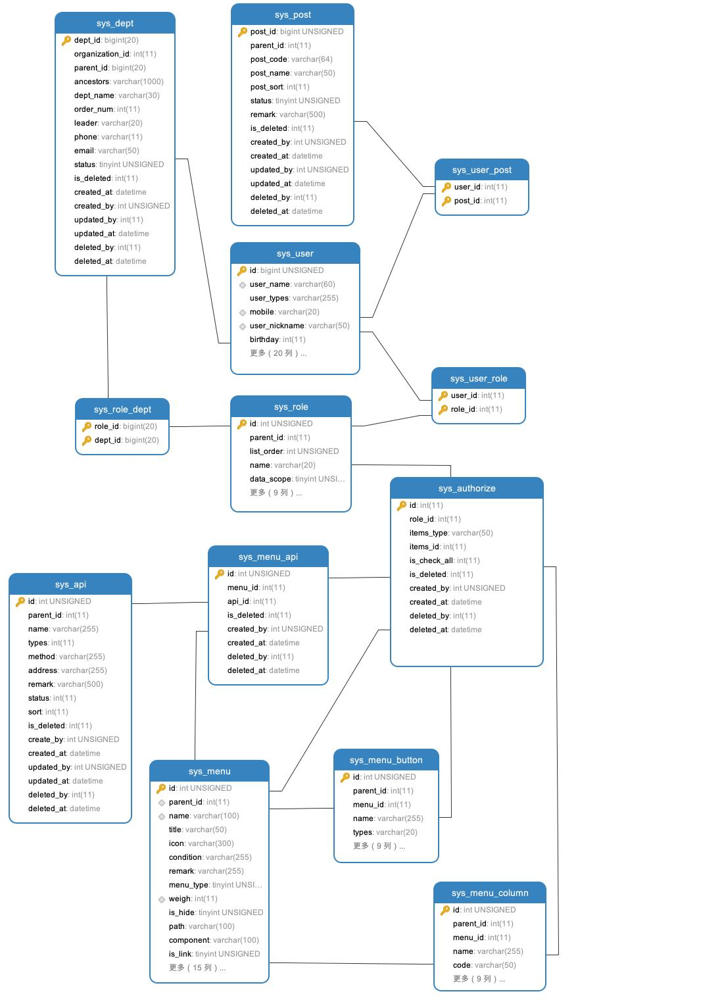
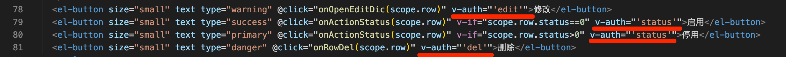

# 权限开发

## 后端
### 权限结构表物理模型关系图



### 数据库设计

1. 系统菜单

```
 CREATE TABLE `sys_menu` (
  `id` int(10) unsigned NOT NULL AUTO_INCREMENT,
  `parent_id` int(11) NOT NULL DEFAULT '0' COMMENT '父ID',
  `name` varchar(100) NOT NULL DEFAULT '' COMMENT '规则名称',
  `title` varchar(50) NOT NULL DEFAULT '' COMMENT '菜单名称',
  `icon` varchar(300) NOT NULL DEFAULT '' COMMENT '图标',
  `condition` varchar(255) NOT NULL DEFAULT '' COMMENT '条件',
  `remark` varchar(255) NOT NULL DEFAULT '' COMMENT '备注',
  `menu_type` tinyint(3) unsigned NOT NULL DEFAULT '0' COMMENT '类型 0目录 1菜单 2按钮',
  `weigh` int(11) NOT NULL DEFAULT '0' COMMENT '权重',
  `is_hide` tinyint(3) unsigned NOT NULL DEFAULT '0' COMMENT '显示状态',
  `path` varchar(100) NOT NULL DEFAULT '' COMMENT '路由地址',
  `component` varchar(100) NOT NULL DEFAULT '' COMMENT '组件路径',
  `is_link` tinyint(3) unsigned NOT NULL DEFAULT '0' COMMENT '是否外链 1是 0否',
  `module_type` varchar(30) NOT NULL DEFAULT '' COMMENT '所属模块 system 运维 company企业',
  `model_id` int(10) unsigned NOT NULL DEFAULT '0' COMMENT '模型ID',
  `is_iframe` tinyint(3) unsigned NOT NULL DEFAULT '0' COMMENT '是否内嵌iframe',
  `is_cached` tinyint(3) unsigned NOT NULL DEFAULT '0' COMMENT '是否缓存',
  `redirect` varchar(255) NOT NULL DEFAULT '' COMMENT '路由重定向地址',
  `is_affix` tinyint(3) unsigned NOT NULL DEFAULT '0' COMMENT '是否固定',
  `link_url` varchar(500) NOT NULL DEFAULT '' COMMENT '链接地址',
  `status` int(11) NOT NULL COMMENT '状态 0 停用 1启用',
  `is_deleted` int(11) NOT NULL COMMENT '是否删除 0未删除 1已删除',
  `created_by` int(10) unsigned DEFAULT '0' COMMENT '创建人',
  `created_at` datetime DEFAULT NULL COMMENT '创建时间',
  `updated_by` int(11) DEFAULT NULL COMMENT '修改人',
  `updated_at` datetime DEFAULT NULL COMMENT '更新时间',
  `deleted_by` int(11) DEFAULT NULL COMMENT '删除人',
  `deleted_at` datetime DEFAULT NULL COMMENT '删除时间',
  PRIMARY KEY (`id`) USING BTREE,
  UNIQUE KEY `name` (`name`) USING BTREE,
  KEY `pid` (`parent_id`) USING BTREE,
  KEY `weigh` (`weigh`) USING BTREE
) ENGINE=InnoDB AUTO_INCREMENT=119 DEFAULT CHARSET=utf8mb4 ROW_FORMAT=DYNAMIC COMMENT='菜单节点表';

```

2. 菜单与按钮关系表
```
CREATE TABLE `sys_menu_button` (
  `id` int(11) unsigned NOT NULL AUTO_INCREMENT,
  `parent_id` int(11) NOT NULL COMMENT '父ID',
  `menu_id` int(11) NOT NULL COMMENT '菜单ID',
  `name` varchar(255) NOT NULL COMMENT '名称',
  `types` varchar(20) NOT NULL COMMENT '类型 自定义 add添加 edit编辑 del 删除',
  `description` varchar(255) DEFAULT NULL COMMENT '描述',
  `status` int(11) NOT NULL COMMENT '状态 0 停用 1启用',
  `is_deleted` int(11) NOT NULL COMMENT '是否删除 0未删除 1已删除',
  `created_by` int(10) unsigned DEFAULT '0' COMMENT '创建人',
  `created_at` datetime DEFAULT NULL COMMENT '创建时间',
  `updated_by` int(11) DEFAULT NULL COMMENT '修改人',
  `updated_at` datetime DEFAULT NULL COMMENT '更新时间',
  `deleted_by` int(11) DEFAULT NULL COMMENT '删除人',
  `deleted_at` datetime DEFAULT NULL COMMENT '删除时间',
  PRIMARY KEY (`id`) USING BTREE
) ENGINE=InnoDB AUTO_INCREMENT=162 DEFAULT CHARSET=utf8mb4 ROW_FORMAT=DYNAMIC COMMENT='菜单与按钮关系表';
```

3. 菜单与列表关系表
```
CREATE TABLE `sys_menu_column` (
  `id` int(11) unsigned NOT NULL AUTO_INCREMENT,
  `parent_id` int(11) NOT NULL COMMENT '父ID',
  `menu_id` int(11) NOT NULL COMMENT '菜单ID',
  `name` varchar(255) NOT NULL COMMENT '名称',
  `code` varchar(50) NOT NULL COMMENT '代表字段',
  `description` varchar(255) DEFAULT NULL COMMENT '描述',
  `status` int(11) NOT NULL COMMENT '状态 0 停用 1启用',
  `is_deleted` int(11) NOT NULL COMMENT '是否删除 0未删除 1已删除',
  `created_by` int(10) unsigned DEFAULT '0' COMMENT '创建人',
  `created_at` datetime DEFAULT NULL COMMENT '创建时间',
  `updated_by` int(11) DEFAULT NULL COMMENT '修改人',
  `updated_at` datetime DEFAULT NULL COMMENT '更新时间',
  `deleted_by` int(11) DEFAULT NULL COMMENT '删除人',
  `deleted_at` datetime DEFAULT NULL COMMENT '删除时间',
  PRIMARY KEY (`id`) USING BTREE
) ENGINE=InnoDB AUTO_INCREMENT=243 DEFAULT CHARSET=utf8mb4 ROW_FORMAT=DYNAMIC COMMENT='菜单列表字段';
```

4. 接口管理表

```
CREATE TABLE `sys_api` (
  `id` int(11) unsigned NOT NULL AUTO_INCREMENT,
  `parent_id` int(11) NOT NULL,
  `name` varchar(255) NOT NULL COMMENT '名称',
  `types` int(11) NOT NULL COMMENT '1 分类 2接口',
  `method` varchar(255) DEFAULT NULL COMMENT '请求方式(数据字典维护)',
  `address` varchar(255) DEFAULT NULL COMMENT '接口地址',
  `remark` varchar(500) DEFAULT NULL COMMENT '备注',
  `status` int(11) NOT NULL COMMENT '状态 0 停用 1启用',
  `sort` int(11) DEFAULT NULL COMMENT '排序',
  `is_deleted` int(11) NOT NULL COMMENT '是否删除 0未删除 1已删除',
  `create_by` int(10) unsigned DEFAULT '0' COMMENT '创建者',
  `created_at` datetime DEFAULT NULL COMMENT '创建时间',
  `updated_by` int(10) unsigned DEFAULT '0' COMMENT '更新者',
  `updated_at` datetime DEFAULT NULL COMMENT '修改时间',
  `deleted_by` int(11) DEFAULT NULL COMMENT '删除人',
  `deleted_at` datetime DEFAULT NULL COMMENT '删除时间',
  PRIMARY KEY (`id`) USING BTREE
) ENGINE=InnoDB AUTO_INCREMENT=311 DEFAULT CHARSET=utf8mb4 ROW_FORMAT=DYNAMIC COMMENT='API 接口管理表';
```

5. 菜单与接口关系表

```
CREATE TABLE `sys_menu_api` (
  `id` int(11) unsigned NOT NULL AUTO_INCREMENT COMMENT 'id',
  `menu_id` int(11) NOT NULL COMMENT '菜单ID',
  `api_id` int(11) NOT NULL COMMENT 'apiId',
  `is_deleted` int(11) NOT NULL COMMENT '是否删除 0未删除 1已删除',
  `created_by` int(10) unsigned DEFAULT '0' COMMENT '创建人',
  `created_at` datetime DEFAULT NULL COMMENT '创建时间',
  `deleted_by` int(11) DEFAULT NULL COMMENT '删除人',
  `deleted_at` datetime DEFAULT NULL COMMENT '删除时间',
  PRIMARY KEY (`id`) USING BTREE
) ENGINE=InnoDB AUTO_INCREMENT=386 DEFAULT CHARSET=utf8mb4 ROW_FORMAT=DYNAMIC COMMENT='菜单与接口关系表';
```
6. 角色与菜单、按钮、列表、接口权限配置管理表

```
CREATE TABLE `sys_authorize` (
  `id` int(11) NOT NULL AUTO_INCREMENT,
  `role_id` int(11) NOT NULL COMMENT '角色ID',
  `items_type` varchar(50) NOT NULL COMMENT '项目类型 menu菜单 button按钮 column列表字段 api接口',
  `items_id` int(11) NOT NULL COMMENT '项目ID',
  `is_check_all` int(11) NOT NULL COMMENT '是否全选 1是 0否',
  `is_deleted` int(11) NOT NULL COMMENT '是否删除 0未删除 1已删除',
  `created_by` int(10) unsigned DEFAULT '0' COMMENT '创建人',
  `created_at` datetime DEFAULT NULL COMMENT '创建时间',
  `deleted_by` int(11) DEFAULT NULL COMMENT '删除人',
  `deleted_at` datetime DEFAULT NULL COMMENT '删除时间',
  PRIMARY KEY (`id`) USING BTREE
) ENGINE=InnoDB AUTO_INCREMENT=6185 DEFAULT CHARSET=utf8mb4 ROW_FORMAT=DYNAMIC COMMENT='角色与菜单、按钮、列表权限关系';
```

## 后端

1. logic目录下middleware中Auth鉴权进行接口访问权限开发

```
func (s *sMiddleware) Auth(r *ghttp.Request) {
	userId := service.Context().GetUserId(r.Context())
	if userId == 0 {
		response.JsonRedirectExit(r, consts.ErrorNotLogged, "未登录或会话已过期，请您登录后再继续", s.LoginUrl)
		return
	} else {
		//查询系统参数
		sysConfigInfo, err := service.ConfigData().GetConfigByKey(r.Context(), consts.IsOpenAccessControl)
		if err != nil {
			return
		}
		if sysConfigInfo != nil {
			if strings.EqualFold(sysConfigInfo.ConfigValue, "1") {
				//判断用户是否有访问权限
				url := r.Request.URL.Path
				if !strings.EqualFold(url, "/api/v1/system/user/currentUser") {
					//获取用户角色信息
					userRoleInfo, err := service.SysUserRole().GetInfoByUserId(r.Context(), userId)
					if err != nil {
						response.JsonRedirectExit(r, consts.ErrorInvalidRole, "获取用户角色失败", "")
						return
					}
					if userRoleInfo != nil {
						var roleIds []int
						//判断是否为超级管理员
						var isSuperAdmin = false
						for _, userRole := range userRoleInfo {
							//获取角色ID
							if userRole.RoleId == 1 {
								isSuperAdmin = true
							}
							roleIds = append(roleIds, userRole.RoleId)
						}
						if !isSuperAdmin {
							//获取角色ID下所有的请求API
							authorizeInfo, authorizeErr := service.SysAuthorize().GetInfoByRoleIdsAndItemsType(r.Context(), roleIds, consts.Api)
							if authorizeErr != nil {
								response.JsonRedirectExit(r, consts.ErrorInvalidData, "获取用户权限失败", "")
								return
							}
							if authorizeInfo != nil {
								//判断是否与当前访问接口一致
								var menuApiIds []int
								for _, authorize := range authorizeInfo {
									menuApiIds = append(menuApiIds, authorize.ItemsId)
								}
								//获取所有的接口API
								menuApiInfo, menuApiErr := service.SysMenuApi().GetInfoByIds(r.Context(), menuApiIds)
								if menuApiErr != nil {
									response.JsonRedirectExit(r, consts.ErrorInvalidData, "相关接口未配置", "")
									return
								}
								if menuApiInfo != nil {
									var apiIds []int
									for _, menuApi := range menuApiInfo {
										apiIds = append(apiIds, menuApi.ApiId)
									}
									//获取所有的接口
									apiInfo, apiErr := service.SysApi().GetInfoByIds(r.Context(), apiIds)
									if apiErr != nil {
										response.JsonRedirectExit(r, consts.ErrorInvalidData, "获取接口失败", "")
										return
									}
									if apiInfo != nil {
										var isExist = false
										//获取请求路径
										for _, api := range apiInfo {
											if strings.EqualFold(url, api.Address) {
												isExist = true
												break
											}
										}
										if !isExist {
											response.JsonRedirectExit(r, consts.ErrorAccessDenied, "无权限访问", "")
											return
										}
									} else {
										response.JsonRedirectExit(r, consts.ErrorInvalidData, "相关接口未配置", "")
										return
									}

								} else {
									response.JsonRedirectExit(r, consts.ErrorAccessDenied, "接口未绑定菜单,请联系管理员!", "")
									return
								}

							} else {
								response.JsonRedirectExit(r, consts.ErrorAccessDenied, "未授权接口,无访问权限!", "")
								return
							}
						}
					} else {
						response.JsonRedirectExit(r, consts.ErrorInvalidRole, "用户未配置角色信息,请联系管理员", "")
						return
					}
				}
			}
		}

	}
	r.Middleware.Next()
}
```

2. 数据权限
   logic/system/sys_authorize_utils.go中查找GetDataWhere()方法，在业务端调用次方法可以进行数据权限设置
   在登录日志调用数据权限示例:


## 前端

### 1.  按钮权限使用说明

1. 先在菜单管理页面增加按钮权限，为按钮权限起名，如【新增: add】
2. 在需要控制的按钮上增加 v-auth="'add'" ，如果用户有这个按钮权限这个按钮就可以正常使用，否则按钮不可点击。




### 2. 列表权限使用说明

1. 先在菜单管理页面增加列表权限，为列表权限起名，如【操作: handle】。
2. 在需要控制的 el-table-column 上增加 v-col="'handle'" ，如果用户有这个列表权限这一列就可以正常显示，否则该列在图表中不显示。


