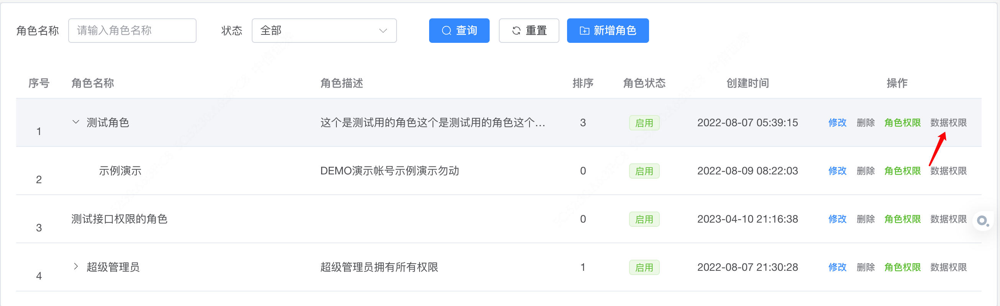

# 数据权限开发

## 概述

数据权限是指根据不同的用户角色或部门，对数据的查看、修改、删除等操作进行授权控制。数据权限的设计和实现，可以有效保护数据安全，并确保数据的合理使用。


## 数据权限的实现

* **应用程序级别**：通过应用程序的拦截器或过滤器来实现数据权限。在应用程序中，根据用户的身份和部门来判断是否有权限访问数据。

## 数据权限的开发步骤

* 在设计的数据表中增加dept_id等字段信息
* 在列表查询的logic实现中，增加调用以下方法获取对应的where对数据进行筛选

```go
    //根据数据权限过滤数据
    m, _ = service.SysAuthorize().FilterDataByPermissions(ctx, m)
```

## 数据权限的注意事项

* **数据库**：数据库对应的表结构，必须增加dept_id字段信息

## 示例

本示例采用的是根据用户的身份和部门来判断是否有权限访问数据

* 在角色管理列表对角色进行配置数据权限




``` go
  // UserList 用户列表
  func (s *sSysUser) UserList(ctx context.Context, input *model.UserListDoInput) (total int, out []*model.UserListOut, err error) {
    m := dao.SysUser.Ctx(ctx)
    if input.KeyWords != "" {
      keyWords := "%" + input.KeyWords + "%"
      m = m.Where("user_name like ? or  user_nickname like ?", keyWords, keyWords)
    }
    if input.DeptId != 0 {
      //m = m.Where(dao.SysUser.Columns().DeptId, req.DeptId)
      deptIds, _ := s.getSearchDeptIds(ctx, gconv.Int64(input.DeptId))
      m = m.Where("dept_id in (?)", deptIds)
    }
    if input.UserName != "" {
      m = m.Where(dao.SysUser.Columns().UserName, input.UserName)
    }
    if input.Status != -1 {
      m = m.Where(dao.SysUser.Columns().Status, input.Status)
    }
    if input.Mobile != "" {
      m = m.WhereLike(dao.SysUser.Columns().Mobile, "%"+input.Mobile+"%")
    }
    if len(input.DateRange) > 0 {
      m = m.Where("created_at >=? AND created_at <?", input.DateRange[0], gtime.NewFromStrFormat(input.DateRange[1], "Y-m-d").AddDate(0, 0, 1))
    }
    m = m.Where(dao.SysUser.Columns().IsDeleted, 0)

    //根据数据权限过滤数据
    m, _ = service.SysAuthorize().FilterDataByPermissions(ctx, m)

    //获取总数
    total, err = m.Count()
    if err != nil {
      err = gerror.New("获取数据失败")
      return
    }
    if input.PageNum == 0 {
      input.PageNum = 1
    }
    if input.PageSize == 0 {
      input.PageSize = consts.DefaultPageSize
    }
    //获取用户信息
    err = m.Page(input.PageNum, input.PageSize).OrderDesc(dao.SysUser.Columns().CreatedAt).Scan(&out)
    if err != nil {
      err = gerror.New("获取用户列表失败")
    }

    deptIds := g.Slice{}
    for _, v := range out {
      deptIds = append(deptIds, v.DeptId)
    }
    deptData, _ := GetDeptNameDict(ctx, deptIds)
    for _, v := range out {
      err = gconv.Scan(deptData[v.DeptId], &v.Dept)
      v.RolesNames = getUserRoleName(ctx, gconv.Int(v.Id))
    }
    return
  }
```

```go
  func (s *sSysAuthorize) FilterDataByPermissions(ctx context.Context, model *gdb.Model) (*gdb.Model, error) {
    where, err := service.SysAuthorize().GetDataWhere(ctx)
    if err != nil {
      return model, err
    }
    if where != nil && len(where) > 0 {
      return model.Where(where), err
    }
    return model, err
  }
```

```go
  // GetDataWhere 获取数据权限条件查询
  func (s *sSysAuthorize) GetDataWhere(ctx context.Context) (where g.Map, err error) {
    //判断请求方式
    requestWay := service.Context().GetRequestWay(ctx)
    if strings.EqualFold(requestWay, consts.TokenAuth) {
      loginUserId := service.Context().GetUserId(ctx)
      loginUserDeptId := service.Context().GetUserDeptId(ctx)
      //1、获取当前用户所属角色
      userRoleInfo, userRoleErr := service.SysUserRole().GetInfoByUserId(ctx, loginUserId)
      if userRoleErr != nil {
        err = gerror.New("获取用户角色失败")
        return
      }
      if userRoleInfo == nil {
        err = gerror.New("用户无权限访问")
        return
      }
      //判断用户是否为超级管理员
      var isSuperAdmin = false
      var roleIds []int
      for _, userRole := range userRoleInfo {
        if userRole.RoleId == 1 {
          isSuperAdmin = true
        }
        roleIds = append(roleIds, userRole.RoleId)
      }
      if isSuperAdmin {
        //超级管理员可以访问所有的数据
        return
      }
      //不是超级管理员则获取所有角色信息
      var roleInfo []*entity.SysRole
      err = dao.SysRole.Ctx(ctx).WhereIn(dao.SysRole.Columns().Id, roleIds).Where(g.Map{
        dao.SysRole.Columns().Status:    1,
        dao.SysRole.Columns().IsDeleted: 0,
      }).Scan(&roleInfo)
      if err != nil {
        err = gerror.New("获取用户角色失败")
        return
      }
      //2获取角色对应数据权限
      deptIdArr := gset.New()
      for _, role := range roleInfo {
        switch role.DataScope {
        case 1: //全部数据权限
          return
        case 2: //自定数据权限
          //获取角色所有的部门信息
          roleDeptInfo, _ := service.SysRoleDept().GetInfoByRoleId(ctx, int(role.Id))
          if roleDeptInfo == nil {
            err = gerror.New(role.Name + "自定义数据范围,请先配置部门!")
            return
          }
          var deptIds []int64
          for _, roleDept := range roleDeptInfo {
            deptIds = append(deptIds, roleDept.DeptId)
          }
          deptIdArr.Add(gconv.Interfaces(deptIds)...)
        case 3: //本部门数据权限
          deptIdArr.Add(gconv.Int64(loginUserDeptId))
        case 4: //本部门及以下数据权限
          deptIdArr.Add(gconv.Int64(loginUserDeptId))
          //获取所有部门
          var deptInfo []*entity.SysDept
          m := dao.SysDept.Ctx(ctx)
          _ = m.Where(g.Map{
            dao.SysDept.Columns().Status:    1,
            dao.SysDept.Columns().IsDeleted: 0,
          }).Scan(&deptInfo)

          if deptInfo != nil {
            //获取当前部门所有的下级部门信息
            childrenDeptInfo := GetNextDeptInfoByNowDeptId(int64(loginUserDeptId), deptInfo)
            if childrenDeptInfo != nil {
              allChildrenDeptInfo := GetAllNextDeptInfoByChildrenDept(childrenDeptInfo, deptInfo, childrenDeptInfo)
              if allChildrenDeptInfo != nil {
                for _, allChildrenDept := range allChildrenDeptInfo {
                  deptIdArr.Add(gconv.Int64(allChildrenDept.DeptId))
                }
              }
            }
          }
        case 5: //仅限于自己的数据
          where = g.Map{"created_by": loginUserId}
          return
        }
      }
      //此添加是为了兼容以前的数据
      deptIdArr.Add(0)
      if deptIdArr.Size() > 0 {
        where = g.Map{"dept_id": deptIdArr.Slice()}
      }
    } else if strings.EqualFold(requestWay, consts.AKSK) {
      //判断是父级部门还是子部门
      deptIdArr := gset.New()
      parentDeptId := service.Context().GetUserDeptId(ctx)
      if parentDeptId != 0 {
        deptIdArr.Add(gconv.Int64(parentDeptId))
        //获取所有部门
        var deptInfo []*entity.SysDept
        m := dao.SysDept.Ctx(ctx)
        _ = m.Where(g.Map{
          dao.SysDept.Columns().Status:    1,
          dao.SysDept.Columns().IsDeleted: 0,
        }).Scan(&deptInfo)
        if deptInfo != nil {
          //获取当前部门所有的下级部门信息
          childrenDeptInfo := GetNextDeptInfoByNowDeptId(int64(parentDeptId), deptInfo)
          if childrenDeptInfo != nil {
            allChildrenDeptInfo := GetAllNextDeptInfoByChildrenDept(childrenDeptInfo, deptInfo, childrenDeptInfo)
            if allChildrenDeptInfo != nil {
              for _, allChildrenDept := range allChildrenDeptInfo {
                deptIdArr.Add(gconv.Int64(allChildrenDept.DeptId))
              }
            }
          }
        }
      } else {
        //获取传过来的子部门ID
        childrenDeptIds := service.Context().GetChildrenDeptId(ctx)
        for _, childrenDeptId := range childrenDeptIds {
          deptIdArr.Add(gconv.Int64(childrenDeptId))
        }
      }
      //此添加是为了兼容以前的数据
      deptIdArr.Add(0)
      if deptIdArr.Size() > 0 {
        where = g.Map{"dept_id": deptIdArr.Slice()}
      }
    }

    return
  }
  
```