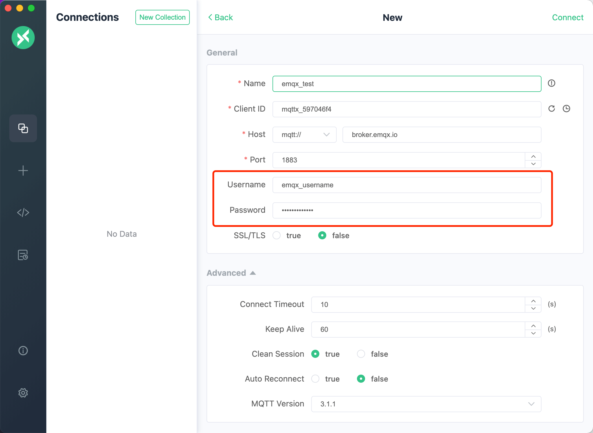
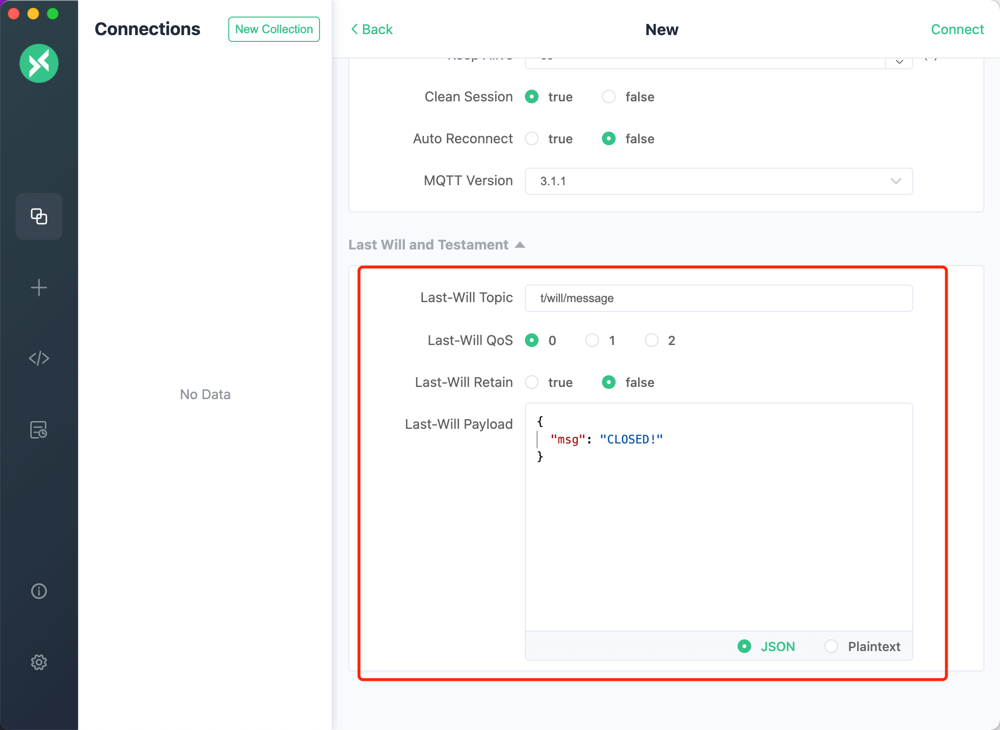

# MQTT 设备接入

通过一个模拟设备的接入，来演示系统接入设备的情况。以MQTTX为例，介绍使用第三方软件以MQTT协议接入SagooIOT物联网平台。

**注：这里采用的是SagooIOT官方标准Json格式数据** [非官方数据格式的处理请见这里](mqtt2.md)

## 下载并安装MQTTX

前往[官网下载](https://mqttx.app/)安装

## 使用MQTTX模拟设备

打开MQTTX软件，点击新建连接创建一个连接，设置连接参数。

 **连接参数说明**

| 参数      | 说明                                                         |
| --------- | ------------------------------------------------------------ |
| Name      | 输入您的自定义名称。                                         |
| Client ID | 设备Id。必须与系统中设备的ID填写一致。                       |
| Host      | 连接域名。本地连接可直接填写 `127.0.0.1`,如为远程连接，请跟据你的mqtt服务安装的连接地址进行设置。 |
| Port      | 请填写mqtt服务的端口。                                       |
| Username  | 填写mqtt接入账号                                             |
| Password  | 填写mqtt接入密码                                             |

## 设备数据上报

设备连接上平台后，就可进行一些事件上报、属性读取等操作。

MQTTX 进行数据上报,详细的消息协议请参考[Sagoo Mqtt协议介绍](/develop/protocol/mqtt.html)

