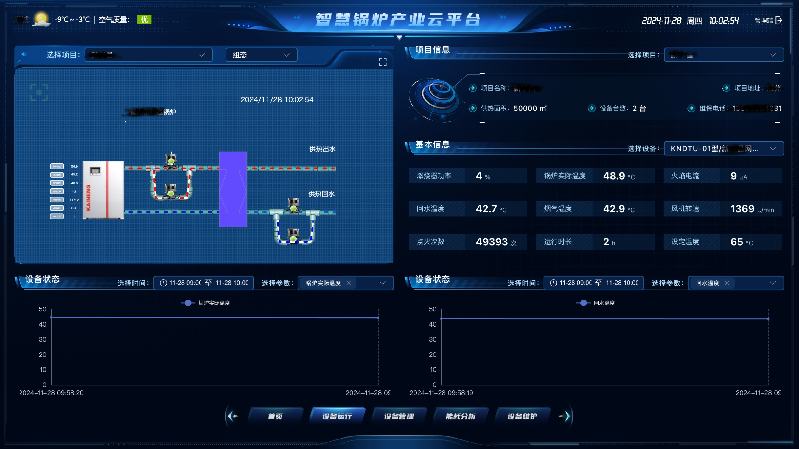

# 智慧锅炉平台

该案例是一个集成了实时监控、数据分析和远程管理的智能系统。该平台旨在提高锅炉运行的效率和安全性，同时降低能耗和维护成本。

项目特点：

* 实时监控： 平台能够实时监控锅炉的运行状态，包括温度、压力、流量等关键参数。
* 数据可视化： 通过图表和图形界面，用户可以直观地看到锅炉的运行数据和历史趋势。
* 智能分析： 利用先进的算法对收集的数据进行分析，预测潜在的故障和优化运行参数。
* 远程控制： 允许用户通过云平台远程控制锅炉的运行，实现远程启停和参数调整。
* 报警系统： 当检测到异常情况时，系统会立即发出警报，提醒操作人员采取相应措施。

