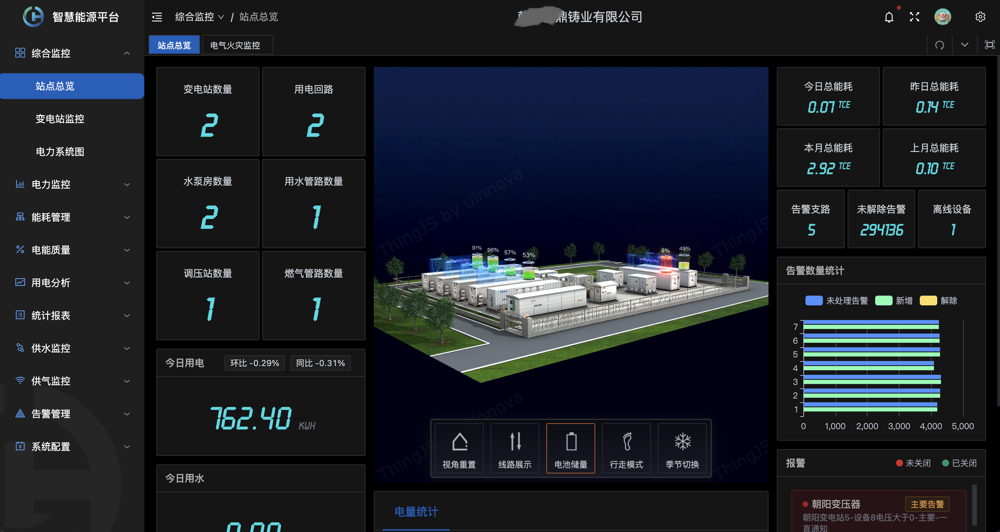
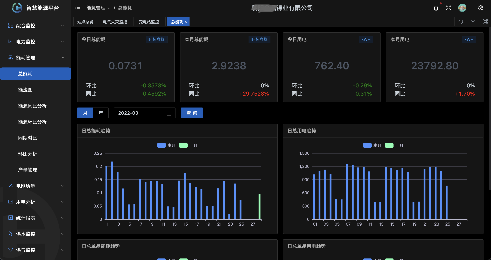
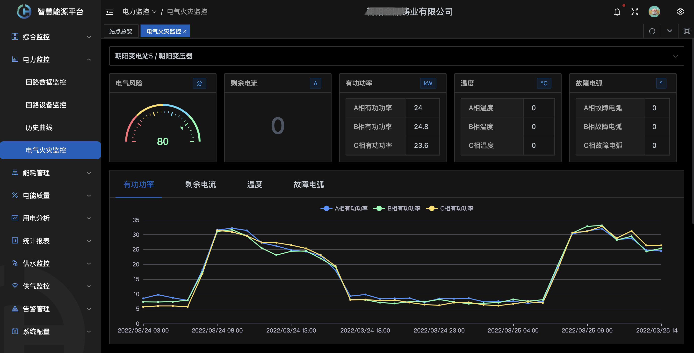
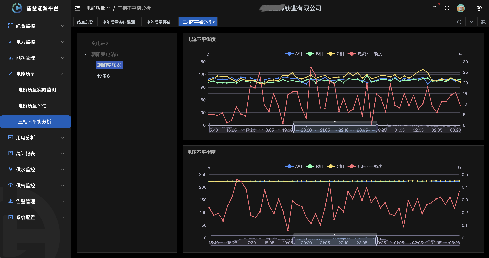

# 智慧电力运维及运营平台

智慧电力运维系统(配电房智能运维)通过安装在电力设备上的多种传感器和现场监测装置，远程在线监测、监视电力设备的运行状态及设备周围的环境状况（如:设备短路、电缆温度过高、进水、非法闯入等），当电力设备出现故障或现场发生异常时，装置能在第一时间自动采集信息，并向上级远方监控管理中心发送监测信息（数据、语音、视频等）和报警信息，运维人员无需亲临现场即可及时了解设备运行状态，直接对现场进行监听、监视，将事故消灭在萌芽状态。

