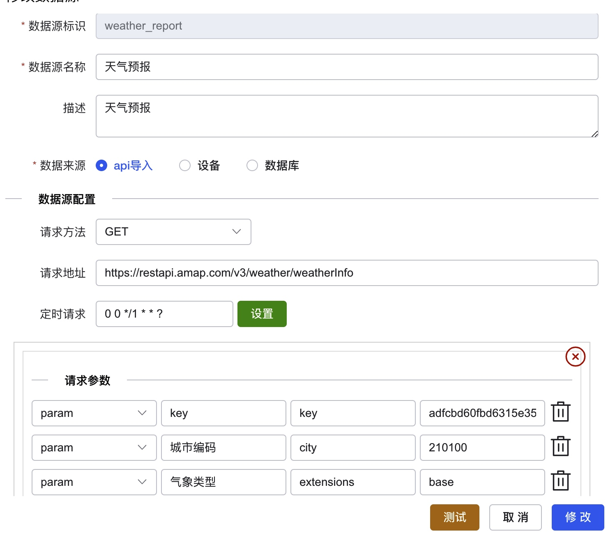
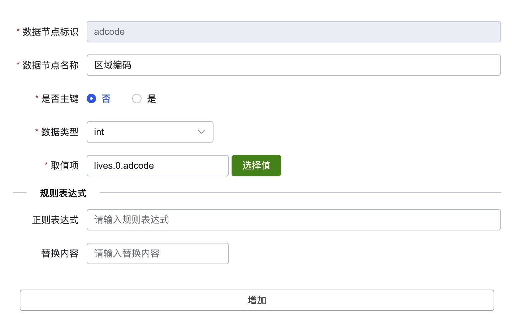
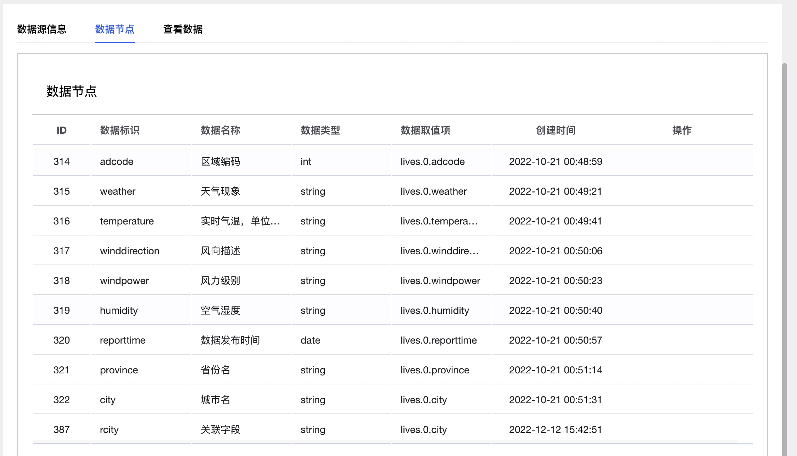
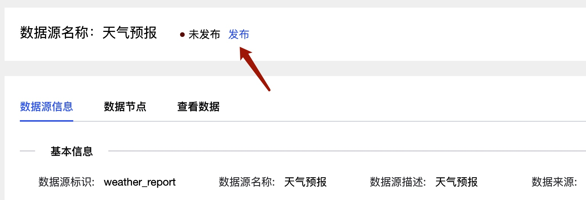
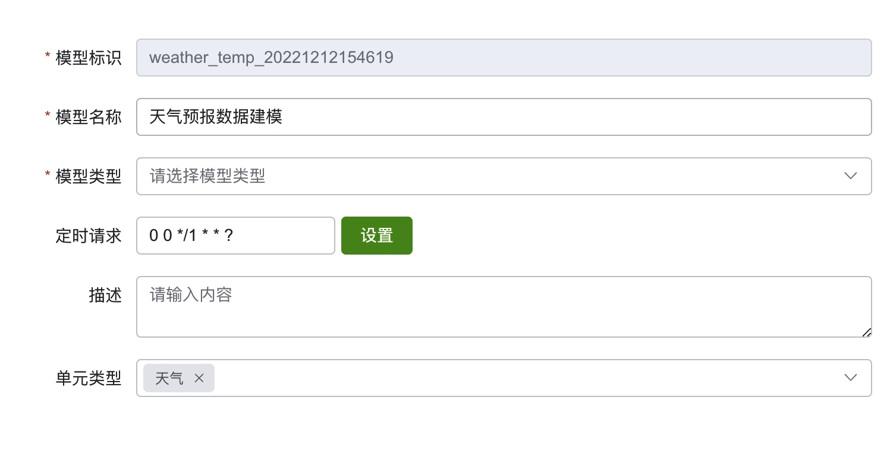
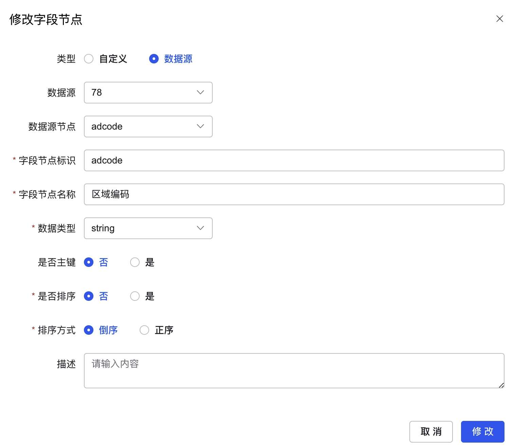
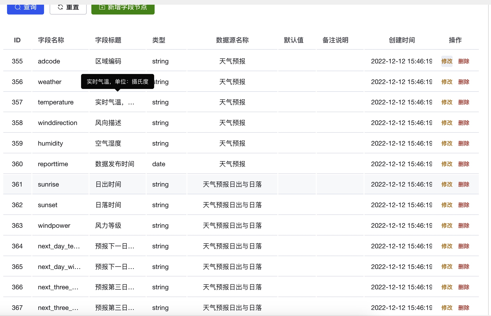
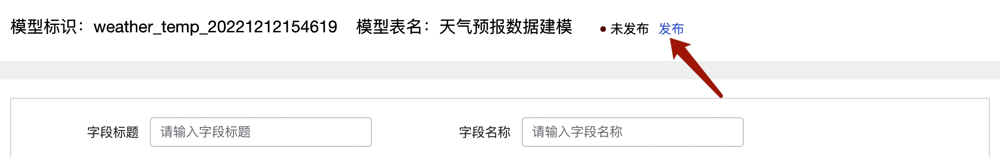

# 快速开始

1. 添加数据源
    
    a. 新建数据源，输入获取天气预报的第三方API接口及参数配置
    
   
   b. 点击列表中上一步所创建的数据源详情按钮，配置数据节点
     
   
   c. 添加数据节点用户获取json字符串中某一个字段的值
    
    这里的规则表达式可以自己写正则表达式对源json中某一个字段值进行匹配返回自定义内容


2. 发布数据源
    

1. 根据业务创建数据建模
   
   a. 新建数据建模
    
    这里的单元类型是在数据字典中配置，对应的业务模块，比如天气监测，对应的参数值会在下面业务实现中用到
     
     b. 新建字段节点选择对应的数据源获取数据
     
   
   
 
   c. 发布对应的数据建模
   

1. 获取建模数据处理对应业务返回前端
   
   a. 在api/v1目录下创建文件并定义API入参出参
    ```
     type CityWeatherListReq struct {
        	g.Meta `path:"/weather/cityWeatherList" method:"get" summary:"获取城市的风力及日照时长" tags:"天气监测"`
        	Name   string `json:"name" description:"名字"`
        }
     type CityWeatherListRes struct {
    	Info []*model.CityWeatherListRes
     }
    ```
    b. 在logic下增加对应业务实现
      ```
       func (a *sEnvWeather) CityWeatherList(ctx context.Context) (cityWeatherListOut []*model.CityWeatherListOut, err error) {
            	info, err := service.CityData().GetAll(ctx)
            	if err != nil {
            		return
            	}
            	if info != nil {
            		var cityIds []int
            		for _, city := range info {
            			cityIds = append(cityIds, city.Id)
            		}
            		if len(cityIds) > 0 {
            			//绑定的数据建模
            			dataInfo, _ := service.DataTemplateBusi().GetInfos(ctx, consts.Weather)
            			if dataInfo != nil {
            				//查询数据建模数据
            				var in = new(model.TemplateDataAllInput)
            				in.Id = uint64(dataInfo.DataTemplateId)
            				//查询条件
            				params := map[string]interface{}{
            					"CREATED_AT >= ? ": gtime.Now().Format("Y-m-d 00:00:00"),
            					"CREATED_AT < ? ":  gtime.Now().Format("Y-m-d H:i:s"),
            				}
            				in.Param = params
            				out, _ := service.DataTemplate().GetAllData(ctx, in)
            
            				for _, city := range info {
            					var cityWeather = new(model.CityWeatherListOut)
            					cityWeather.Id = city.Id
            					cityWeather.Name = city.Name
            					cityWeather.Code = city.Code
            					//获取当前城市当天城市数据
            					var cityOut g.List
            					for _, v := range out.List {
            						if strings.EqualFold(city.Code, v["adcode"].(string)) {
            							cityOut = append(cityOut, v)
            						}
            					}
            					if len(cityOut) > 0 {
            						if err = gconv.Scan(cityOut[len(cityOut)-1], &cityWeather); err != nil {
            							return
            						}
            					}
            					//计算日照时长
            					if cityWeather.Sunrise != "" && cityWeather.Sunset != "" {
            						cityWeather.SunshineDuration = int(gtime.New(gtime.Now().Format("Y-m-d ") + cityWeather.Sunset + ":00").Sub(gtime.New(gtime.Now().Format("Y-m-d ") + cityWeather.Sunrise + ":00")).Hours())
            					}
            
            					cityWeatherListOut = append(cityWeatherListOut, cityWeather)
            				}
            			}
            		}
            	}
            	return
            }
      ```
   
    c. 使用gf gen service命令生成对应的interface
     ```
      type (
	IEnvWeather interface {
        		CityWeatherList(ctx context.Context) (cityWeatherListOut []*model.CityWeatherListOut, err error)
        )
        
        var (
        	localEnvWeather IEnvWeather
        )
        
        func EnvWeather() IEnvWeather {
        	if localEnvWeather == nil {
        		panic("implement not found for interface IEnvWeather, forgot register?")
        	}
        	return localEnvWeather
        }
        
        func RegisterEnvWeather(i IEnvWeather) {
        	localEnvWeather = i
      }
     ```
    d. controller定义方法体接口service层返回的业务数据并返回给前端
    ```
     func (a *cWeather) CityWeatherList(ctx context.Context, req *envirotronics.CityWeatherListReq) (res *envirotronics.CityWeatherListRes, err error) {
        	out, err := service.EnvWeather().CityWeatherList(ctx)
        	if err != nil {
        		return
        	}
        	var cityWeatherListRes []*model.CityWeatherListRes
        	if out != nil {
        		if err = gconv.Scan(out, &cityWeatherListRes); err != nil {
        			return
        		}
        	}
        	res = &envirotronics.CityWeatherListRes{
        		Info: cityWeatherListRes,
        	}
        	return
      }
    ```
