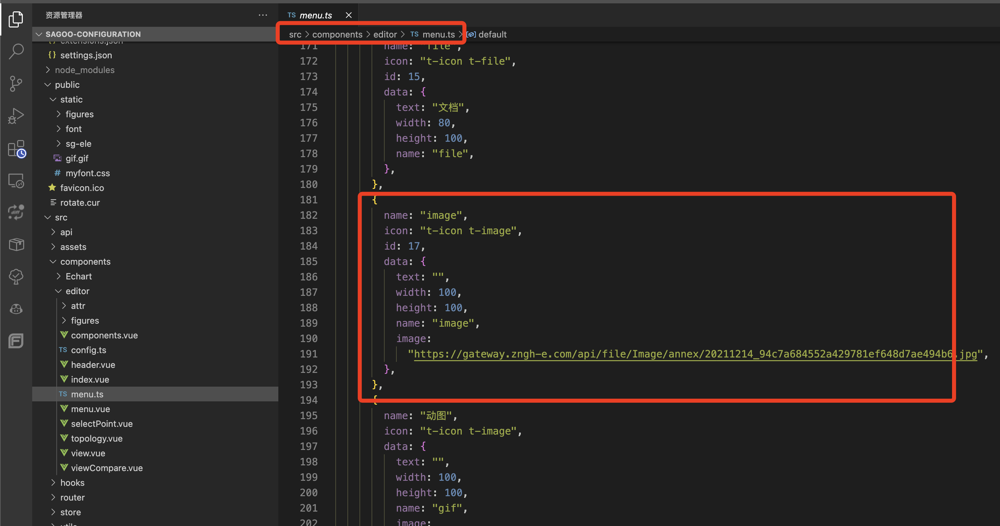
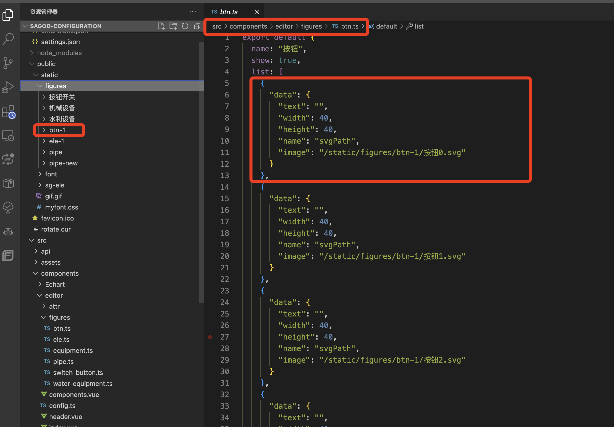
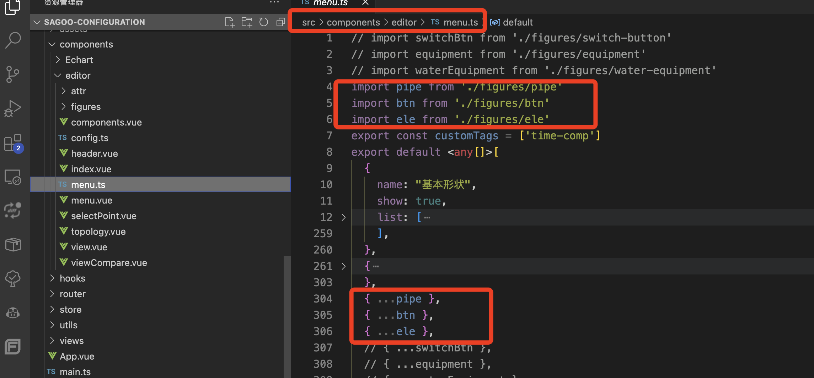

# 图元扩展

组态工具项目中可以自定义左侧菜单栏中的图元及分组等信息，方便客户根据自己的需求定制自己的组件库。

## 增加单个图元

通过再这个文件中增加配置，实现增加图片图元的功能【下图是 `jpg,png` 的方式】。

```json
{
  "name": "image",
  "icon": "t-icon t-image",
  "id": 111,
  "data": {
    "text": "",
    "width": 100,
    "height": 100,
    "name": "image",
    "image": "https://xxx.xxx/image.jpg"
  }
}
```

也可以增加 `svg` 类型的图元。

```json
{
  "data": {
    "text": "",
    "width": 40,
    "height": 40,
    "name": "svgPath",
    "image": "https://xxx.xxx/image.svg"
  }
}
```



## 批量增加图元分组

1. 先将图片文件放到 `public/static` 下的文件夹中，然后再 `json` 配置中写好以 `public` 为根路径下的绝对路径。



2.将文件引入到 `menu.ts` 中进行使用。


