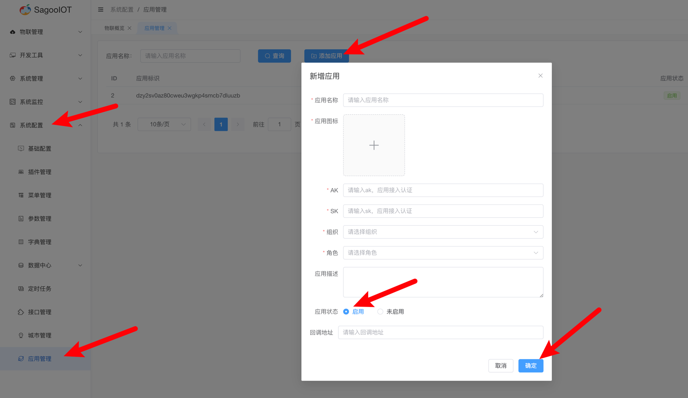

# AK/SK说明

SagooIOT提供OpenAPIs功能，方便第三方应用直接调用系统相关的开发接口。该接口是通过AK/SK的方式进行鉴权。需要调用方跟据Secret Key与Access Key值计算签名。

## 什么是AK/SK
ak/sk是一种身份认证方式，常用于系统间接口调用时的身份验证，其中ak为Access Key ID，sk为Secret Access Key。客户端和服务端两者会协商保存一份相同的sk，其中sk必须保密。

## AK/SK认证过程
客户端在调用的服务端接口时候，会带一下参数进行请求，在服务端接收到这个请求的时候，首先会根据ak去数据库里面去找到对应的sk，然后使用sk对请求内容进行加密得到一个签名，然后对比客户端传过来的签名和服务端计算的出来的签名是否一致，如果一致则代表身份认证通过，反之则不通过。
1. ak：标明请求方是谁，即该例子中的ak
2. time：请求时间，时间戳，将会被对应的sk配合加密算法进行加密，得到一个signature签名
3. sign：签名，使用sk配合对应的加密算法后进行加密得到的签名。
4. appId: 应用id，在系统中创建，用于标识应用的唯一性。

请求示例：
https://xxx.com/students?ak=reewrwererw&time=1640494526&sign=54acba6857b284a8a481ed5913edd34d994721cc584305ff02c81bb3ced17212&appId=aaaa

## 使用方式

1. 创建应用，登录平台后 `系统配置`->`应用管理`->`添加应用` 填写好应用名称等相关信息，注意`应用状态`设置为`启用`
   
2. 对于创建好的应用记录好 `appId` `ak` `sk` 三个字段信息，参照[签名生成方式](example.md)进行签名
3. 按照上面认证过程携带相应的请求参数进行请求
