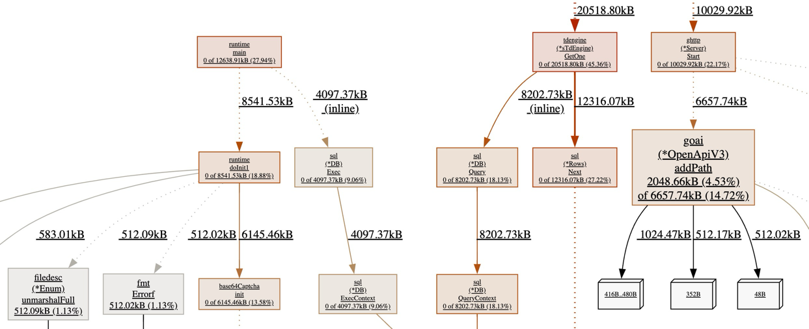
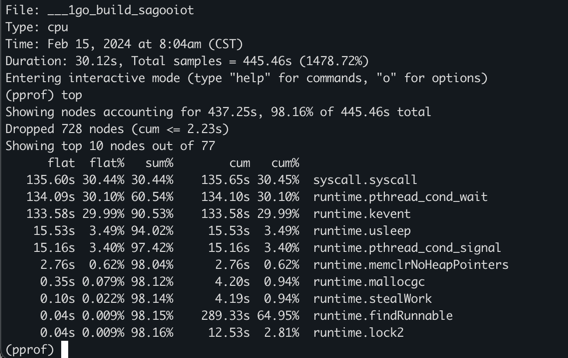
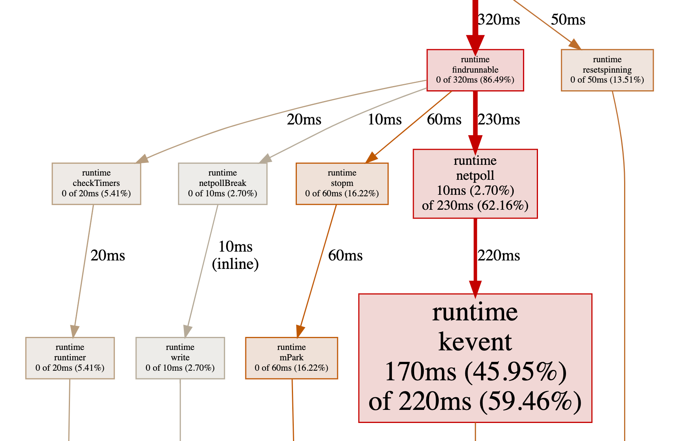
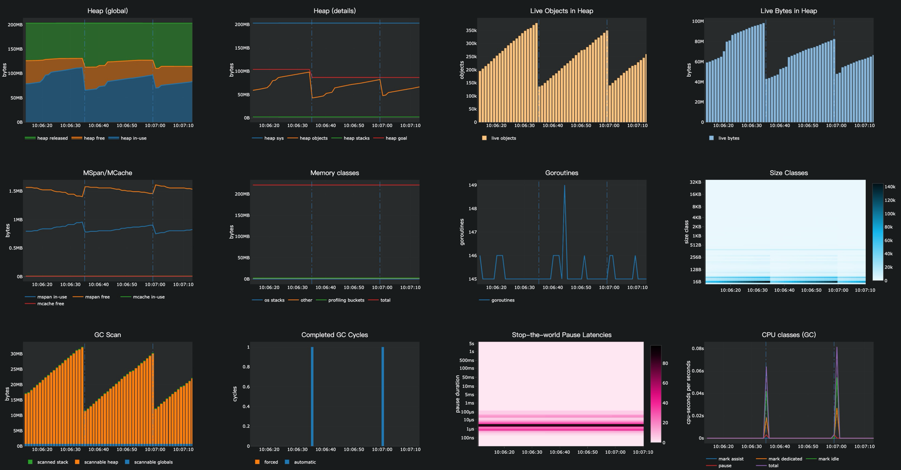

# 性能分析

SagooIOT 提供了非常强大和简便的服务性能分析功能，内部完美集成了pprof性能分析工具。
要进行服务性能分析需要在配置文件中开启性能分析开关。

## 开启pprof

```yaml
# 系统配置
system:
    enablePProf: true # 是否开启pprof
    pprofPort:  "58088" # pprof端口

```

使用`go tool pprof`分析数据，主要有两种模式：

* 命令行交互模式

`go tool pprof [file_pprof|url_pprof]`

* web页面模式

`go tool pprof -http=:6666 [file_pprof|url_pprof]`
其中，`file_pprof`表示生成的prof分析文件，如`cpu.prof`；`url_pprof`表示远端服务开启的pprof访问，如http://localhost:8080/debug/pprof/profile

进入命令行交互模式后，可以使用help查看所有子命令，使用`help <cmd|option>`查看子命令使用方法。如 help、help top等


在开启性能分析支持后，我们可以使用`go tool pprof`命令行工具进行分析：

```shell
  go tool pprof http://127.0.0.1:8000/debug/pprof/profile

```
执行后pprof工具经过约30秒左右的接口信息采集（这30秒期间WebServer应当有流量进入，我们这里不停地访问hello world页面以作测试），然后生成性能分析报告，随后可以通过top10/web等pprof命令查看报告结果，更多命令可使用go tool pprof查看。关于pprof的详细使用介绍，请查看Golang官方：[blog.golang.org/profiling-go-programs](https://blog.golang.org/profiling-go-programs)

执行后可以使用 web、top等命令查看分析的内容


### 基于WEB服务分析
```shell
go tool pprof -http=:1212  http://127.0.0.1:8199/debug/pprof/heap
```

选项说明：

| Profile项    | 说明         | 详情                                                         |
| ------------ | ------------ | ------------------------------------------------------------ |
| allocs       | **内存分配** | 从程序启动开始，分配的全部内存                               |
| block        | **阻塞分析** | 导致同步原语阻塞的堆栈跟踪                                   |
| cmdline      | 命令行调用   | 当前程序的命令行调用                                         |
| oroutine     | gorouting    | 所有当前 goroutine 的堆栈跟踪                                |
| heap         | 堆           | 活动对象的内存分配抽样。您可以指定 gc 参数以在获取堆样本之前运行 GC |
| mutex        | **互斥锁**   | 争用互斥锁持有者的堆栈跟踪                                   |
| profile      | **CPU分析**  | CPU 使用率分析。可以在url中，通过seconds指定持续时间（默认30s）。获取配置文件后，使用 go tool pprof 命令分析CPU使用情况 |
| threadcreate | 线程创建     | 导致创建新操作系统线程的堆栈跟踪                             |
| trace        | 追踪         | 当前程序的执行轨迹。可以在url中，通过seconds指定持续时间（默认30s）。获取跟踪文件后，使用 go tool trace 命令调查跟踪 |

在性能分析时，使用最多有三种：内存分析(allocs,heap),CPU分析(profile), 阻塞分析(block), 互斥锁分析(mutex)。

### 基于命令行分析

命令：

* 内存分配分析: `go tool pprof http://127.0.0.1:8000/debug/pprof/allocs`
* 阻塞分析分析: `go tool pprof http://127.0.0.1:8000/debug/pprof/block`
* 命令行调用分析: `go tool pprof http://127.0.0.1:8000/debug/pprof/cmdline`
* 协程性能分析: `go tool pprof  http://127.0.0.1:8000/debug/pprof/goroutine`
* 内存堆分析: `go tool pprof  http://127.0.0.1:8000/debug/pprof/heap`
* 互斥锁分析: `go tool pprof http://127.0.0.1:8000/debug/pprof/mutex`
* CPU性能分析: `go tool pprof http://127.0.0.1:8000/debug/pprof/profile`
* 线程创建分析: `go tool pprof http://127.0.0.1:8000/debug/pprof/threadcreate`
* 追踪分析: `go tool pprof http://127.0.0.1:8000/debug/pprof/trace`


例如：CPU Profiling

```shell
go tool pprof http://127.0.0.1:8000/debug/pprof/profile

```

执行后，默认需要等30s才会显示交互。


**TOP指令显示：**

输入 `top` 查看CPU使用情况



每一行表示一个函数的信息，列信息字段解释：

> - flat：函数在 CPU 上运行的时间
> - flat%：函数在CPU上运行时间的百分比
> - sum%：是从第一行到当前行所有函数累加使用 CPU 的比例，如第二行sum=53.85=30.77+23.08
> - cum：这个函数以及子函数运行所占用的时间，应该大于等于flat
> - cum%：这个函数以及子函数运行所占用的比例，应该大于等于flat%
> - 最后一列：函数的名字

**list指令分析函数**

确定出哪个函数耗时之后，可以用pprof分析函数中的哪一行导致的耗时，使用子命令：list 函数名。

**web指令生成图示**：

在交互模式下输入 web，会自动生成一个 svg 文件，并跳转到浏览器打开。

:::note 注意
在使用web指令时，需要安装graphviz工具，否则会报错。安装方法 https://shidawuhen.github.io/2020/02/08/go-callvis/ 。
:::



图中每个方框对应应用程序运行的一个函数，方框越大代表函数执行的时间越久（函数执行时间会包含它调用的子函数的执行时间，但并不是正比的关系）；方框之间的箭头代表着调用关系，箭头上的数字代表被调用函数的执行时间。

具体细节可以参考：https://github.com/google/pprof/tree/master/doc#interpreting-the-callgraph

以runtime netpoll为例：
* 箭头上的230ms表示该函数总共的执行时间，包含自身和下游所有子节点；
* 方框中的10ms表示自身的执行时间；
* 方框中的2.70%表示自身执行时间在该函数总共执行时间的占比在总时间中的占比：2.70 = (10/230)*62.16
* 方框中的62.16%表示总时间占比，即整个程序耗时占比。

## 性能实时监控

SagooIot提供了一个非常方便的性能实时监控工具，可以在浏览器中实时查看服务的性能信息，包括堆、对象、goroutines、GC暂停、调度器等，非常方便。默认端口为：`58089`，可以在配置文件中修改。

访问地址是： `http://localhost:58089/debug/statsviz/`

域名或是IP以实际运行的环境为准。



## Expvar开放性能参数查看

访问地址是： `http://localhost:8000/debug/vars/` 端口为http服务的端口
