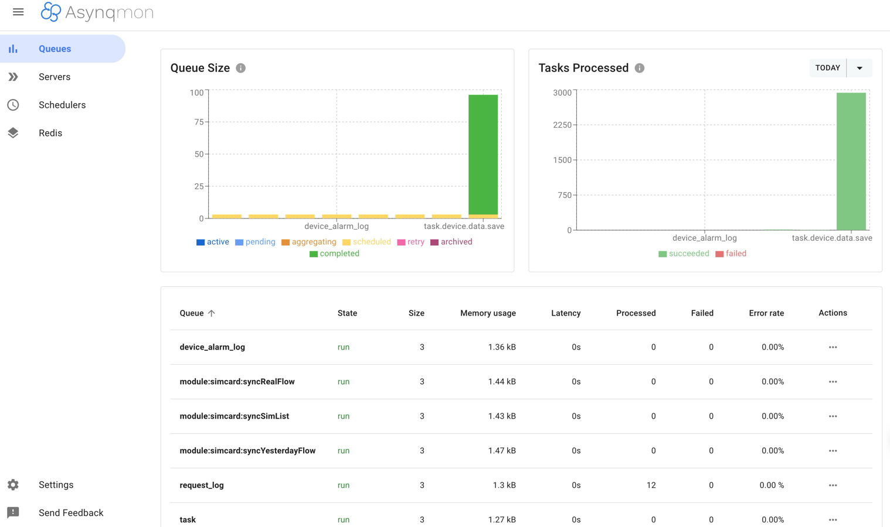

# 任务队列查看

一个完善的队列系统，监控是必不可少的。系统中配备了两种形式的监控：webUI和命令行工具。

## 命令行工具

能过命令行查看当前任务队列的状态，如下：

安装asynq 工具：

```bash
go install github.com/hibiken/asynq/tools/asynq  

```
运行这个工具：

```bash
asynq dash

```
效果如下：


## WebUI监控

webUI监控是通过开源的asynqmon包实现的，地址是 https://github.com/hibiken/asynqmon

如下图所示：

