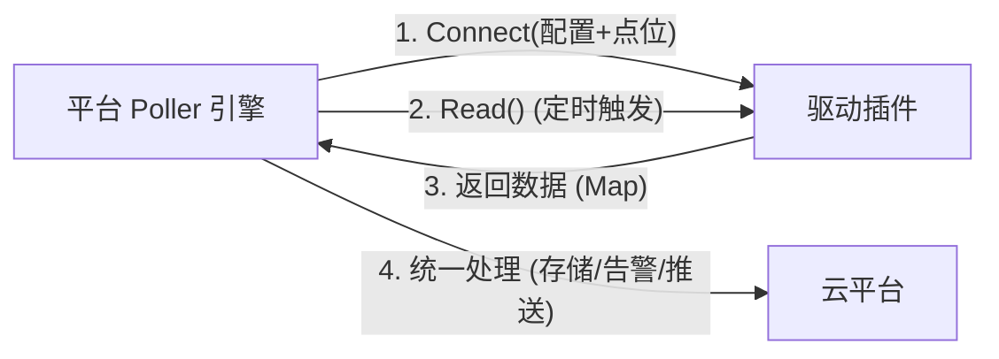

# 主动采集类设备驱动插件开发

本手册旨在指导开发者开发适用于 SagooIOT 平台的**主动采集类设备驱动插件**。

**主动采集 (Active Collection)** 是指平台作为发起方，按照预设的策略（如定时轮询）主动向设备请求数据的模式。典型的应用场景包括：
*   **Modbus TCP/RTU** 设备轮询
*   **OPC UA Client** 订阅或读取
*   **SNMP** 网络设备状态查询
*   **HTTP Pull** 定期请求设备 API

此类插件在 SagooIOT 体系中被称为 **Driver (驱动)** 类型的插件。

---

## 2. 核心架构与原理

### 2.1 "配置即驱动" 理念

SagooIOT 采用 "配置即驱动" 的设计理念，将业务逻辑（读什么）与连接逻辑（从哪读）分离：

1.  **产品层 (Product)**：通过**物模型 (TSL)** 定义数据点位（Points）。例如：温度属性对应 Modbus 寄存器 40001。
2.  **设备层 (Device)**：定义连接配置（Connection）。例如：IP 地址、端口、从站 ID、采集间隔。
3.  **平台层 (Poller)**：内置的 Poller 引擎会自动将“连接配置”和“点位定义”组合，发送给驱动插件。
4.  **插件层 (Driver)**：无状态执行单元。接收配置 -> 建立连接 -> 执行读取 -> 返回标准数据。

### 2.2 数据流向



---

## 3. 开发流程

开发一个驱动插件主要包含以下步骤：

1.  **定义配置结构**：定义插件需要的全局配置和实例配置（连接参数）。
2.  **定义通信接口**：基于 `net/rpc` 或 `gRPC` 实现驱动接口。
3.  **实现核心方法**：`Info`, `Connect`, `Read`, `Write`, `Disconnect`, `GetStatus`。
4.  **实现配置描述**：在 `Info` 中返回配置模板，供前端自动生成表单。

### 3.1 接口定义

驱动插件必须实现以下 RPC 接口：

```go
type Driver interface {
    // 获取插件元信息及配置模板
    Info() PluginInfo
    
    // 建立连接 (传入实例配置 + 点位定义)
    Connect(config map[string]string) JsonRes
    
    // 执行一次数据采集
    Read() JsonRes
    
    // 执行写入操作 (可选)
    Write(data []byte) JsonRes
    
    // 断开连接
    Disconnect() JsonRes
    
    // 获取运行状态
    GetStatus() JsonRes
}
```

### 3.2 数据模型

#### 请求与响应

所有接口统一通过 `JsonRes` 返回结果：

```go
type JsonRes struct {
    Code    int         `json:"code"`    // 0: 成功, 非0: 失败
    Message string      `json:"message"` // 错误信息
    Data    interface{} `json:"data"`    // 返回数据
}
```

#### 插件信息 (PluginInfo)

```go
type PluginInfo struct {
    Types          string        `json:"types"`          // 固定为 "driver"
    HandleType     string        `json:"handleType"`     // 插件标识 (e.g., "modbus")
    Name           string        `json:"name"`           // 插件名称
    // ... 其他元数据
    PluginConfig   []ConfigField `json:"pluginConfig"`   // 全局配置模板
    InstanceConfig []ConfigField `json:"instanceConfig"` // 实例配置模板
}
```

---

## 4. 实现指南 (以 Modbus 为例)

### 4.1 步骤一：创建项目结构

建议参考 `plugins/modbus` 的结构：
```
my-driver/
├── main.go        # 插件入口，注册 RPC 服务
├── driver.go      # 核心逻辑：实现 Driver 接口
├── manager.go     # 设备连接管理：维护连接池
├── model.go       # 数据结构定义
└── config.go      # 配置辅助函数
```

### 4.2 步骤二：实现配置描述 (Info)

在 `Info()` 方法中，你需要告知平台前端如何渲染配置表单。

```go
func (d *MyDriver) Info() PluginInfo {
    return PluginInfo{
        Types:      "driver",
        HandleType: "my-protocol",
        Name:       "my-protocol-driver",
        // ...
        InstanceConfig: []ConfigField{
            {
                Key:      "ip",
                Name:     "设备IP",
                Type:     "string",
                Required: true,
            },
            {
                Key:      "port",
                Name:     "端口",
                Type:     "port",
                DefaultValue: 8080,
            },
            {
                Key:      "poll_interval",
                Name:     "采集间隔(秒)",
                Type:     "integer",
                DefaultValue: 5,
            },
        },
    }
}
```

### 4.3 步骤三：处理连接 (Connect)

`Connect` 方法会收到一个 `map[string]string`，其中包含了：
1.  用户在设备页面配置的**连接参数**（如 IP、Port）。
2.  平台自动注入的 `deviceKey`。
3.  平台根据物模型解析出的 **点位定义 (Configuration)**，通常在 config map 中以 JSON 字符串形式存在（如 key 为 `points` 或 `tsl`）。

**主要逻辑**：
1.  解析配置 Map 到结构体。
2.  解析 `points` (点位) 定义。
3.  初始化设备客户端（Client）。
4.  建立实际的网络连接。
5.  将连接对象存储在内存管理器中（Map: DeviceKey -> Client）。

```go
func (d *MyDriver) Connect(configRaw map[string]string) JsonRes {
    // 1. 解析配置
    config := parseConfig(configRaw)
    
    // 2. 建立连接
    client := NewClient(config.IP, config.Port)
    if err := client.Connect(); err != nil {
        return JsonRes{Code: 1, Message: err.Error()}
    }
    
    // 3. 存储连接实例
    d.manager.Add(config.DeviceKey, client)
    
    return JsonRes{Code: 0, Message: "Connected"}
}
```

### 4.4 步骤四：实现采集 (Read)

`Read` 方法被 Poller 定时调用。它是无参数的（上下文已在 `Connect` 时建立）。

**主要逻辑**：
1.  根据上下文（通常是 Driver 实例持有的当前 DeviceKey，或者是单实例插件设计）获取对应的 Client。
    *   *注意：如果插件是多例模式（每个设备一个插件进程），则直接使用成员变量。如果是单例模式（所有设备共用一个插件进程），则需要通过架构保证上下文，但在 SagooIOT 当前架构中，通常是一个插件进程管理多个设备连接，因此 `Connect` 和 `Read` 需要有上下文管理机制。*
    *   **修正**：SagooIOT 的 Driver 插件目前通常设计为**单进程多实例管理**。`Connect` 会传入 `deviceKey`。`Read` 方法在 RPC 调用时实际上是无状态的吗？
    *   **关键点**：Poller 调用 `Read` 时，RPC 框架如何知道读哪个设备？
    *   *当前设计回顾*：在 `Modbus` 插件中，`Driver` 结构体持有 `config` 成员变量。当 Poller 为每个设备创建一个 Plugin Client 实例时，它是与特定的插件进程实例绑定的。
    *   **架构说明**：SagooIOT 主程序为每个设备创建独立的 Plugin Client 吗？不是的。
    *   **正确模式**：根据 `driver.go` 的实现：
        ```go
        func (d *ModbusDriver) Read() JsonRes {
            // ...
            data, err := d.manager.ReadDeviceData(d.config.DeviceKey)
            // ...
        }
        ```
        这意味着**每一个设备对应一个 Driver 实例（在主程序侧）**。主程序通过 `go-plugin` 启动插件时，如果是 `Dispense` 模式，每个设备会获取一个独立的接口实现实例。
        **但在 Modbus 插件 `main.go` 中**：
        ```go
        modbusDriver := NewModbusDriver()
        plugin.Serve(..., "driver": &DriverPlugin{Impl: modbusDriver})
        ```
        这里只有一个全局 `modbusDriver` 实例。
        **这就引出了一个并发/上下文问题**：如果多个设备共用同一个 Plugin 进程，`d.config` 会被覆盖吗？
        **深度分析**：`Connect` 方法更新了 `d.config`。如果多个设备并发调用 `Connect`，确实有竞态风险。
        *参考 Modbus 实现*：`Connect` 加了锁 `d.mu.Lock()`。但是 `d.config` 是结构体成员。这意味着 **Modbus 插件当前的实现假定了一个 Plugin 进程只服务于一个设备，或者 Poller 为每个设备启动了一个独立的插件进程？**
        *根据 go-plugin 机制*：通常一个 Client 对应一个子进程。如果 Poller 为每个设备都 `NewClient`，那么就会启动 N 个子进程。这对于大量设备是不可接受的。
        **更高效的模式 (Multiplexing)**：主程序只启动一个插件进程，但在该进程内通过 ID 区分设备。
        **但在 Modbus 插件代码中**，`Connect` 直接修改了 `d.config`。这强烈暗示 **目前的实现是：一个设备 = 一个插件进程实例** (或者 Poller 尚未实现复用)。
        *文档《主动采集类设备接入方案》中提到*：“连接复用...Manager 应识别并复用底层的 TCP 连接”。这暗示 Manager 管理多个连接。
        **综合判断**：开发插件时，建议内部通过 `Manager` 管理多设备。但是 `Read()` 接口没有参数 `deviceKey`！
        *这是一个接口设计的约束*。如果 `Read()` 没有参数，那么该 Driver 实例必须绑定到一个特定的设备。
        **结论**：目前的接口定义隐含了 **1 Device = 1 Driver Interface Instance**。
        在 `go-plugin` 中，可以通过 `MuxBroker` 实现同一个进程以此为基础，分发出不同的 Server 实例（Stateful Plugins）。或者，简单地，主程序为每个设备启动一个插件进程（资源消耗大，仅适合少量设备）。
        **最佳实践建议**：为了兼容性和性能，建议插件内部实现 `Manager`，但接口层目前看来是基于**状态化实例**的。即 `Connect` 初始化该实例的状态（绑定 DeviceKey），后续 `Read` 基于该状态执行。

2.  遍历 `Connect` 时保存的点位列表。
3.  对每个点位（或批量）执行协议读取操作。
4.  将结果封装为 `map[string]interface{}`，Key 为点位名称 (Property Key)。

```go
func (d *MyDriver) Read() JsonRes {
    // 1. 获取连接
    client, ok := d.manager.Get(d.config.DeviceKey)
    if !ok {
        return JsonRes{Code: 1, Message: "Not connected"}
    }
    
    // 2. 执行读取
    data := make(map[string]interface{})
    for _, point := range d.config.Points {
        value, err := client.Read(point.Address)
        if err != nil {
             // 记录错误或跳过
             continue
        }
        data[point.Name] = value
    }
    
    // 3. 返回数据
    return JsonRes{
        Code: 0, 
        Data: map[string]interface{}{
            "properties": data,
            "timestamp": time.Now().UnixMilli(),
        },
    }
}
```

### 4.5 步骤五：解析物模型 (TSL)

设备接入方案中，点位定义来自物模型。插件会收到一个 JSON 字符串（通常在 `Connect` 的 config 中）。
开发者需要编写解析逻辑，将 TSL 的扩展属性 (`extension` 或 `extConfig`) 映射为驱动可理解的地址。

示例 TSL 片段：
```json
{
    "properties": [
        {
            "key": "temp",
            "name": "温度",
            "extConfig": {
                "protocol": "modbus",
                "config": {
                    "registerAddr": 40001,
                    "dataType": "float"
                }
            }
        }
    ]
}
```

解析逻辑参考：
```go
func parseTSL(tslString string) []Point {
    // Unmarshal JSON
    // Filter properties where utility matches my-protocol
    // Map 'registerAddr' to Point.Address
    // Return Point list
}
```

---

## 5. 最佳实践

### 5.1 连接管理
*   **连接池**：对于 TCP 类连接，务必实现连接池。如果多个设备连接同一个 IP:Port（例如通过网关），应复用底层 TCP 连接，避免端口耗尽。
*   **断线重连**：插件应自动处理网络波动导致的断开，具备重连机制。

### 5.2 错误处理
*   **Fail Fast**：配置错误应在 `Connect` 阶段立即返回失败。
*   **Partial Success**：在 `Read` 阶段，如果部分点位读取失败，建议尽可能返回成功读取的数据，并在日志中记录失败的点位。

### 5.3 类型安全
*   严格处理数据类型转换。从 TSL 解析出的配置通常是 interface{}，使用时需进行类型断言和安全转换（推荐使用 `cast` 库或类似工具）。

### 5.4 日志规范
*   利用配置中的 `debug` 开关控制日志级别。
*   日志应包含 `DeviceKey` 以便排查特定设备的问题。

---

## 6. 常见问题 (FAQ)

**Q: 插件是作为独立进程运行的吗？**
A: 是的，每个插件（如 modbus 插件）是一个独立的 OS 进程。

**Q: 如何调试插件？**
A: 由于插件是子进程，直接打断点比较困难。建议：
1.  编写单元测试，mock 掉 RPC 调用。
2.  在插件中输出日志到文件或标准错误（主程序会捕获 stderr）。
3.  利用 SagooIOT 的开发模式，通过 `go run` 独立运行插件进行调试（需要 mock 主程序调用）。

**Q: 支持自定义数据上报时间吗？**
A: 支持。虽然 Poller 主要基于定时轮询，但插件可以在 `Read` 中阻塞等待（不推荐过长时间），或者在 `Connect` 后自行启动 goroutine 采集并缓存，`Read` 仅负责返回缓存数据。
