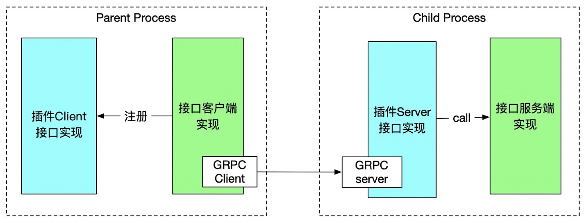

# 插件介绍

SagooIOT gRPC plugin是使用HashiCorp/go-plugin框架实现的，它遵循开闭原则，通过接口固定上层业务逻辑，通过改变实现的RPC服务接口来扩展业务。Go Plugin提供了两类插件：RPC插件和GRPC插件，这两类插件的客户端的底层调用方式不同。前者使用net/rpc，后者使用grpc服务调用。这两种插件都提供了Server和Client方法。Server方法充当了服务端stub，当服务端接收到请求后，调用接口的服务端实现。Client方法是一个工厂方法，用于生成客户端接口实现对象。

Go Plugin在启动过程中会启动一个子进程，运行RPC/gRPC服务。主进程可以通过RPC/gRPC接口来调用插件，支持多版本的服务并存。然而，Go Plugin本身不提供服务的高可用解决方案，需要自己来提供。

## 设计标准

* 性能：调用插件要尽可能的快；对于任务插件，使用单独的工作空间（协程、线程、进程的池子化处理），大的、慢的、长期运行的插件，要少调用
* 稳定性：插件依赖的发布平台要少发布，交互API的设计要做好抽象，上下文的环境变量非必须不添加，减少升级需求，甚至能支持多个实例互备热升级
* 可靠性：如果有失效、崩溃的可能，必须有快速、简单、完整的恢复机制；业务插件的执行不能影响依赖的发布平台的守护进程或者线程的稳定
* 安全性：应该通过代码签名之类的手段防篡改
* 扩展性：支持插件热更新和上下线，下线需要健康检查，公共库插件至少能热加载
* 复用性：业务插件不要太多一次性的上下线
* 易用性：提供使用简单、功能正交的API，业务插件能够获取依赖的发布平台的上下文和调用公共库

## 关于 hashicorp/go-plugin

**本系统中插件机制采用的是hashicorp/go-plugin**

* 进程隔离：有，多进程，server+client
* 主程序调用插件：一切协议预协定object
* 插件感知主程序上下文：一切协议预协定object
* stream支持：单向和双向，基于http/2
* 插件发现：主程序循环扫描插件目录并维护状态；通过第三方文件diff工具维护，例如git
* 上线：能
* 下线：能
* 更新：能
* 通信：支持grpc
* 序列化：protobuf
* 性能：中/偏高

### go-plugin是什么？
我们知道Go语言缺乏动态加载代码的机制，Go程序通常是独立的二进制文件，因此难以实现类似于C++的插件系统。即使go的最新标准引入了go plugin机制，但是由于限制性条件比较多导致在生产环境中不是很好用，比如插件的编写环境和插件的使用环境要保持一致，如gopath、go sdk版本等。

HashiCorp公司开源的go-plugin库解决了上述问题，允许应用程序通过本地网络（本机）的gRPC调用插件，规避了Go无法动态加载代码的缺点。go-plugin是一个通过RPC实现的Go插件系统，并在Packer、Terraform, Nomad、Vault等由HashiCorp主导的项目中均有应用。

顺便说一句，Vault开源代码，我这几天看了下，代码写的很不错，感兴趣的小伙伴可以看看vault是怎么使用go-plugin，很值得借鉴，后续会针对vault的源代码的插件部分进行剖析。

### 特性
go-plugin的特性包括：

1. 插件是Go接口的实现：这让插件的编写、使用非常自然。对于插件编写者来说，他只需要实现一个Go接口即可；对于插件的用户来说，就像在同一个进程中使用和调用函数即可。go-plugin会处理好本地调用转换为gRPC调用的所有细节

2. 跨语言支持：插件可以被任何主流语言编写（和使用），该库支持通过gRPC提供服务插件，而基于gRPC的插件是允许被任何语言编写的。

3. 支持复杂的参数、返回值：go-plugin可以处理接口、io.Reader/Writer等复杂类型，我们为您提供了一个库（MuxBroker），用于在客户端/服务器之间创建新连接，以服务于附加接口或传输原始数据。

4. 双向通信：为了支持复杂参数，宿主进程能够将接口实现发送给插件，插件也能够回调到宿主进程（这点还需要看官网的双向通信的例子好好理解下）

5. 内置日志系统：任何使用log标准库的的插件，都会自动将日志信息传回宿主机进程。宿主进程会镜像日志输出，并在这些日志前面加上插件二进制文件的路径。这会使插件的调试变简单。如果宿主机使用hclog，日志数据将被结构化。如果插件同样使用hclog，插件的日志会发往宿主机并被结构化。

6. 协议版本化：支持一个简单的协议版本化，可增加版本号使之前插件无效。当接口签名变化、协议版本改变等情况时，协议版本话是很有用的。当协议版本不兼容时，会发送错误消息给终端用户。

7. 标准输出/错误同步：插件以子进程的方式运行，这些插件可以自由的使用标准输出/错误，并且输出会被镜像回到宿主进程。

8. TTY Preservation：插件子进程可以链接到宿主进程的stdin标准输入文件描述符，允许以TTY方式运行的软件。

9. 插件运行状态中，宿主进程升级：插件可以"reattached"，所以可以在插件运行状态中升级宿主机进程。NewClient函数使用ReattachConfig选项来确定是否Reattach以及如何Reattach。
10. 加密通信：gRPC信道可以加密

### 架构优势
插件不影响宿主机进程：插件崩溃了，不会导致宿主进程崩溃
插件容易编写：仅仅写个go应用程序并执行go build。或者使用其他语言来编写gRPC服务 ，加上少量的模板来支持go-plugin。
易于安装：只需要将插件放到宿主进程能够访问的目录即可，剩下的事情由宿主进程来处理。
完整性校验：支持对插件的二进制文件进行Checksum
插件是相对安全的：插件只能访问传递给它的接口和参数，而不是进程的整个内存空间。另外，go-plugin可以基于TLS和插件进行通信。
### 适用场景
go-plugin目前仅设计为在本地[可靠]网络上工作，不支持go-plugin在真实网络，并可能会导致未知的行为。

即不能将go-plugin用于在两台服务器之间的远程过程调用，这点和传统的RPC有很大区别，望谨记。

更多内容请见文章出处：
[https://zhuanlan.zhihu.com/p/451382884](https://zhuanlan.zhihu.com/p/451382884)

