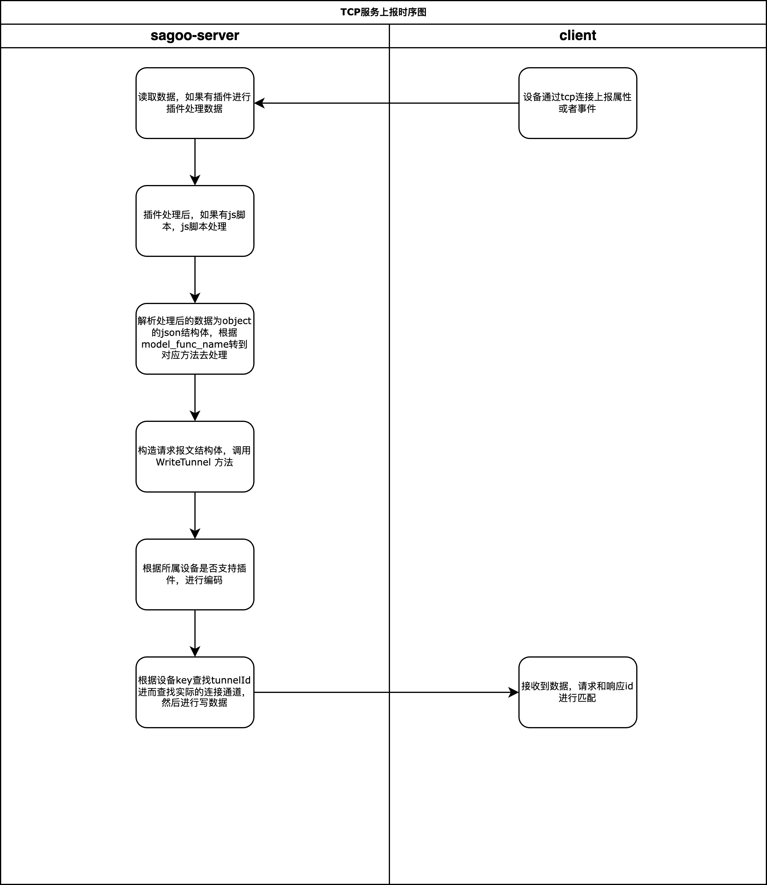
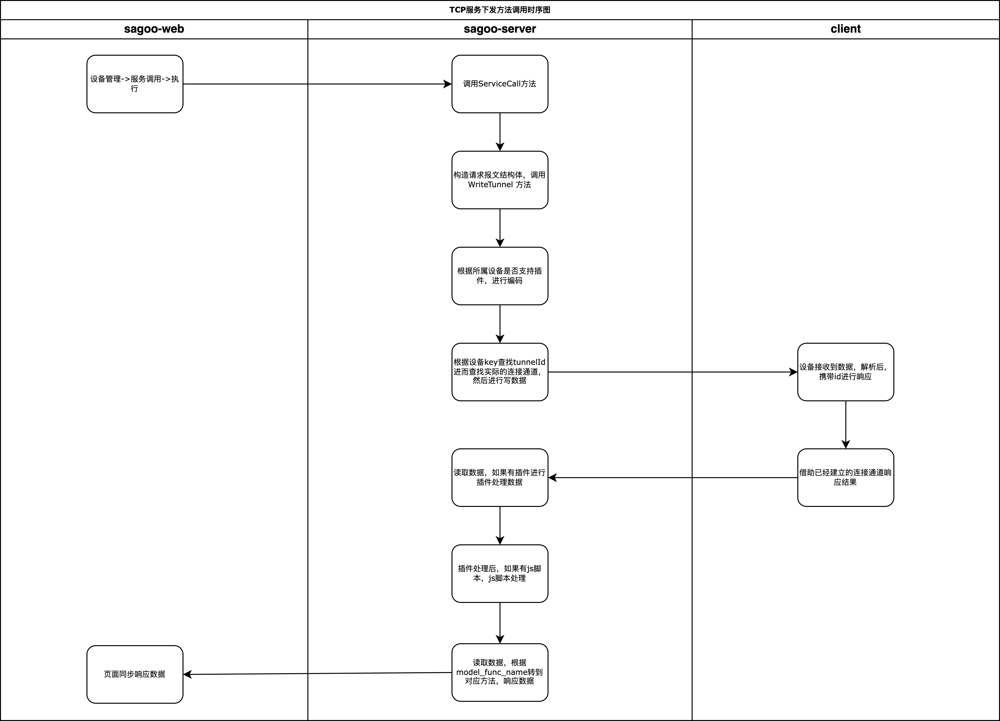

#  tcp插件

## 插件实现接口说明

1. 开发参考 [协议插件开发](../plugin/protocol.md) 文档。
2. 接口说明
   1. Info: 方法中需要指定插件的类型（协议插件、通知插件），处理方式类型，插件名称（就是插件的ID）
   2. Encode: 负责将平台下发的数据转换为设备可识别的数据格式
   3. Decode: 负责将设备上报的数据转换为平台可识别的数据格式

## TCP设备与SagooIOT通信时序图

协议插件充当的角色是设备与平台之间的中间件，设备与平台之间的通信报文格式由协议插件自行定义，协议插件但是协议插件需要遵循SagooIOT平台定义的通信时序，如下图所示：

1. 设备上报
   
2. 平台下发
   

## 平台可识别的数据格式说明

```json
{
  "id": "123",
  "version": "1.0",
  "model_func_name": "upProperty",
  "model_func_identify": "",
  "sys": {
    "ack": 0
  },
  "params": {
    "Power": {
      "value": "on",
      "time": 1524448722000
    },
    "WF": {
      "value": 23.6,
      "time": 1524448722000
    }
  },
  "method": "thing.event.property.post"
}
```
**字段说明**

   1. id：消息ID，用于唯一标识一条消息，由设备端或者服务端生成，必须保证唯一性。
   2. version：消息版本号，目前版本为1.0。
   3. model_func_name: 物物模型功能名称，此字段为tcp设备消息特有的字段，目前支持的功能有
      * upProperty: 设备上报属性
      * upSetProperty: 设备上报设置属性
      * upEvent: 设备上报事件
      * upBatch: 设备批量上报
      * upServiceOutput: 设备服务调用响应
      * downProperty: 平台下发设备属性
      * downServiceInput: 平台下发服务调用请求
      
   4. model_func_identify: 此字段为tcp设备消息特有的字段，这个参数是用来标记服务调用的id或者上报事件的id，如果不是这两种情况，则留空。
   5. sys：系统级参数，目前仅支持ack，ack=0表示不需要应答，ack=1表示需要应答。
   6. params：消息体，消息体中包含了设备上报的属性值，属性值的格式为JSON格式。
   7. method：消息类型

## 平台可识别的报文协议

### 设备上报属性

#### 请求

**请求数据格式：**

```json
{
    "id": "123",
    "version": "1.0",
    "model_func_name": "upProperty",
    "model_func_identify": "",
    "sys":{
        "ack":0
    },
    "params": {
        "Power": {
            "value": "on",
            "time": 1524448722000
        },
        "WF": {
            "value": 23.6,
            "time": 1524448722000
        }
    },
    "method": "thing.event.property.post"
}
```

字段说明

1. id：消息ID，用于唯一标识一条消息，由设备端生成，必须保证唯一性。
2. version：消息版本号，目前版本为1.0。
3. sys：系统级参数，目前仅支持ack，ack=0表示不需要应答，ack=1表示需要应答。
4. params：消息体，消息体中包含了设备上报的属性值，属性值的格式为JSON格式。
5. method：消息类型，目前仅支持thing.event.property.post。
6. Power：属性名称，必须与物模型中定义的属性名称一致。
7. value：属性值，必须与物模型中定义的属性类型一致。
8. time：属性值的时间戳，单位为秒，可选，如果不携带该字段，则默认为消息发送时间。

#### 应答

1. 应答数据格式：

```json
{
  "code": 200,
  "data": {},
  "id": "123",
  "message": "success",
  "method": "thing.event.property.post",
  "version": "1.0"
}
```

字段说明
1. code：应答码，200表示成功，其他表示失败。
2. data：应答数据，目前为空。
3. id：消息ID，与请求中的消息ID一致。
4. message：应答消息，目前为空。
5. method：消息类型，目前仅支持thing.event.property.post。
6. version：消息版本号，目前版本为1.0

### 设备上报事件

#### 请求

1. 请求数据格式：

```json
{
  "id": "123",
  "version": "1.0",
  "model_func_name": "upEvent",
  "model_func_identify": "${event.identifier}",
  "sys":{
    "ack":0
  },
  "params": {
    "value": {
      "Power": "on",
      "WF": "2"
    },
    "time": 1524448722000
  },
  "method": "thing.event.${tsl.event.identifier}.post"
}
```

字段说明

1. id：消息ID，用于唯一标识一条消息，由设备端生成，必须保证唯一性。
2. version：消息版本号，目前版本为1.0。
3. sys：系统级参数，目前仅支持ack，ack=0表示不需要应答，ack=1表示需要应答。
4. params：消息体，消息体中包含了设备上报的事件值，事件值的格式为JSON格式。
5. method：消息类型，目前仅支持thing.event.`${tsl.event.identifier}`.post。
6. value：事件值，必须与物模型中定义的事件类型一致。
7. time：事件值的时间戳，单位为秒，可选，如果不携带该字段，则默认为消息发送时间。

#### 应答

1. 请求数据格式：

```json
{
  "code": 200,
  "data": {},
  "id": "123",
  "message": "success",
  "method": "thing.event.${tsl.event.identifier}.post",
  "version": "1.0"
}
```

字段说明

1. code：应答码，200表示成功，其他表示失败。
2. data：应答数据，目前为空。
3. id：消息ID，与请求中的消息ID一致。
4. message：应答消息，目前为空。
5. method：消息类型，目前仅支持thing.event.`${tsl.event.identifier}`.post。
6. version：消息版本号，目前版本为1.0

### 服务调用

#### 请求

1. 请求数据格式：

```json
{
  "id": "123",
  "version": "1.0",
  "model_func_name": "downServiceInput",
  "model_func_identify": "${service.identifier}",
  "params": {
    "Power": "on",
    "WF": "2"
  },
  "method": "thing.service.${tsl.service.identifier}"
}
```

参数说明
1. id：消息ID，用于唯一标识一条消息，由设备端生成，必须保证唯一性。
2. version：消息版本号，目前版本为1.0。
3. params：消息体，消息体中包含了设备上报的事件值，事件值的格式为JSON格式。
4. method：消息类型，目前仅支持thing.service.`${tsl.service.identifier}`。

#### 应答

1. 应答数据格式：

```json
{
  "code": 200,
  "data": {},
  "id": "123",
  "message": "success",
  "version": "1.0"
}
```

字段说明
1. code：应答码，200表示成功，其他表示失败。
2. data：应答数据，目前为空。
3. id：消息ID，与请求中的消息ID一致。
4. message：应答消息，目前为空。
5. version：消息版本号，目前版本为1.0

### 网关批量上传事件和属性

#### 请求

1. 请求数据格式：

```json
{
  "id": "123",
  "version": "1.0",
  "model_func_name": "upBatch",
  "model_func_identify": "",
  "sys":{
    "ack":0
  },
  "params": {
    "properties": {
      "Power": {
        "value": "on",
        "time": 1524448722000
      }
    },
    "events": {
      "alarmEvent1": {
        "value": {
          "param1": "on",
          "param2": "2"
        },
        "time": 1524448722000
      },
      "alertEvent2": {
        "value": {
          "param1": "on",
          "param2": "2"
        },
        "time": 1524448722000
      }
    },
    "subDevices": [
      {
        "identity": {
          "productKey": "",
          "deviceKey": ""
        },
        "properties": {
          "Power": {
            "value": "on",
            "time": 1524448722000
          },
          "WF": {
            "value": { },
            "time": 1524448722000
          }
        },
        "events": {
          "alarmEvent1": {
            "value": {
              "param1": "on",
              "param2": "2"
            },
            "time": 1524448722000
          },
          "alertEvent2": {
            "value": {
              "param1": "on",
              "param2": "2"
            },
            "time": 1524448722000
          }
        }
      }
    ]
  },
  "method": "thing.event.property.pack.post"
}
```

字段说明
1. id：消息ID，用于唯一标识一条消息，由设备端生成，必须保证唯一性。
2. version：消息版本号，目前版本为1.0。
3. sys：系统级参数，目前仅支持ack，ack=0表示不需要应答，ack=1表示需要应答。
4. params：消息体，消息体中包含了设备上报的事件值，事件值的格式为JSON格式。
5. method：消息类型，目前仅支持thing.event.property.pack.post。
6. properties：设备属性值，必须与物模型中定义的属性类型一致。
7. events：设备事件值，必须与物模型中定义的事件类型一致。
8. subDevices：子设备属性值和事件值，必须与物模型中定义的属性类型和事件类型一致。
9. identity：子设备标识，必须与物模型中定义的子设备标识一致。
10. value：属性值或事件值，必须与物模型中定义的属性类型或事件类型一致。
11. time：属性值或事件值的时间戳，单位为秒，可选，如果不携带该字段，则默认为消息发送时间。

#### 响应

1. 响应数据格式：

```json
{
  "code": 200,
  "data": {},
  "id": "123",
  "message": "success",
  "method": "thing.event.property.pack.post",
  "version": "1.0"
}
```

字段说明
1. code：应答码，200表示成功，其他表示失败。
2. data：应答数据，目前为空。
3. id：消息ID，与请求中的消息ID一致。
4. message：应答消息，目前为空。
5. method：消息类型，目前仅支持thing.event.property.pack.post。
6. version：消息版本号，目前版本为1.0


