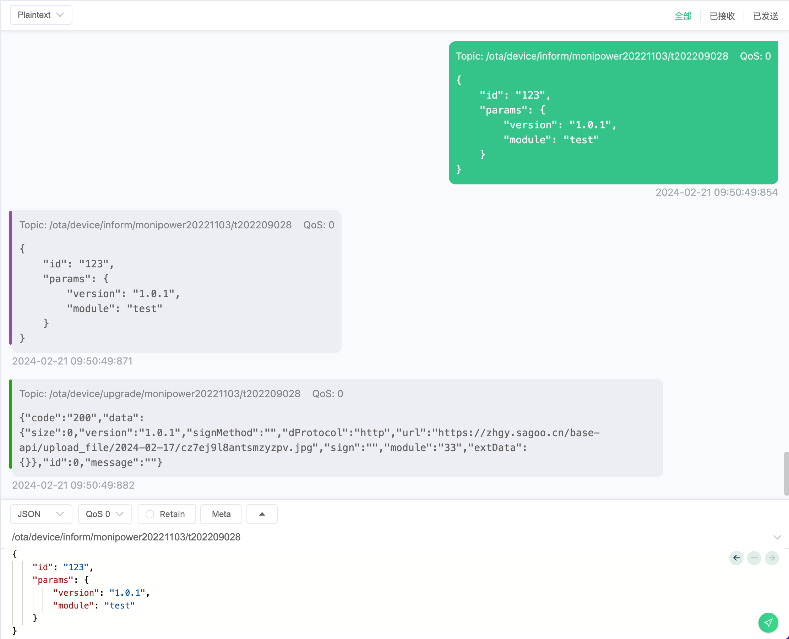
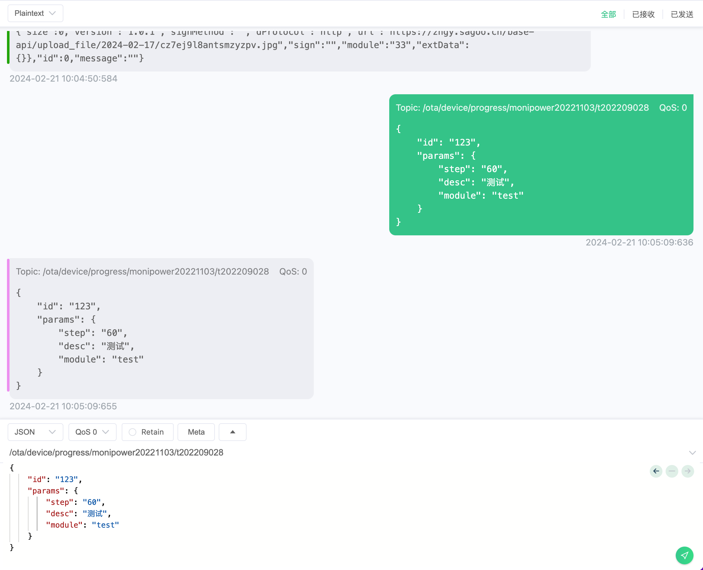
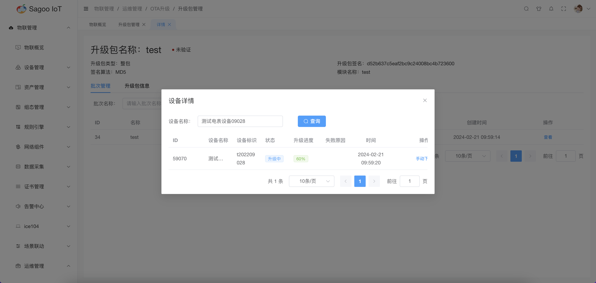

# OTA 升级


## 运行原理

OTA升级运行原理如下图所示：


在OTA升级服务中，按照以下模式运行：

- 设备上报版本号 将设备接入物联网平台，通过初始化和配置OTA功能，使设备能在首次升级前上报版本号，确保顺利进行功能更新和性能优化。
- 推送升级包信息 通过为设备添加OTA模块和升级包，用户可以定义不同可升级模块（如固件、软件、驱动），并选择完整的升级文件或差分升级方式，实现对设备的功能更新和性能优化。用户可选择验证升级包，确保升级成功后再进行批量升级。
- 设备下载升级包 设备通过HTTPS或MQTT协议获取升级包信息，并下载相应升级包，同时上报版本号和升级进度至SagooIOT物联网平台。
- 查看升级结果 通过查看设备升级状态和升级包信息，用户可以了解目标设备的升级情况，包括版本分布和成功率统计，从而分析OTA升级失败原因并提升设备升级成功率。

## 升级步骤

```mermaid
sequenceDiagram
    participant Device as 设备端
    participant OTA as SagoolOT<br/>OTA服务
    participant Management as SagoolOT<br/>管理

    Device->>OTA: 可选: 设备上报当前版本 (MQTT协议)<br/>/ota/device/inform/${ProductKey}/${DeviceKey}

    Management->>OTA: 在管理页面添加升级包，对设备发起OTA升级

    OTA->>Device: 下发升级包信息给设备 (MQTT协议)<br/>/ota/device/upgrade/${ProductKey}/${DeviceKey}

    OTA->>Device:  设备下载升级包 (HTTPS协议或MQTT协议)

    Device->>OTA: 设备上报升级进度 (MQTT协议)<br/>/ota/device/progress/${ProductKey}/${DeviceKey}

    Device->>OTA: 设备端升级完成后，上报最新版本 (MQTT协议)<br/>/ota/device/inform/${ProductKey}/${DeviceKey}

    OTA->>Management: 管理页面显示OTA升级进度
    OTA->>Management: 管理页面显示升级成功
```


**注：** 文件下载方式现在只支持Https协议，MQTT协议暂不支持。


## 上报ota相关信息
1. 请求Topic: `/ota/device/inform/${productKey}/${deviceKey}`
2. 请求数据格式:

```json
{
  "id": "123",
  "params": {
    "version": "1.0.1",
    "module": "MCU"
  }
}
```

字段说明
1. id: 消息ID，用于唯一标识一条消息，由设备端生成，必须保证唯一性。类型为字符串
2. version: OTA模块版本，类型为字符串
3. module: OTA模块名称，类型为字符串

### MQTT示例


##  推送ota升级包
1. 请求Topic: `/ota/device/upgrade/${productKey}/${deviceKey}`
2. 请求数据格式:
    1. 升级包为https
       ```json
       {
           "code": "200",
           "data": {
               "size": 432945,
               "version": "2.0.0",
               "url": "https://***/nop***.tar.gz?Expires=1502955804&OSSAccessKeyId=***&Signature=XfgJu7P6DW***qAKU%3D&security-token=***Tz2IHtIf3***",
               "sign": "93230c3bde425a9d***",
               "signMethod": "MD5",
               "module": "MCU",
               "extData":{
                   "key1":"value1",
                   "key2":"value2",
                   "_package_udi":"{\"ota_notice\":\"升级底层摄像头驱动，解决视频图像模糊的问题。\"}"
               }
           },
           "id": 1626969597470,
           "message": "success"
       }
       ```
    2. 字段说明
        1. code: 应答码，200表示成功，其他表示失败。
        2. id: 消息ID，每个请求唯一
        3. message: 结果信息
        4. version: 设备升级包的版本信息
        5. url: 升级包下载地址，类型为字符串,OTA升级包中仅有一个升级包文件，且下载协议为HTTPS时，包含该参数。
        6. sign: 	OTA升级包文件的签名。OTA升级包中仅有一个升级包文件时，包含该参数。
        7. signMethod: 签名方法。取值：SHA256 MD5 对于Android差分升级包类型，仅支持MD5签名方法。
        8. module: 升级包所属的模块名。模块名为default时，物联网平台不下发module参数。
        9. extData: 扩展数据，类型为json字符串,升级批次标签列表和推送给设备的自定义信息。_package_udi表示自定义信息的字段。单个标签格式："key":"value"
        10. dProtocol: 升级包传输协议，类型为字符串,仅升级包下载协议为MQTT时，包含该参数.


## 上报升级进度信息
1. 请求Topic: `/ota/device/progress/${productKey}/${deviceKey}`
2. 请求数据格式:
```json
{
    "id": "123",
    "params": {
        "step": "-1",
        "desc": "OTA升级失败，请求不到升级包信息。",
        "module": "MCU"
    }
}
```
字段说明

1. id: 消息ID，用于唯一标识一条消息，由设备端生成，必须保证唯一性。类型为字符串
2. step: OTA升级进度，类型为字符串.取值范围如下
    1. 1~100的整数：升级进度百分比。
    2. -1：升级失败。
    3. -2：下载失败。
    4. -3：校验失败。
    5. -4：烧写失败。
3. desc: 升级描述，类型为字符串，长度不超过128个字符。如果发生异常，此字段可承载错误信息。
4. module: OTA模块名称，类型为字符串

### MQTT示例


### 界面示例

