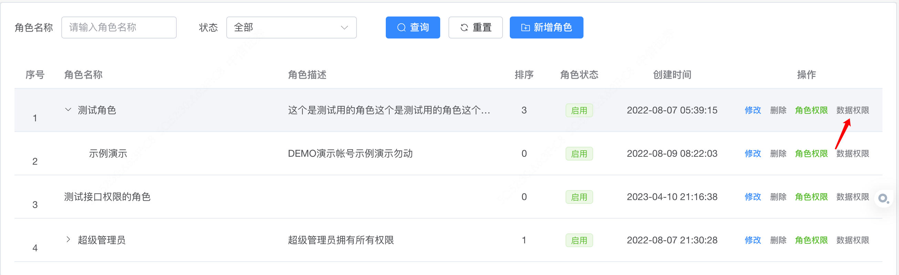
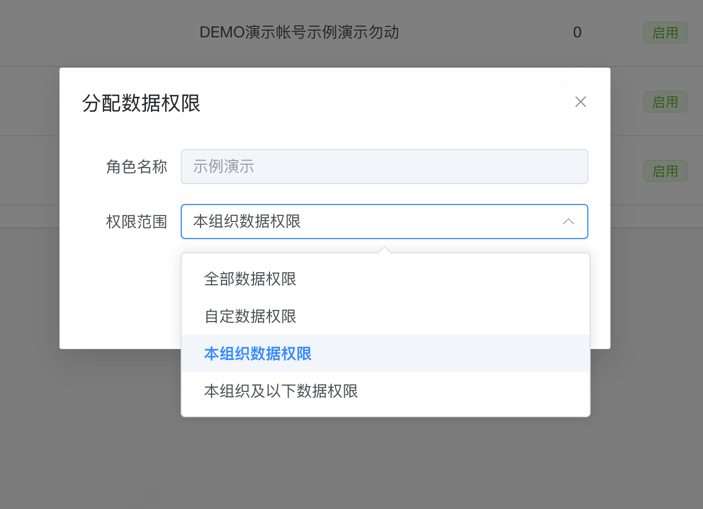

# 数据权限

## 概述

数据权限是指根据不同的用户角色或部门，对数据的查看、修改、删除等操作进行授权控制。数据权限的设计和实现，可以有效保护数据安全，并确保数据的合理使用。


## 数据权限的实现

* **应用程序级别**：通过应用程序的拦截器或过滤器来实现数据权限。在应用程序中，根据用户的身份和部门来判断是否有权限访问数据。
 
## 数据权限的开发步骤

* 在设计的数据表中增加dept_id等字段信息
* 在列表查询的logic实现中，增加调用以下方法获取对应的where对数据进行筛选

```go
    //根据数据权限过滤数据
    m, _ = service.SysAuthorize().FilterDataByPermissions(ctx, m)
```

## 数据权限的注意事项

* **数据库**：数据库对应的表结构，必须增加dept_id字段信息

## 数据权限配置




