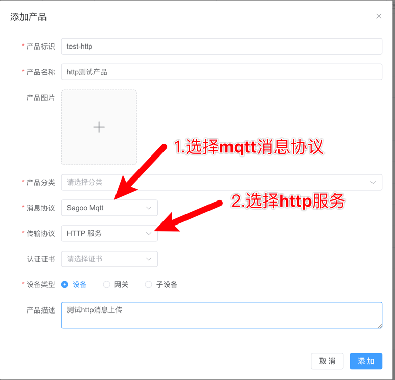
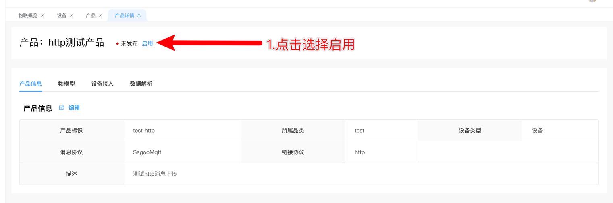
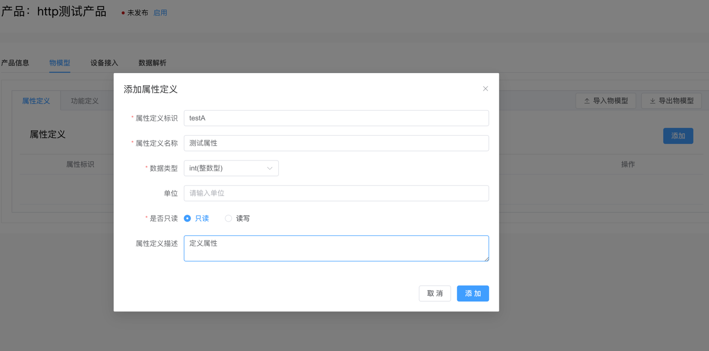
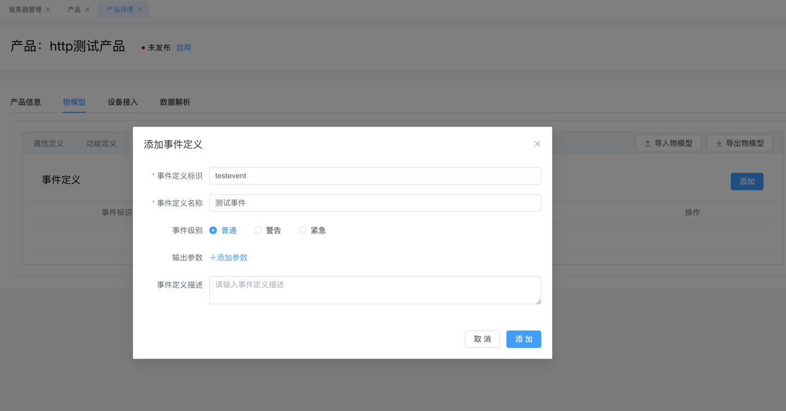
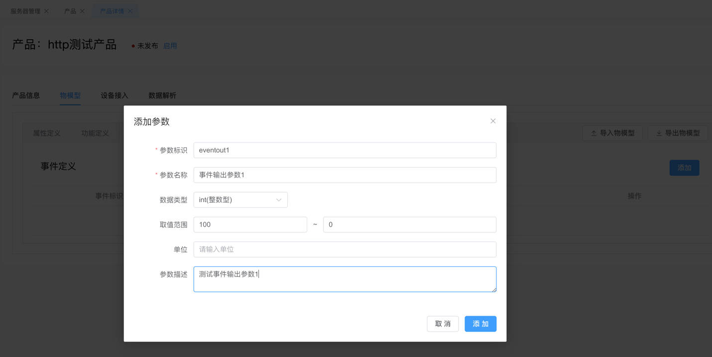
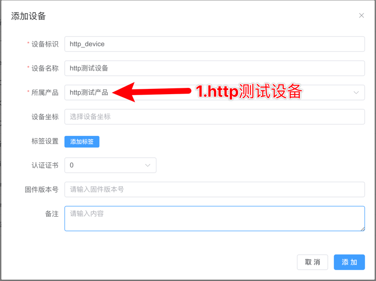
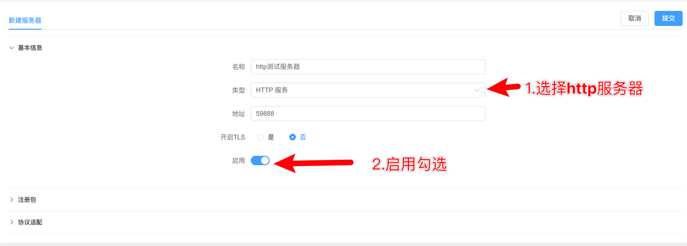
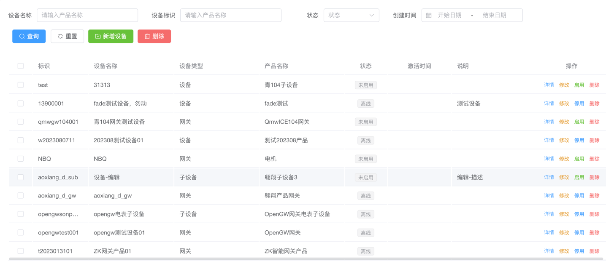
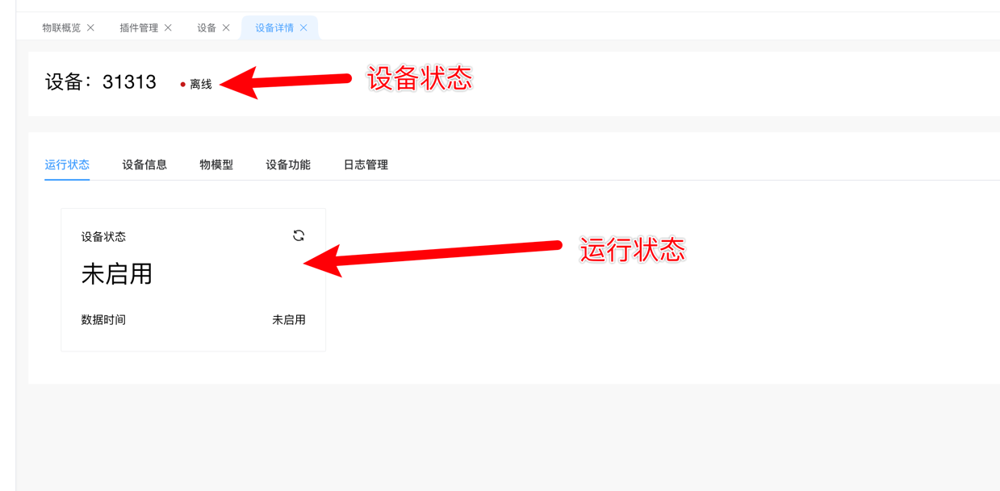

# HTTP 设备接入

本教程介绍如何使用`HTTP`协议接入sagoo物联网平台。

## 创建http产品

登录sagoo物联网平台，点击左侧导航栏的`物联管理`->`设备管理`->`产品`->`添加`，创建一个HTTP产品。需要注意的是，消息协议需要选择`Sagoo Mqtt`，传输协议需要选择`服务器`

点击创建好的产品，点击`详情`,点击`启用`

## 创建产品物物模型

登录sagoo物联网平台，点击左侧导航栏的`物联管理`->`设备管理`->`产品`->`详情`->`物模型` 添加好物模型的相关属性和事件

## 创建http设备

点击左侧导航栏的`物联管理`->`设备管理`->`设备`，创建一个设备。需要注意的是，产品需要选择刚才创建的产品

## 创建http服务器

## 平台侧创建`http`服务器

点击左侧菜单栏`物联管理`->`网络组件`->`服务器管理`，点击`新建`,填写服务器`名称`，类型选择`http`服务器,`启用`勾选，然后点击`提交`。

## 按照下面的http协议进行请求

认证方式: `bear token`认证,`token` 为网络服务的服务器的 `token`

### 属性上报

1. 请求地址: `https://{domain}/:ProductKey/:DeviceKey/properties/report`
2. method: `POST`
3. 请求body: 参见mqtt服务请求的请求参数, json格式，放在http的报文中[设备上报属性](/guide/device_access/mqtt)

### 事件上报

1. 请求地址: `https://{domain}/:ProductKey/:DeviceKey/event/:EventId`
2. method: `POST`
3. 请求body: 参见mqtt服务请求的请求参数, json格式，放在http的报文中[设备上报事件](/guide/device_access/mqtt)

## 测试设备

1. 上面所有步骤都完成后，就可以测试设备了，打开设备列表，找到自己对应的测试设备(`物联管理`->`设备管理`->`设备`)。
   
2. 找到对应测试设备后，点击`操作`下面的`详情`按钮，进入设备详情查看设备状态是否在线以及相关属性信息是否上报成功。
   
