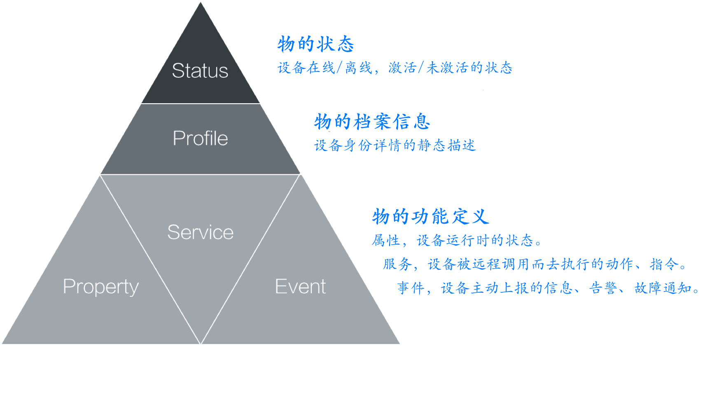
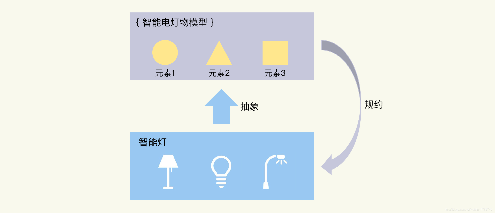
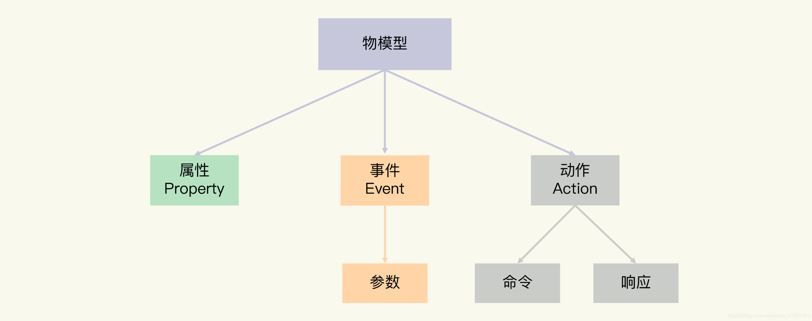

# 什么是物模型

现实世界是由真实存在的物理设备所组成的，我们可以将这些设备称之为“物”。物联网的目的则是能够将现实世界中的万“物”通过网络连接在一起，并将其数字化成云端的服务或者资源，通过整合各类服务资源实现智能化。因此，在物联网所构建的数字世界里，我们首先需要对“物”有一个清晰、统一的定义，用于描述“物”具体能做什么，能够提供什么样的服务和资源。ICA联盟从产品层面对“物”进行了功能建模，定义出统一的“物的抽象模型”以及“物的描述语言（TSL，Things Specification Language）”


# 物的抽象模型

物的抽象模型是对“设备是什么”、“设备能做什么”的一种描述，包括有：物的状态、物的档案信息、物的功能定义。


| 物的状态Status            | 设备在线/离线、激活/未激活的状态。                           |                                                              |
| ------------------------- | ------------------------------------------------------------ | ------------------------------------------------------------ |
| 物的档案信息Profile       | 设备身份详情的静态描述，包含设备身份标识和设备描述信息。     |                                                              |
| 物的功能定义Functionality | 属性Property                                                 | 属性是指设备运行时可持续存在的状态，例如电源开关，空调的目标温度，灯的亮度等，是一个可以持续存在的状态。属性支持get和set，应用系统可发起对属性的读取和设置请求。 |
| 服务Service               | 服务是设备能够被远程调用而去执行的动作、指令，通常需要花费一定时间执行，例如设备复位、重启，修改密码等。服务包含"输入参数"和"输出参数"，输入参数是指物在执行某一动作时需要的指令信息，输出参数是指物在完成某一动作后需要反馈的状态信息。 |                                                              |
| 事件Event                 | 事件是指在某种情况下物主动上报的信息，这类信息是无法通过查询物的属性而获知的。相比于属性状态，事件一般而言包含设备需要及时被外部感知和处理的通知信息，可包含多个输出参数，如某项任务完成的信息或者设备发生故障/告警时的温度等，事件可以被订阅和推送。 |                                                              |

# 物的描述语言TSL

ICA数据标准的平台会采用JSON Schema定义，自动生成物模型的描述代码（JSON格式），我们称之为“物的描述语言”（TSL, Things Specification Language）。


## 物模型（产品模型、数据模板）

物模型指将物理空间中的实体数字化，并在云端构建该实体的数据模型。在物联网平台中，定义物模型即定义产品功能。完成功能定义后，系统将自动生成该产品的物模型。物模型描述产品是什么、能做什么、可以对外提供哪些服务。

物模型TSL（Thing Specification Language）。是一个JSON格式的文件。它是物理空间中的实体，如传感器、车载装置、楼宇、工厂等在云端的数字化表示，从属性、服务和事件三个维度，分别描述了该实体是什么、能做什么、可以对外提供哪些信息。定义了这三个维度，即完成了产品功能的定义。

使用 TSL 描述的物联网中的实体模型，就是“物模型”也称产品模型、数据模板。

物模型将产品功能类型分为三类：属性、服务和事件。定义了这三类功能，即完成了物模型的定义。

> 以上名词来自阿里云物联网平台，解释原文: https://www.alibabacloud.com/help/zh/doc-detail/73727.htm

| 功能类型         | 说明                                                         |
| ---------------- | ------------------------------------------------------------ |
| 属性（Property） | 一般用于描述设备运行时的状态，如环境监测设备所读取的当前环境温度等。属性支持GET和SET请求方式。应用系统可发起对属性的读取和设置请求。 |
| 服务（Service）  | 设备可被外部调用的能力或方法，可设置输入参数和输出参数。相比于属性，服务可通过一条指令实现更复杂的业务逻辑，如执行某项特定的任务。 |
| 事件（Event）    | 设备运行时的事件。事件一般包含需要被外部感知和处理的通知信息，可包含多个输出参数。如，某项任务完成的信息，或者设备发生故障或告警时的温度等，事件可以被订阅和推送。 |


## 模型和设备的关系是什么？

物模型是物理世界的实体东西的一个抽象，是进行数字化描述后，用于数字世界的数字模型。抽象就是要提取出产品的共同特征，形成模型。以智能灯为例，不同的灯，尽管规格不同，但它们的属性是相似，比如都有开关状态的属性，功能逻辑也相仿。我们可以将这些特征标准化，形成智能灯的物模型。
反过来，物模型也规约了设备的功能。新增加的设备，如果是同一类型的，在设计、研发中，会遵循相同的功能定义，有相同的特征，实现相同的服务。比如，灯都应该有“开”和“关”两种状态。



## 要使用物模型？
基于共同的抽象特征，物模型可以让应用程序不再针对一个个的产品设备，而是同一类设备采用相同的处理逻辑。这实际上是应用开发的基础。当烟感传感器的数值触发报警时，即使是不同品牌的烟感产品，应用程序也可以对数值做相同的处理和判断，否则只能分别进行数值分析。
另外，物模型中，设备的功能是明确定义的，可以方便地实现场景联动。比如，光线传感器可以基于光照强度，向智能电灯发送亮度的控制命令，或者开和关的命令。

## 定义物模型的三种功能元素
### 属性–了产品设备运行时的某种状态
我们知道，智能电灯的状态，要么是打开，要么是关闭；当进行控制时，这两种状态还会相互转换。此外，有些灯还可以根据需求设置不同的亮度、颜色和色温等。
属性的特点是可读可写。也就是说，应用程序可以读取属性，也可以设置设备的属性。我们还可以看到类似的例子，比如环境监测设备的温度、湿度这两个属性等。

### 事件–由产品设备在运行过程中产生的信息、告警和故障等
如果智能电灯在运行过程中，出现了低电压的情况，或者发生了硬件故障，那么联网的设备可以将这些信息发送出去，通知你来及时作出处理。
一个事件可以包含多个输出参数。事件不同于属性，事件是设备上报的，不能由应用来设置。类似的例子，还有某任务完成时的消息，环境传感器检测到污染物的告警等。

### 动作（服务）–被调用的能力或者方法
我们再看生活中关于灯的一个使用场景：第一次约会的时候，你希望灯能够烘托出浪漫的气氛，就要调节灯的颜色、亮度和色温。如果分别设置属性，将会非常繁琐，这时你会想到要为灯增加一个场景模式的功能，一个命令就可以设置到浪漫模式。
这种设备
动作由应用下发给设备，设备可以返回结果给应用。从执行的流程看，动作还可以进一步分为同步和异步。这取决于动作是否是个耗时的操作，以及其他应用逻辑对于动作执行结果的依赖关系。




## 物模型的六种数据类型
和编程语言一样，作为一种模型语言，物模型的数据也有不同的数据类型。它们主要包括六种：
布尔型（Bool）：非真即假的二值型变量。例如，开关功能只有开、关两种状态。
整数型（Int）：可用于线性调节的整数变量。例如，电灯的亮度是一个整数范围。
字符串型（String）：以字符串形式表达的功能点。例如，灯的位置。
浮点型（Float）：精度为浮点型的功能点。例如，电压值的范围是 0.0 - 24.0。
枚举型（Enum）：自定义的有限集合值。例如，灯的颜色有白色、红色、黄色等。
时间型（Timestamp）：String 类型的 UTC 时间戳。
对于整数型、浮点型的数值，它们的单位可以是百分比、电压、米等。
物模型一般是用 JSON 格式来表述模型元素。JSON 是 Web 开发中，经常使用的数据格式，相比于 XML，它更加简洁、清晰，也更轻量级。

按照属性、事件、动作 / 服务这三个要素，一起看看如何用 JSON 格式来定义智能电灯的物模型吧。

## 智能电灯的物模型
智能电灯的开关属性是布尔类型，是必须有的属性。它可以通过 JSON 表述如下：


```json
{
      "id": "power_switch",   //属性的唯一标识
      "name": "电灯开关",      //名称
      "desc": "控制电灯开灭",   //属性的详细描述
      "required": true,       //表示此属性是否必需包含，是
      "mode": "rw",           //属性的模式，r代表读，w代表写
      "define": {             //属性的数值定义
        "type": "bool",       //数值的类型，布尔
        "mapping": {          //具体数值的含义
          "0": "关",           //0表示灯关闭
          "1": "开"            //1表示灯打开
        }
      }
    }
    
```


智能电灯的电压是需要监控的数值，当电压低时，可以上报这个事件。这个事件有一个参数，即电压值，数据类型是浮点类型。JSON 格式的描述如下：

```json
 {
   "id": "low_voltage",      //事件唯一标识
   "name": "LowVoltage",      //事件名称
   "desc": "Alert for device voltage is low",  //事件的描述
   "type": "alert",          //事件的类型，告警
   "required": false,        //表示此属性是否必需包含，否
   "params": [                //事件的参数
     {
       "id": "voltage",        //事件参数的唯一标识
       "name": "Voltage",      //事件参数的名称
       "desc": "Current voltage",  //参数的描述
       "define": {                 //参数的数值定义
         "type": "float",          //数值类型，浮点数
         "unit": "V",              //数值的单位，伏
         "step": "1",              //数值变化的步长，1
         "min": "0.0",              //数值的最小值
         "max": "24.0",             //数值的最大值
         "start": "1"                //事件的起始值
       }
     }
   ]
 }

```

动作的定义，和属性、事件的定义过程类似，这里我就不再单独解释了。我们直接将所有属性、事件和动作合并，就得到了智能电灯物模型的完整 JSON 格式：

```json
{
  "version": "1.0",            //模型版本
  "properties": [              //属性列表
    {
      "id": "power_switch",    //电灯开关属性
      "name": "电灯开关",
      "desc": "控制电灯开灭",
      "required": true,
      "mode": "rw",
      "define": {
        "type": "bool",
        "mapping": {
          "0": "关",
          "1": "开"
        }
      }
    },
    {
      "id": "brightness",        //亮度属性
      "name": "亮度",
      "desc": "灯光亮度",
      "mode": "rw",
      "define": {
        "type": "int",
        "unit": "%",
        "step": "1",
        "min": "0",
        "max": "100",
        "start": "1"
      }
    },
    {
      "id": "color",            //电灯颜色属性
      "name": "颜色",
      "desc": "灯光颜色",
      "mode": "rw",
      "define": {
        "type": "enum",
        "mapping": {
          "0": "Red",
          "1": "Green",
          "2": "Blue"
        }
      }
    },
    {
      "id": "color_temp",        //色温属性
      "name": "色温",
      "desc": "灯光冷暖",
      "mode": "rw",
      "define": {
        "type": "int",
        "min": "0",
        "max": "100",
        "start": "0",
        "step": "10",
        "unit": "%"
      }
    }
  ],
  "events": [                        //事件列表
    {
      "id": "status_report",          //运行状态报告
      "name": "DeviceStatus",
      "desc": "Report the device status",
      "type": "info",
      "required": false,
      "params": [                      //事件参数列表
        {
          "id": "status",
          "name": "running_state",
          "desc": "Report current device running state",
          "define": {
            "type": "bool",
            "mapping": {
              "0": "normal",
              "1": "fault"
            }
          }
        },
        {
          "id": "message",
          "name": "Message",
          "desc": "Some extra message",
          "define": {
            "type": "string",
            "min": "0",
            "max": "64"
          }
        }
      ]
    },
    {
      "id": "low_voltage",            //低电压告警事件
      "name": "LowVoltage",
      "desc": "Alert for device voltage is low",
      "type": "alert",
      "required": false,
      "params": [
        {
          "id": "voltage",
          "name": "Voltage",
          "desc": "Current voltage",
          "define": {
            "type": "float",
            "unit": "V",
            "step": "1",
            "min": "0.0",
            "max": "24.0",
            "start": "1"
          }
        }
      ]
    },
    {
      "id": "hardware_fault",            //硬件错误事件
      "name": "Hardware_fault",
      "desc": "Report hardware fault",
      "type": "fault",
      "required": false,
      "params": [
        {
          "id": "name",
          "name": "Name",
          "desc": "Name like: memory,tf card, censors ...",
          "define": {
            "type": "string",
            "min": "0",
            "max": "64"
          }
        },
        {
          "id": "error_code",
          "name": "Error_Code",
          "desc": "Error code for fault",
          "define": {
            "type": "int",
            "unit": "",
            "step": "1",
            "min": "0",
            "max": "2000",
            "start": "1"
          }
        }
      ]
    }
  ],
  "actions": [],                  //动作列表
  "profile": {                    //产品参数
    "ProductId": "8D1GQLE4VA",    //产品ID
    "CategoryId": "141"            //产品分类编号
  }
}

```

创建模型–拷贝和继承
创建模型的时候，有拷贝和继承两种模式，这两种创建模式的不同主要体现在模型关系上。

**“拷贝”**模式类似于编程语言中的值拷贝，新建模型与被拷贝模型有完全相同的三元素，两个模型相互独立，模型变更互不影响。

**“继承”**模式就是面向对象编程中的继承概念，新建模型被定义为“子模型”，被继承的模型定义为“父模型”。
继承的具体特征是：
1.子模型继承父模型的所有要素，且继承的元素无法被修改。
2.子模型可以再被继承，支持多层的继承关系。
3.子模型可以创建独立的要素，但子模型中新增的要素不可以和所有上级父模型中的元素重名。
4.当父模型中的元素发生变更时，子模型中继承自父模型的元素同步变更，保持与父模型一致。

以我们刚刚定义的智能电灯的物模型为例，如果要增加安装位置的属性，可以继承已有的模型，然后再增加安装位置的属性。（注意：下面的 JSON 表述省略了与父模型重复的内容。）
```json
{
...
{
      "id": "name",                  //灯位置属性
      "name": "灯位置名称",
      "desc": "灯位置名称：书房、客厅等",
      "mode": "rw",
      "required": false,
      "define": {
        "type": "string",
        "min": "0",
        "max": "64"
      }
    }
...
}

```

