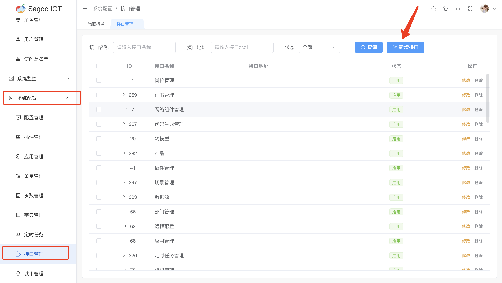
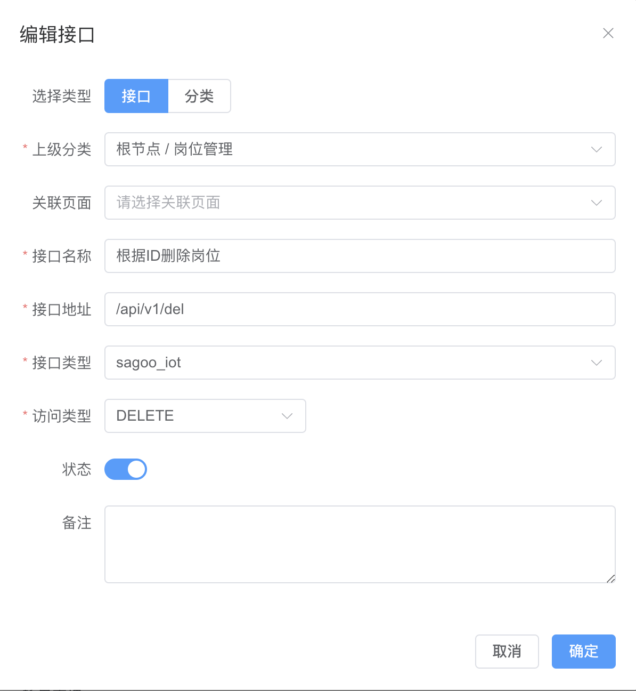
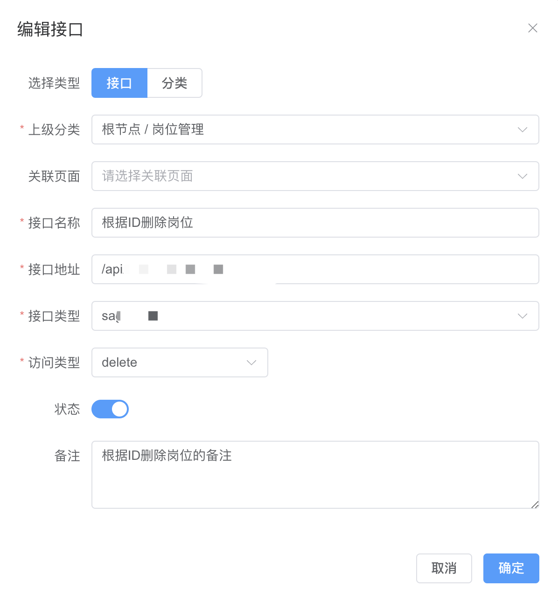
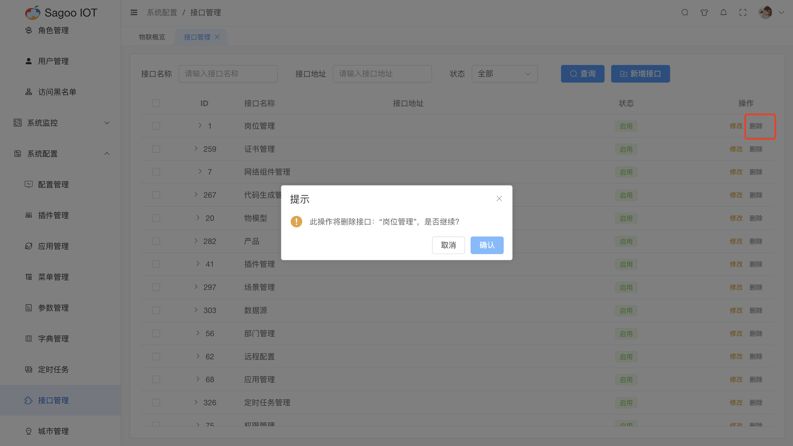

# 接口管理

SagooIoT系统中的接口由接口管理进行集中管理。方便在系统权限配置过程中，对接口进行统一的权限管理。

## 创建接口

1. 请确保已登录SagooIOT物联网平台。

2. 在左侧导航栏中，选择系统配置->接口管理

3. 创建接口
* 点击“新增接口”按钮。
  
* 在弹出的对话框中，输入必填项。
  
* 确定后，系统将创建并显示新的接口。

## 修改接口信息

* 如果需要编辑接口的名称或其他信息，可以在接口列表项点击“修改”按钮进行修改。
  

## 删除接口信息

* 如果需要删除接口的信息，可以在接口列表项点击“删除”按钮进行删除。
  

## 页面内容说明

| 接口名称 | 描述                 |
|------|--------------------|
| 选择类型 | 必选框，是对接口类型进行定义。    |
| 上级分类 | 必选框，是对上级分类进行定义。    |
| 关联页面 | 非必选框，是对关联页面进行定义。   |
| 接口名称 | 必填输入框，是对接口名称进行定义。  |
| 接口地址 | 必填输入框，是对接口地址进行定义。  |
| 接口类型 | 必选框，是对接口类型进行定义。    |
| 访问类型 | 必选框，是对接口访问类型进行定义。  |
| 状态   | 必选框，是对接口是否启用进行定义。  |
| 备注   | 非必填输入框，是对接口描述进行定义。 |

