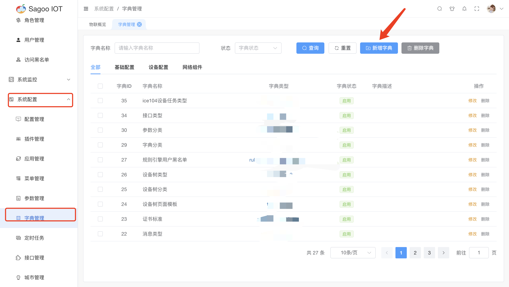
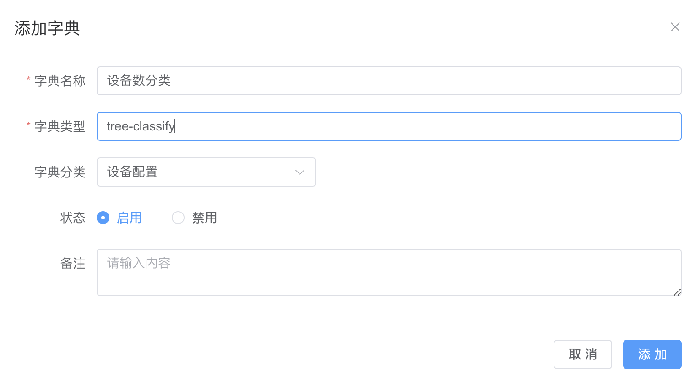
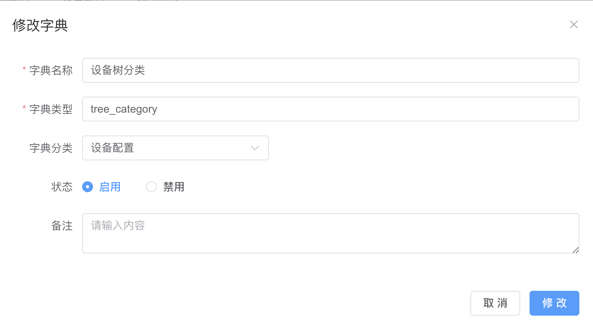
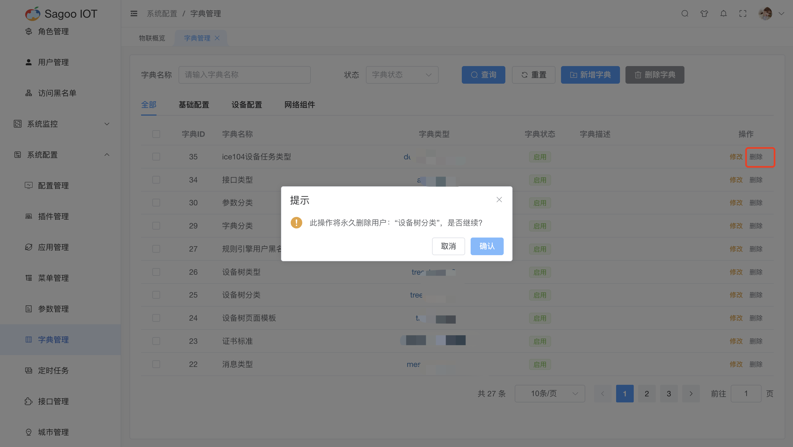

# 字典管理

SagooIoT系统中涉及到字典内容的都由字典管理进行集中管理。

## 创建字典

1. 请确保已登录SagooIOT物联网平台。

2. 在左侧导航栏中，选择系统配置->字典管理

3. 创建字典
点击“新增字典”按钮。
  
在弹出的对话框中，输入必填项。
  
确定后，系统将创建并显示新的字典。

| 字典名称 | 描述                    |
|------|-----------------------|
| 字典名称 | 必填输入框，是对字典名称进行定义。     |
| 字典类型 | 必填输入框，是对字典类型进行定义。     |
| 字典分类 | 非必选框，是对字典分类进行定义。      |
| 状态   | 非必选框，是对字典是否启用进行定义。    |
| 备注   | 非必填输入框，是对字典描述进行定义。    |

## 修改字典信息

如果需要编辑字典的名称或其他信息，可以在字典列表项点击“修改”按钮进行修改。
  

## 删除字典信息

如果需要删除字典的信息，可以在字典列表项点击“删除”按钮进行删除。
  

  

