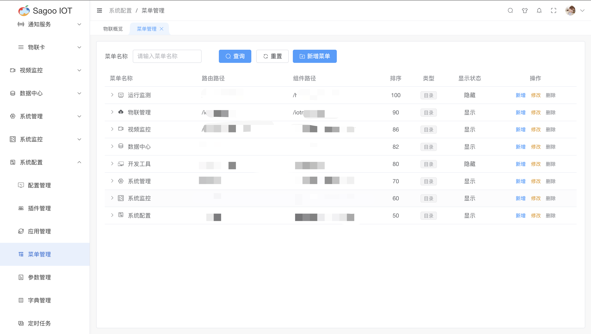
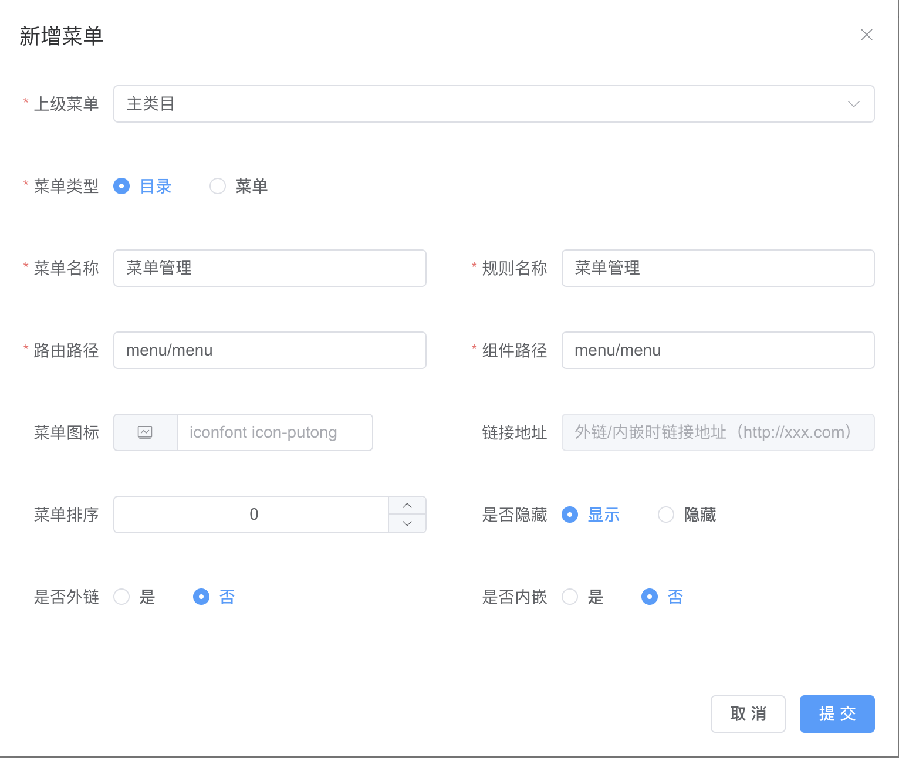
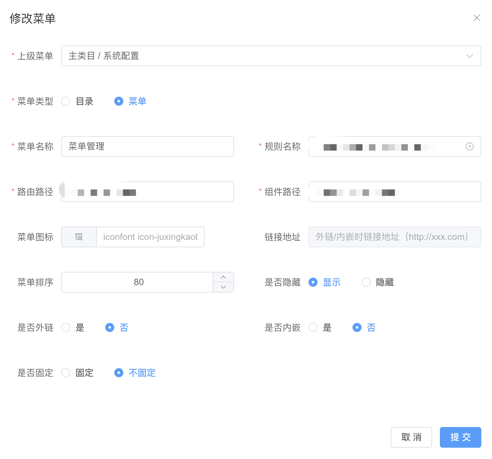

# 菜单管理

菜单管理是指对系统或应用程序中的菜单进行设计、配置和管理的过程。菜单通常用于用户界面，以提供对系统功能、操作和内容的访问和导航。

## 创建菜单

1. 请确保已登录SagooIOT物联网平台。

2. 在左侧导航栏中，选择系统配置->菜单管理

3. 创建菜单
点击“新增菜单”按钮。
  
在弹出的对话框中，输入必填项。
  
确定后，系统将创建并显示新的菜单。

| 参数名称 | 描述                          |
|------|-----------------------------|
| 上级菜单 | 必选框，是对上级菜单进行定义。             |
| 菜单类型 | 必选框，是对菜单类型进行定义，类型包含目录和菜单选项。 |
| 菜单名称 | 必填输入框，是对菜单名称进行定义。           |
| 规则名称 | 必填输入框，是对规则名称进行定义。           |
| 路由路径 | 必填输入框，是对页面路径进行定义。           |
| 组件路径 | 必填输入框，是对前端代码目录的路径进行定义。      |
| 菜单图标 | 非必填输入框，是对菜单图标进行定义。          |
| 是否隐藏 | 非必选框，是对菜单是否隐藏进行定义。          |
| 是否外链 | 非必选框，是对菜单是否外链进行定义。          |
| 是否内嵌 | 非必选框，是对菜单是否内嵌进行定义。          |

## 修改菜单信息

如果需要编辑菜单的名称或其他信息，可以在菜单列表项点击“修改”按钮进行修改。
  

## 删除菜单信息

如果需要删除菜单的信息，可以在菜单列表项点击“删除”按钮进行删除。

## 按钮权限说明
在菜单列表“二级菜单”操作项中点击“更多-按钮权限”，此处的功能是对当前菜单的按钮权限进行配置。

## 列表权限说明
在菜单列表“二级菜单”操作项中点击“更多-列表权限”，此处的功能是对当前菜单的列表权限进行配置。

## 接口权限说明
在菜单列表“二级菜单”操作项中点击“更多-接口权限”，此处的功能是对当前菜单的接口权限进行配置。
