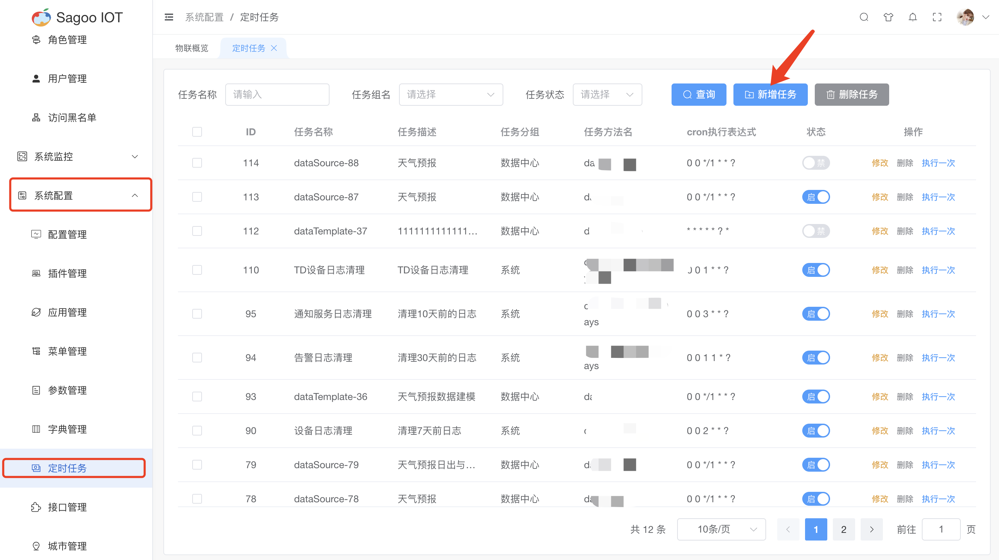
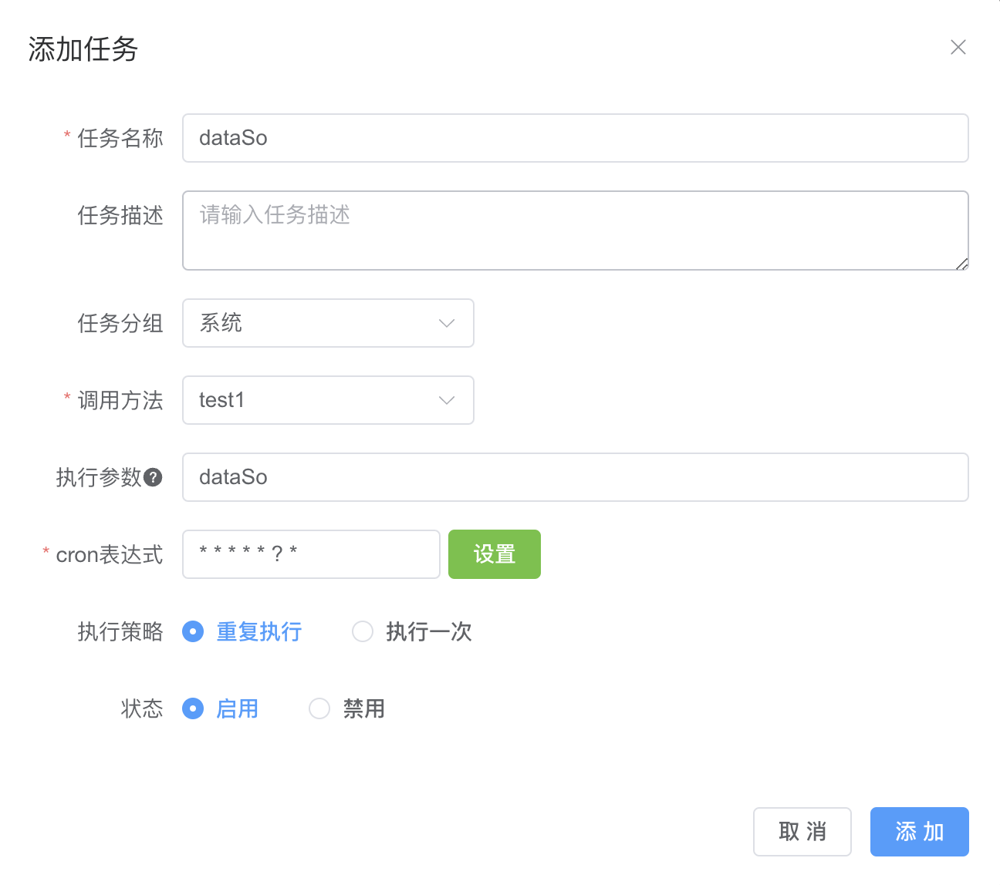
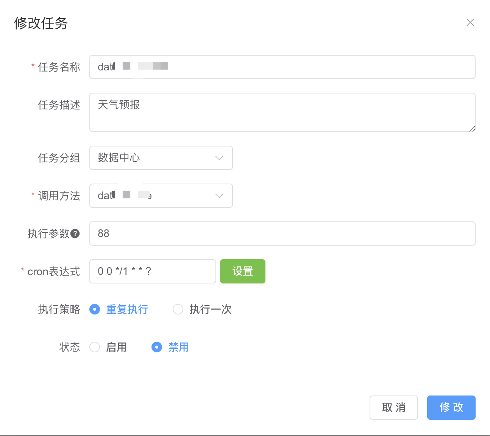
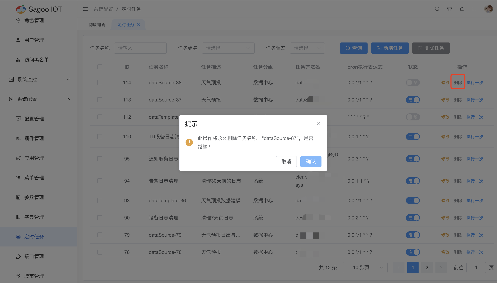

# 定时任务

## 定时任务说明

定时任务是指系统或应用程序按照预定的时间计划执行的自动化任务或操作。这些任务可以周期性地执行，也可以在特定的日期和时间点执行。

## 创建任务

1. 请确保已登录SagooIOT物联网平台。

2. 在左侧导航栏中，选择系统配置->定时任务

3. 创建任务
点击“新增任务”按钮。
  
在弹出的对话框中，输入必填项。
  
确定后，系统将创建并显示新的任务。

| 任务名称    | 描述                     |
|---------|------------------------|
| 任务名称    | 必填输入框，是对任务名称进行定义。      |
| 任务描述    | 非必填输入框，是对任务描述进行定义。     |
| 任务分组    | 非必选框，是对任务分组进行定义。       |
| 调用方法    | 必选框，是对调用方法进行定义。        |
| 执行参数    | 非必填输入框，是对执行参数进行定义。     |
| cron表达式 | 必填输入框，是对任务cron表达式进行定义。 |
| 执行策略    | 非必选，是对任务的执行策略进行定义。     |
| 状态      | 非必选框，是对任务是否启用进行定义。     |

:::note 备注
建议采用配置界面进行配置，不直接输入，避免设置错误
:::

## 修改任务信息

如果需要编辑任务的名称或其他信息，可以在任务列表项点击“修改”按钮进行修改。
  

## 删除任务信息

如果需要删除任务的信息，可以在任务列表项点击“删除”按钮进行删除。
  

## 执行一次

如果需要立即执行任务，可以在任务列表项点击“执行一次”按钮进行执行。

