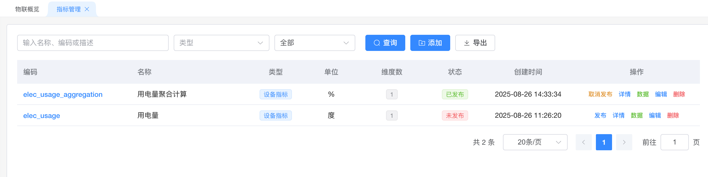
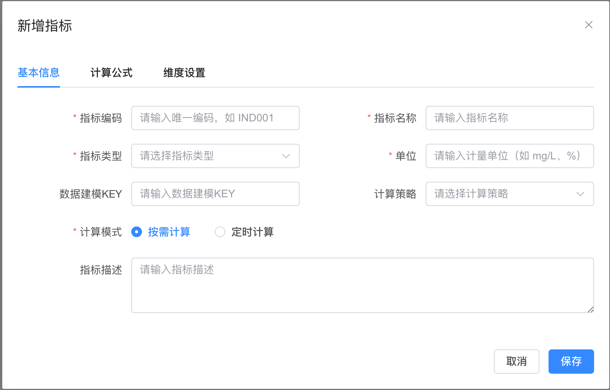
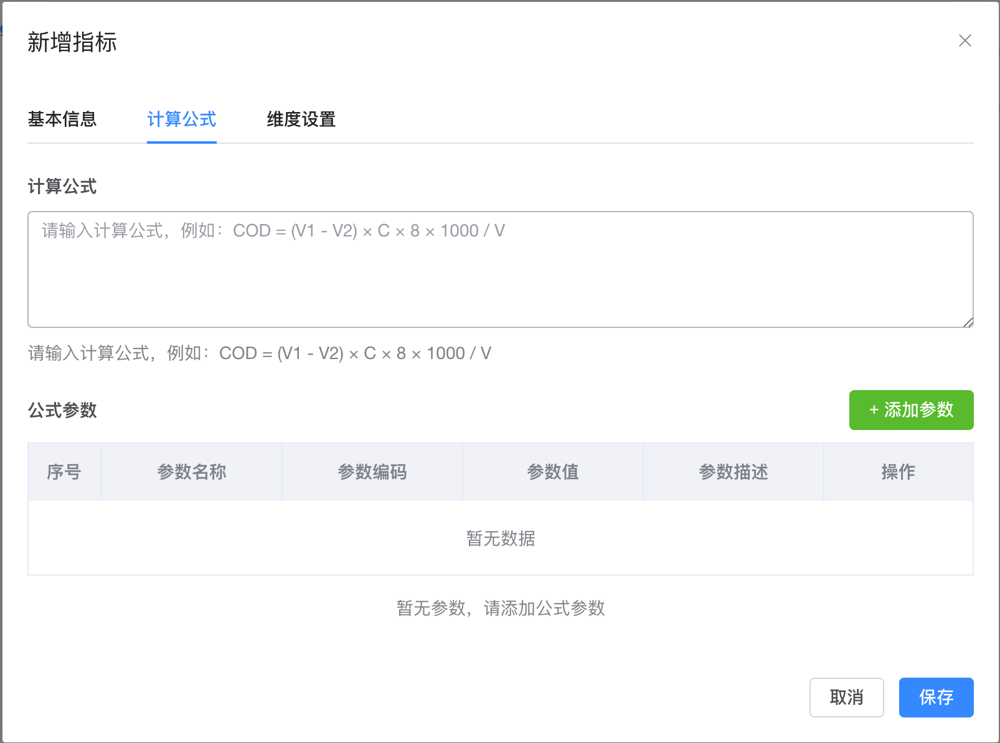
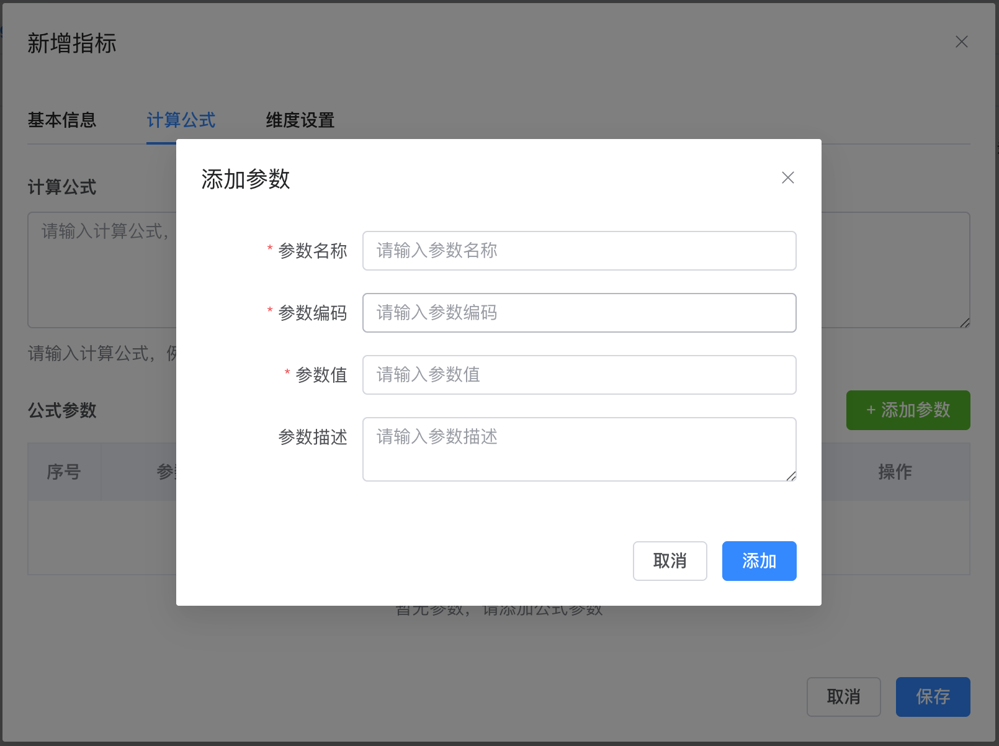
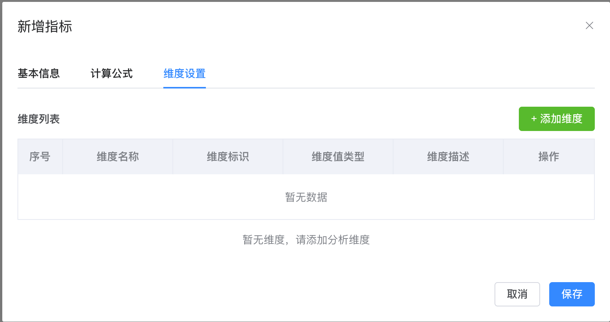
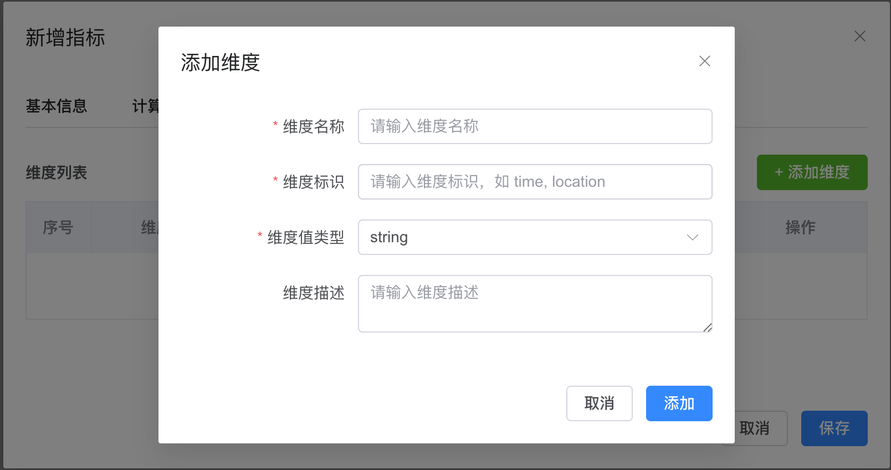
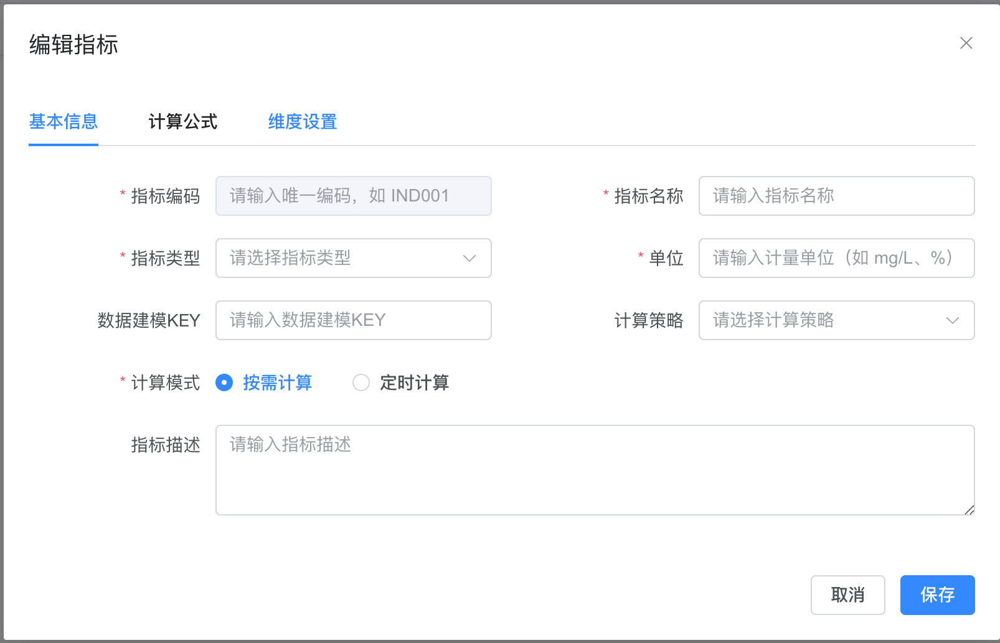
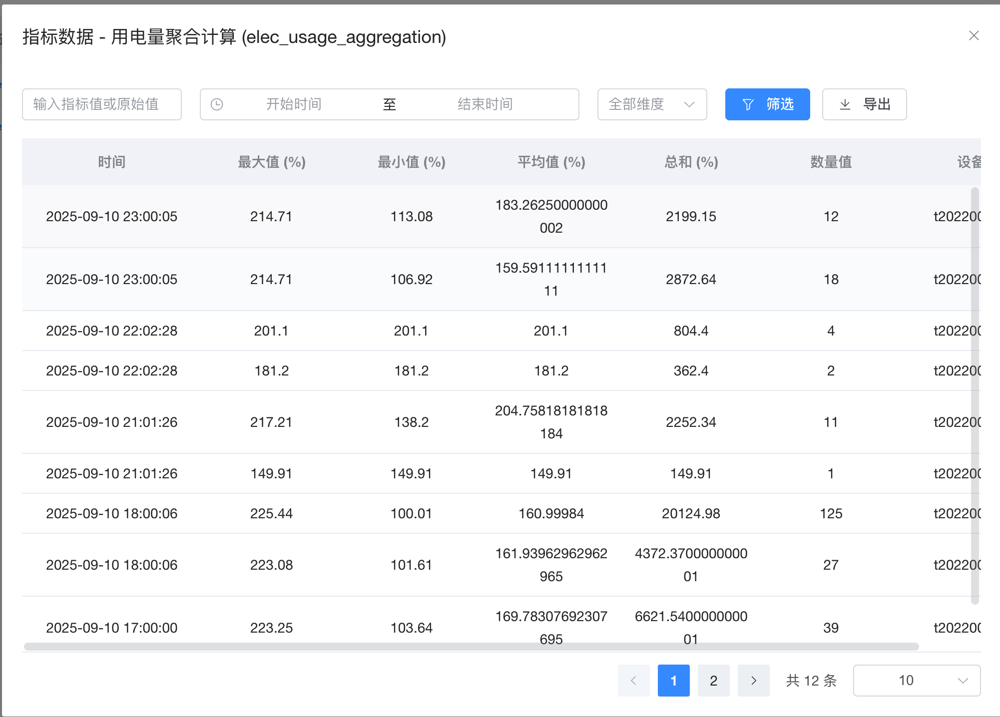

# 指标管理

## 系统概述

指标管理系统是一个集成化平台，用于统一管理企业内部的各种业务指标。系统支持指标定义、数据采集、计算分析、可视化展示等全流程管理，为业务决策提供有力支持。

### 核心功能
- **指标定义与管理**：支持多种计算策略的指标定义
- **数据建模集成**：与数据建模系统深度集成
- **计算服务支持**：支持聚合、累计、数学等多种计算
- **定时任务调度**：支持定时自动计算
- **多维度分析**：支持维度设置和多维度数据分析

## ⚠️ 使用前必读

### 系统配置前置条件

在开始使用指标管理系统之前，请确保完成以下必要的系统配置：

#### 1. 标签管理配置（必须）
**目的**：为指标类型提供分类标签

**操作步骤**：
1. 进入"标签管理"模块
2. 创建指标类型相关的标签
    - 示例标签：
        - 设备指标
        - 电力指标
        - 水质指标
        - 环境指标
3. 记录创建的标签根标识

#### 2. 系统参数配置（必须）
**目的**：配置指标类型的标签根标识

**操作步骤**：
1. 进入"系统管理" → "系统参数"
2. 添加或修改以下参数：
    - **参数键名**：`sys.indicator.type.tagCode`
    - **参数值**：标签管理中创建的指标类型标签根标识
    - **参数描述**：指标类型标签根标识配置

**示例配置**：
```
参数键名：sys.indicator.type.tagCode
参数值：indicator_type_root
参数描述：指标类型标签根标识，用于指标类型分类管理
```

#### 3. 数据源准备（定时计算指标必须）
**适用场景**：当指标配置为定时计算模式时

**操作步骤**：
1. **创建数据源**：
    - 进入"数据中心" → "数据源管理"
    - 创建对应的数据源连接
    - 测试数据源连接是否正常

2. **创建数据建模**：
    - 进入"数据中心" → "数据建模"
    - 基于数据源创建数据建模模板
    - 配置数据采集规则和字段映射
    - 启动数据采集，确保有数据流入

3. **获取数据建模KEY**：
    - 记录创建的数据建模模板的KEY
    - 在指标配置时将使用此KEY进行数据绑定

**重要提醒**：
- 定时计算指标依赖数据建模提供的原始数据
- 必须确保数据建模正常采集数据后，才能创建定时计算指标
- 按需计算指标可以不依赖数据建模，通过API直接提供数据

### 配置检查清单

在创建指标前，请确认以下项目已完成：

- [ ] 标签管理中已创建指标类型标签
- [ ] 系统参数中已配置 `sys.indicator.type.tagCode`
- [ ] （定时计算）数据源已创建并连接正常
- [ ] （定时计算）数据建模已创建并正常采集数据
- [ ] （定时计算）已获取数据建模KEY


---

## 指标列表管理

### 功能概述
指标列表页面是系统的主入口，提供指标的查看、搜索、筛选和基本管理功能。



### 页面元素说明

| 元素 | 功能说明 |
|------|----------|
| 搜索框 | 支持按指标名称模糊搜索 |
| 类型筛选 | 按指标类型进行筛选 |
| 状态筛选 | 按发布状态筛选（全部/已发布/未发布） |
| 查询按钮 | 执行搜索和筛选操作 |
| 添加按钮 | 新增指标 |
| 导出按钮 | 导出指标列表 |

### 操作步骤

#### 1. 查看指标列表
1. 登录系统后，点击左侧菜单"指标管理"
2. 系统默认显示所有指标的列表
3. 列表显示以下信息：
    - **编码**：指标的唯一标识
    - **名称**：指标的业务名称
    - **类型**：指标分类
    - **单位**：计量单位
    - **维度数**：该指标包含的维度数量
    - **状态**：发布状态（已发布/未发布）
    - **创建时间**：指标创建时间
    - **操作**：编辑、查看、删除等操作

#### 2. 搜索指标
1. 在搜索框中输入指标名称关键字
    - 示例：输入"用电量"搜索相关指标
2. 点击"查询"按钮执行搜索
3. 系统显示匹配的指标列表

#### 3. 筛选指标
1. **按类型筛选**：
    - 点击"类型"下拉框
    - 选择指标类型（如：设备指标、电力指标等）
    - 点击"查询"按钮

2. **按状态筛选**：
    - 点击"状态"下拉框
    - 选择状态（全部/已发布/未发布）
    - 点击"查询"按钮

#### 4. 组合搜索
可以同时使用名称搜索和类型、状态筛选进行精确查找：
1. 输入搜索关键字
2. 选择类型和状态
3. 点击"查询"按钮

### 示例数据
```
指标编码：elec_usage_aggregation
指标名称：用电量聚合计算
类型：设备指标
单位：%
维度数：1
状态：已发布
创建时间：2025-08-26 14:33:34
```

---

## 新增指标

### 功能概述
新增指标功能支持创建新的业务指标，包括基本信息设置、计算公式配置和维度设置三个步骤。



### 操作流程

#### 第一步：基本信息设置


##### 必填字段

| 字段名 | 说明 | 示例 |
|--------|------|------|
| 指标编码 | 唯一标识，建议使用英文和下划线 | `elec_usage_total` |
| 指标名称 | 业务名称，便于理解 | `总用电量` |
| 指标类型 | 从标签管理系统选择 | `设备指标` |
| 单位 | 计量单位 | `kWh`、`%`、`度` |

##### 可选字段

| 字段名 | 说明 | 示例 |
|--------|------|------|
| 数据建模KEY | 关联数据源 | `device_power_data` |
| 计算策略 | 选择计算方式 | `聚合计算` |
| 计算模式 | 按需计算/定时计算 | `定时计算` |
| 指标描述 | 详细说明 | `统计设备总用电量，用于能耗分析` |

##### 操作步骤
1. 点击"添加"按钮打开新增指标对话框
2. 填写指标编码（必须唯一）
   ```
   示例：elec_usage_device_001
   ```
3. 填写指标名称
   ```
   示例：设备001用电量
   ```
4. 选择指标类型
    - 点击下拉框选择已定义的标签类型
5. 填写单位
   ```
   示例：kWh（千瓦时）
   ```
6. 填写数据建模KEY（如果需要关联数据源）
7. 选择计算策略和计算模式
8. 填写指标描述
9. 点击"下一步"进入计算公式设置

#### 第二步：计算公式设置



##### 计算策略说明

| 策略类型 | 适用场景 | 示例 |
|----------|----------|------|
| 聚合计算 | 求和、平均值、最大值等 | 设备总用电量、平均温度 |
| 累计计算 | 时序数据累计 | 月度累计用电量 |
| 数学计算 | 自定义公式计算 | COD = (V1 - V2) × C × 8 × 1000 / V |
| 条件计算 | 基于条件的逻辑计算 | 设备状态判断 |
| 统计分析 | 方差、标准差等 | 数据质量分析 |

##### 操作步骤

**1. 聚合计算配置**
- 系统自动计算所有聚合方法（sum、avg、max、min、count）
- 无需手动配置公式
- 直接进入下一步

**2. 数学计算配置**
1. 在计算公式文本框中输入公式
   ```
   示例公式：COD = (V1 - V2) × C × 8 × 1000 / V
   ```
2. 点击"添加参数"按钮添加公式参数



3. 填写参数信息：
    - **参数名称**：`A相电压`
    - **参数编码**：`va`
    - **参数值**：`va`（对应数据字段）
    - **参数描述**：`设备A相电压值`

4. 重复添加所有需要的参数
5. 点击"保存"完成公式配置

**3. 其他计算策略**
根据选择的计算策略，按照系统提示配置相应参数。

#### 第三步：维度设置



##### 维度概念
维度用于对指标数据进行分类、分组和细化，支持多角度数据分析。

##### 操作步骤
1. 点击"添加维度"按钮



2. 填写维度信息：
    - **维度名称**：`设备`
    - **维度标识**：`devicekey`
    - **维度值类型**：选择`string`
    - **维度描述**：`设备唯一标识`

3. 点击"添加"保存维度
4. 重复添加其他维度（如位置、时间等）
5. 点击"保存"完成指标创建

### 完整示例

#### 示例1：设备用电量指标
```
基本信息：
- 指标编码：device_power_consumption
- 指标名称：设备用电量
- 指标类型：设备指标
- 单位：kWh
- 数据建模KEY：power_meter_data
- 计算策略：聚合计算
- 计算模式：定时计算

维度设置：
- 维度1：设备（devicekey, string）
- 维度2：位置（location, string）
```

#### 示例2：COD计算指标
```
基本信息：
- 指标编码：cod_calculation
- 指标名称：COD浓度计算
- 指标类型：水质指标
- 单位：mg/L
- 计算策略：数学计算
- 计算模式：按需计算

计算公式：
- 公式：COD = (V1 - V2) × C × 8 × 1000 / V
- 参数：
  * V1：滴定前体积（v1, float）
  * V2：滴定后体积（v2, float）
  * C：浓度系数（c, float）
  * V：样品体积（v, float）

维度设置：
- 维度1：监测点（monitoring_point, string）
- 维度2：深度（depth, string）
```

---

## 编辑指标

### 功能概述
编辑指标功能允许修改已创建指标的配置信息，包括基本信息、计算公式和维度设置。



### 操作步骤

#### 1. 进入编辑模式
1. 在指标列表中找到要编辑的指标
2. 点击操作列中的"编辑"按钮
3. 系统打开编辑指标对话框，显示当前配置信息

#### 2. 修改基本信息
1. 在"基本信息"标签页中修改相关字段
2. **注意**：指标编码一般不建议修改，可能影响历史数据
3. 可以修改指标名称、类型、单位等信息

#### 3. 修改计算公式
1. 切换到"计算公式"标签页
2. 修改计算公式或参数配置
3. 对于数学计算，可以：
    - 修改公式表达式
    - 添加、删除或修改参数
    - 调整参数值和描述

#### 4. 修改维度设置
1. 切换到"维度设置"标签页
2. 可以添加新维度或修改现有维度
3. **注意**：删除维度可能影响历史数据的查询

#### 5. 保存修改
1. 完成所有修改后点击"保存"按钮
2. 系统验证配置的有效性
3. 保存成功后返回指标列表

### 注意事项
- 已发布的指标修改后需要重新发布才能生效
- 修改计算策略会影响数据表结构
- 建议在修改前备份重要配置信息

---

## 指标数据查看

### 功能概述
指标数据查看功能提供已发布指标的计算结果查询和分析。系统根据不同指标的计算策略，展示相应的计算结果数据，为业务分析和决策提供数据支持。

**重要说明**：指标系统展示的是经过计算处理后的指标结果，而非未经处理的原始数据。不同的计算策略会产生不同类型的结果数据。

### 数据查询操作



#### 页面元素说明

| 元素 | 功能说明 |
|------|----------|
| 指标值搜索 | 搜索特定的指标计算结果数值 |
| 时间范围选择 | 选择查询的时间区间 |
| 维度筛选 | 按维度值进行筛选 |
| 筛选按钮 | 执行查询操作 |
| 导出按钮 | 导出查询结果 |

#### 基本操作步骤

1. **进入数据查看页面**
    - 在指标列表中点击指标名称
    - 或点击操作列中的"查看数据"按钮

2. **设置查询条件**
    - **时间范围**：选择开始时间和结束时间
    - **维度筛选**：选择特定维度值进行筛选
    - **数值搜索**：输入特定的指标值进行搜索

3. **执行查询**
    - 点击"筛选"按钮执行查询
    - 系统返回符合条件的指标计算结果

### 不同计算策略的结果展示

根据指标配置的计算策略不同，系统会展示相应类型的计算结果：

#### 聚合计算结果

**适用指标**：配置为聚合计算策略的指标

**结果数据包含**：
- **时间**：计算时间点
- **最大值**：时间窗口内的最大值
- **最小值**：时间窗口内的最小值
- **平均值**：时间窗口内的平均值
- **总和**：时间窗口内的总和
- **数量值**：参与计算的数据点数量
- **维度信息**：相关的维度值（如设备、位置等）

**示例数据**：
```
时间：2025-09-10 16:39:37
最大值：220.59%
最小值：100.29%
平均值：157.6996%
总和：7884.98%
数量值：50
设备：t202200001
```

#### 累计计算结果

**适用指标**：配置为累计计算策略的指标

**结果数据包含**：
- **时间**：计算时间点
- **累计值**：从起始时间到当前时间的累计结果
- **当期值**：当前时间窗口的计算值
- **维度信息**：相关的维度值

**示例数据**：
```
时间：2025-09-10 16:39:37
累计用电量：15420.8 kWh
当期用电量：1250.6 kWh
设备：device_001
位置：workshop_a
```

#### 数学计算结果

**适用指标**：配置为数学计算策略的指标

**结果数据包含**：
- **时间**：计算时间点
- **计算结果**：根据数学公式计算得出的指标值
- **维度信息**：相关的维度值

**示例数据**：
```
时间：2025-09-10 16:39:37
COD浓度：125.67 mg/L
监测点：point_001
深度：surface
```

#### 条件计算结果

**适用指标**：配置为条件计算策略的指标

**结果数据包含**：
- **时间**：计算时间点
- **条件结果**：基于条件逻辑的计算结果
- **状态信息**：相关的状态或等级
- **维度信息**：相关的维度值

**示例数据**：
```
时间：2025-09-10 16:39:37
设备状态：正常
运行等级：优良
设备：pump_001
区域：zone_a
```

#### 统计分析结果

**适用指标**：配置为统计分析策略的指标

**结果数据包含**：
- **时间**：计算时间点
- **统计指标**：方差、标准差、置信区间等
- **样本信息**：样本数量、有效数据点等
- **维度信息**：相关的维度值

**示例数据**：
```
时间：2025-09-10 16:39:37
标准差：12.45
方差：155.00
样本数：100
数据源：sensor_group_01
```

### 数据导出

#### 操作步骤
1. 设置好查询条件（时间范围、维度筛选等）
2. 点击"导出"按钮
3. 选择导出格式（Excel、CSV等）
4. 系统生成并下载指标计算结果文件

#### 导出内容
- **查询条件信息**：时间范围、维度筛选条件等
- **指标基本信息**：指标名称、编码、计算策略、单位等
- **计算结果数据**：根据指标计算策略展示的完整结果记录
- **统计汇总信息**：数据总量、时间跨度等统计信息

#### 导出文件示例结构
```
指标信息：
- 指标名称：设备用电量聚合计算
- 指标编码：elec_usage_aggregation
- 计算策略：聚合计算
- 单位：%

查询条件：
- 时间范围：2025-09-01 至 2025-09-10
- 设备筛选：t202200001

计算结果数据：
时间                    | 最大值  | 最小值  | 平均值    | 总和     | 数量值 | 设备
2025-09-10 16:39:37    | 220.59% | 100.29% | 157.70%  | 7884.98% | 50    | t202200001
2025-09-10 15:39:37    | 215.32% | 98.45%  | 152.88%  | 7644.12% | 50    | t202200001
...

统计汇总：
- 总记录数：1,250条
- 时间跨度：10天
- 导出时间：2025-09-10 23:15:30
```
---

## 指标发布管理

### 功能概述
指标发布管理控制指标的生效状态，只有已发布的指标才会执行数据计算和采集。

### 发布状态说明

| 状态 | 说明 | 特点 |
|------|------|------|
| 未发布 | 指标已创建但未激活 | 不执行计算，不产生数据 |
| 已发布 | 指标已激活并运行 | 执行定时计算，产生数据 |

### 操作步骤

#### 1. 发布指标
1. 在指标列表中找到未发布的指标
2. 点击操作列中的"发布"按钮
3. 系统执行以下操作：
    - 验证指标配置的完整性
    - 创建指标数据表
    - 创建定时任务（如果是定时计算模式）
    - 更新指标状态为"已发布"

#### 2. 取消发布
1. 在指标列表中找到已发布的指标
2. 点击操作列中的"取消发布"按钮
3. 系统执行以下操作：
    - 停止定时任务
    - 保留历史数据
    - 更新指标状态为"未发布"

#### 3. 重新发布
1. 修改已发布指标的配置后
2. 需要重新发布才能使修改生效
3. 系统会更新相关配置并重启计算任务

### 发布后的系统行为

#### 定时计算指标
- 系统自动创建名为`indicator-{指标编码}`的定时任务
- 任务组为"indicatorJob"
- 按配置的计算周期自动执行
- 可在定时任务管理界面查看执行状态

#### 按需计算指标
- 不创建定时任务
- 通过API或手动触发计算
- 适用于临时分析需求

### 注意事项
- 发布前请确保指标配置正确
- 发布后的指标开始消耗系统资源
- 取消发布不会删除历史数据
- 重新发布可能需要一定时间生效

---
