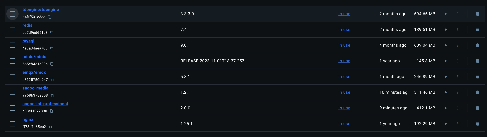

# SagooIOT快速部署指南

## 环境要求
| 组件 | 版本要求 |
|------|----------|
| Docker | ≥ 20.0.0 |
| Docker Compose | ≥ 2.29.7 |


## 部署步骤

:::tip 提示
本指南使用docker-compose进行一键安装。在开始之前，请确保服务器已安装docker-compose。

如未安装，请参考[Docker官方安装文档](https://docs.docker.com/compose/install/)进行安装。
:::

### 1. 获取部署文件

1. 下载docker-compose编排文件：
```bash
# 仓库地址
http://收费版代码库/Sagoo-Cloud/sagoo-docker-compose.git
```

2. 上传文件到服务器：
```bash
# 上传到以下目录
/data/base-server/docker-compose
```

### 2. 安装基础环境

1. 进入部署目录：
```bash
cd /opt/sagoo/docker-compose-base
```

2. 启动服务：
```bash
docker-compose up -d
```

### 3. 验证安装

1. 查看镜像状态：
```bash
docker images
```



2. 检查容器运行状态：
```bash
docker ps -a
```


## 系统访问

### 登录信息

| 项目 | 值 |
|------|-----|
| 访问地址 | http://localhost |
| 默认账号 | admin |
| 默认密码 | admin123456 |
