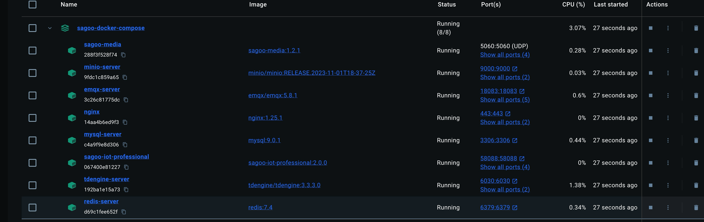

:::info 前置条件
- 本地已安装 Docker
- docker（版本>=20.0.0）
- docker-compose （版本>=2.29.7）
:::

## 快速部署

PS:以下使用docker-compose进行一键安装，在安装之前需要保证服务器支持使用docker-compose命令,未安装可以去docker官网安装docker-compose
官网地址: `https://docs.docker.com/compose/install/`

docker编排版本: v2.29.7

1. 下载docker-compose编排文件
   仓库地址:
   ```
   http://git.mydig.net/Sagoo-Cloud/sagoo-docker-compose.git
   ```
2. 将下载后的docker-compose编排文件上传到服务器目录`/opt/sagoo`
3. 进入到`/opt/sagoo/docker-compose-base`目录下，
4. 使用以下命令进行安装基础环境
   ```linux
     docker-compose up -d
   ```
5. 查看镜像是否都拉取并构建成功
   ```linux
      docker images
   ```

6. 查看容器是否都正常启动
   ```linux
      docker ps -a
   ```

## 访问系统

访问SagooIoT管理界面

- 服务端：`http://localhost:8200`
- 地址: http://localhost
   账号: admin
   密码: admin123456
