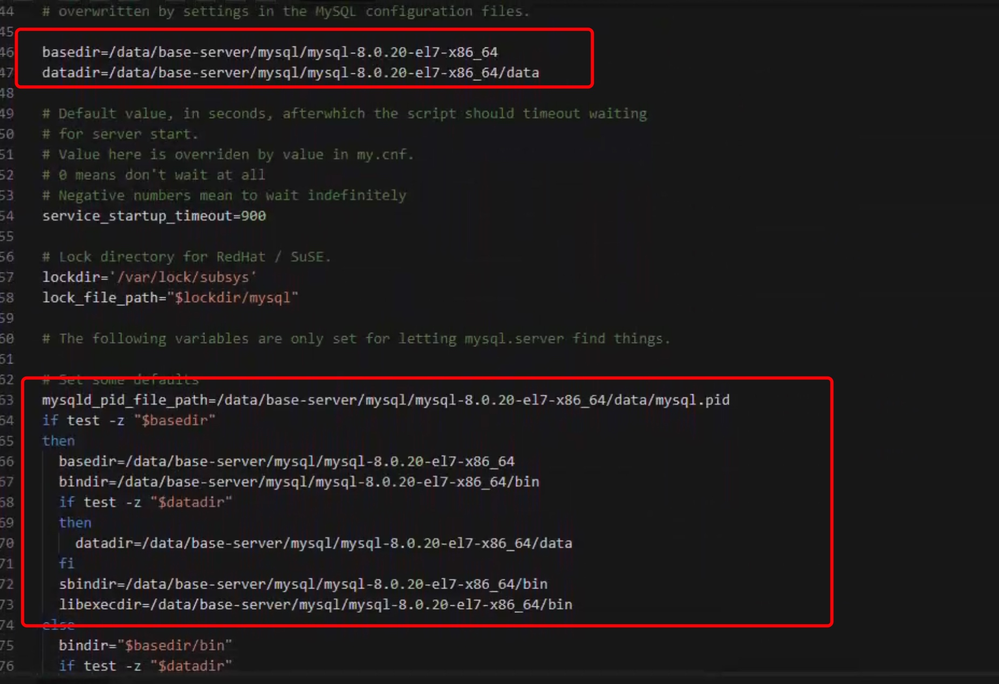
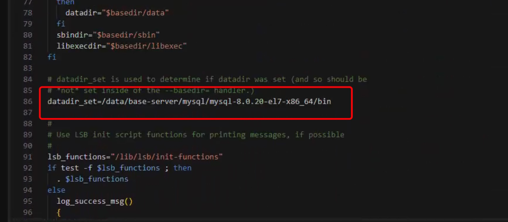
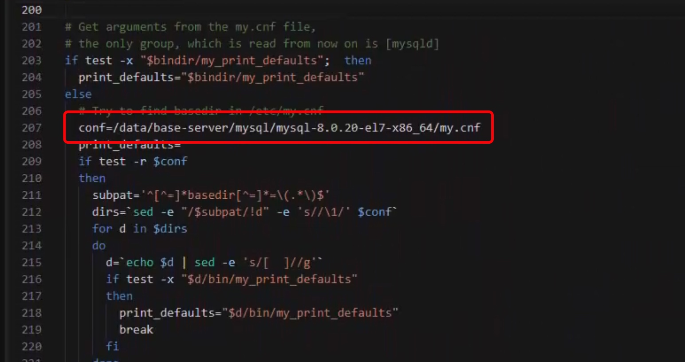
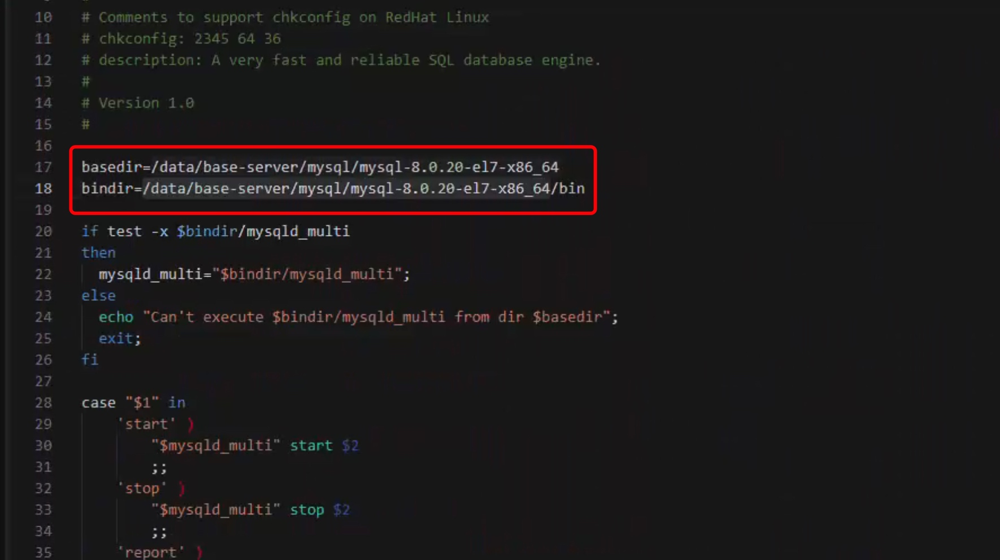
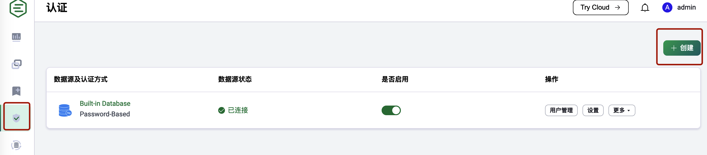

## 环境组件

SagooIOT基础环境安装包括以下几个部分：

| 组件名称 | 版本要求 | 说明 | 相关文档 |
|---------|---------|------|----------|
| Redis | ≥ 7.x | 缓存数据库 | [官方安装文档](https://redis.io/docs/getting-started/installation/) |
| MySQL/PostgreSQL | ≥ 5.7.x / ≥ 16.x | 关系型数据库 | [MySQL](https://dev.mysql.com/doc/) / [PostgreSQL](https://www.postgresql.org/docs/) |
| TDengine | ≥ 3.3.x | 时序数据库 | [官方安装文档](https://docs.taosdata.com/get-started/package/) |
| EMQX | 5.8.2-el7-amd64 | 消息中间件 | [官方安装文档](https://www.emqx.io/docs/zh/v5.1/getting-started/getting-started.html) |
| Nginx | ≥ 1.27.2 | Web服务器 | [官方安装文档](https://nginx.org/en/docs/index.html) |

:::note 说明
- TDengine可选用Influxdb替代
- EMQX为可选组件，SagooIoT默认有自己的MQTT服务
- MySQL和PostgreSQL 任选其一安装即可
:::

## Redis安装

下面是在 Linux 上安装 Redis 7.x 的详细步骤：

### 1. 升级系统并安装必要的软件包

**Debian/Ubuntu系统：**
```bash
sudo apt-get update
sudo apt-get upgrade
sudo apt-get install build-essential tcl
```

:::note 注意
**CentOS系统：**

CentOS 7 及以下版本：
```bash
sudo yum update
sudo yum install gcc make tcl
```

CentOS 8 及以上版本：
```bash
sudo dnf check-update
sudo dnf upgrade
sudo dnf install gcc make tcl
```
:::

### 2. 安装Redis

1. 下载Redis源代码：
```bash
wget http://download.redis.io/releases/redis-7.4.0.tar.gz
```

2. 解压源码包：
```bash
tar xzf redis-7.4.0.tar.gz
```

3. 编译并安装Redis：
```bash
cd /data/base-server/redis/redis-7.4.0
make && make PREFIX=./ install
```

4. 配置redis.conf：
```bash
bind 0.0.0.0          #远程访问
protected-mode no     #关闭保护模式
daemonize yes        #开启守护进程
requirepass admin123456 #设置连接密码
```

5. 启动服务：
```bash
cd /data/base-server/redis/redis-7.4.0/src
./redis-server ../redis.conf
```

6. 验证Redis是否启动：
```bash
ps -ef | grep redis
```

7. 连接redis服务：
```bash
./redis-cli -h 127.0.0.1 -p 6379 -a admin123456
```

:::tip 提示
上面的步骤是在一个没有安装 Redis 的系统上执行的。如果您已经安装了 Redis，请先卸载它，然后再按照上面的步骤重新安装。
请确保您有 root 权限，并在每一步操作前确保系统已经升级到最新版本。
:::

## MySQL安装

### 1. 下载与解压

1. 下载MySQL到服务器：
```bash
wget https://dev.mysql.com/get/Downloads/MySQL-8.0/mysql-8.0.20-el7-x86_64.tar.gz
```

2. 解压文件：
```bash
tar xf mysql-8.0.20-el7-x86_64.tar.gz 
```

### 2. 配置MySQL

1. 创建数据目录：
```bash
cd /data/base-server/mysql/mysql-8.0.20-el7-x86_64
mkdir data
```

2. 创建配置文件：
```bash
cd /data/base-server/mysql/mysql-8.0.20-el7-x86_64
touch my.cnf
```

3. 编辑my.cnf：
```ini
[mysqld]
### 端口号                                 
port=3306

### 安装目录                                
basedir=/data/base-server/mysql/mysql-8.0.20-el7-x86_64/

### 数据存放路径                              
datadir=/data/base-server/mysql/mysql-8.0.20-el7-x86_64/data/

### 会话文件目录
socket=/data/base-server/mysql/mysql-8.0.20-el7-x86_64/data/mysql.sock

# 允许连接失败的最大次数                        
max_connect_errors=10

# 服务端的字符集编码                           
character-set-server=utf8mb4
          
# 默认存储引擎                              
default-storage-engine=INNODB

# 默认用户                                
user=root

# 开启慢查询                               
#slow_query_log=on                     

# 慢查询日志文件目录                           
#slow_query_log_file=/data/base-server/mysql/mysql-8.0.20-el7-x86_64/slow-query.log

[client]
### 连接服务端使用的端口号                          
port=3306
### 会话文件                                 
socket=/data/base-server/mysql/mysql-8.0.20-el7-x86_64/data/mysql.sock
# 默认字符集编码                              
default-character-set=utf8mb4
```

4. 修改mysql.server文件：
```bash
cd /data/base-server/mysql/mysql-8.0.20-el7-x86_64
vi ./support-files/mysql.server
```




5. 修改mysqld_multi.server文件：
```bash
cd /data/base-server/mysql/mysql-8.0.20-el7-x86_64
vi ./support-files/mysqld_multi.server
```


### 3. 初始化与启动

1. 初始化数据库：
```bash
cd /data/base-server/mysql/mysql-8.0.20-el7-x86_64
./bin/mysqld --defaults-file=/data/base-server/mysql/mysql-8.0.20-el7-x86_64/my.cnf --initialize --console --user=root
```

:::tip 提示
初始化后有一个临时密码，这个临时密码一定要保存，后面第一次登录服务需要
:::

2. 创建mysql.sock文件：
```bash
cd /data/base-server/mysql/mysql-8.0.20-el7-x86_64/data
touch mysql.sock
```

3. 启动MySQL服务：
```bash
cd /data/base-server/mysql/mysql-8.0.20-el7-x86_64
./bin/mysqld_safe --defaults-file=my.cnf &
```

4. 验证MySQL是否启动：
```bash
ps -ef | grep mysql
```

5. 登录MySQL数据库：
```bash
cd /data/base-server/mysql/mysql-8.0.20-el7-x86_64
./bin/mysql --socket=./data/mysql.sock -uroot -p
```

6. 修改密码及设置远程登录：
```sql
ALTER USER 'root'@'localhost' IDENTIFIED WITH mysql_native_password BY 'root';
show databases;
use mysql;
update user set host='%' where user ='root';
flush privileges;
```

:::note 备注
以上步骤执行完成之后，默认账号密码都是root，也可以设置自定义密码
:::

## PostgreSQL安装

### 1. 环境准备

1. 下载PostgreSQL 16.3：
```bash
wget https://www.postgresql.org/ftp/source/v16.3/postgresql-16.3.tar.gz
```

2. 解压安装包：
```bash
tar -zxf postgresql-16.3.tar.gz
```

### 2. 编译安装

1. 配置和编译：
```bash
1. cd /data/base-server/postgres
2. ./configure --prefix=/data/base-server/postgres/postgres-16.3 --without-readline
3. make && make install
```
### 3. 用户配置

1. 创建系统用户：
```bash
useradd -m -s /bin/bash postgres
```

2. 设置用户密码：
```bash
sudo passwd postgres
```

3. 设置目录权限：
```bash
sudo chown -R postgres:postgres /data/base-server/postgres/postgres-16.3
```

4. 切换用户（可选）：
```bash
su - postgres
```

### 4. 初始化数据库

1. 初始化数据库集群：
```bash
1. cd /data/base-server/postgres/postgres-16.3/bin
2. ./initdb -D /data/base-server/postgres/postgres-16.3/data
3. ./pg_ctl -D /data/base-server/postgres/postgres-16.3/data -l logfile start
```

2. 设置postgres用户密码：
```bash
1. cd /data/base-server/postgres/postgres-16.3/bin
2. ./psql
3. ALTER USER postgres WITH PASSWORD 'postgres';
4. \q
```

### 5. 环境变量配置

1. 编辑环境变量文件：
```bash
vi /etc/profile.local
```

2. 添加环境变量：
```bash
export PATH=/data/base-server/postgres/postgres-16.3/bin:$PATH
```

3. 使环境变量生效：
```bash
source /etc/profile
```

### 6. 数据库编码设置

1. 查看当前数据库编码：
```sql
SELECT datname, pg_encoding_to_char(encoding) AS encoding FROM pg_database WHERE datname = 'postgres';
```

2. 修改数据库编码（如果编码为SQL_ASCII）：
```sql
UPDATE pg_database SET encoding = pg_char_to_encoding('UTF8') WHERE datname = 'postgres';
```

3. 检查配置文件编码参数：
```ini
lc_messages = 'en_US.UTF-8'		
lc_monetary = 'en_US.UTF-8'		
lc_numeric = 'en_US.UTF-8'		
lc_time = 'en_US.UTF-8'	
```

### 7. 远程连接配置

1. 进入数据目录：
```bash
cd /data/base-server/postgres/postgres-16.3/data
```

2. 修改postgresql.conf：
   - 将`listen_addresses="localhost"`改为`listen_addresses="*"`
   - 取消`port=5432`的注释

3. 修改pg_hba.conf，在IPv4 local connections下添加：
```
host    all    all    0.0.0.0/0    md5
```

4. 重启服务：
```bash
1. cd /data/base-server/postgres/postgres-16.3/bin
2. ./pg_ctl -D /data/base-server/postgres/postgres-16.3/data -l logfile restart
```

## TDengine安装

:::tip 提示
建议安装 TDengine 3.x 最新版，TDengine安装参考其官方安装文档：https://docs.taosdata.com/get-started/

安装包地址：https://docs.taosdata.com/get-started/package/
:::

### 1. 安装步骤

1. 解压源码包：
```bash
tar -zxvf TDengine-server-3.3.4.3-Linux-x64.tar.gz
```

2. 安装：
```bash
cd TDengine-server-3.3.4.3-Linux-x64
sudo ./install.sh
```

3. 启动服务：
```bash
systemctl start taosd
systemctl start taosadapter
systemctl start taoskeeper
systemctl start taos-monitor
systemctl start taos-explorer
```

4. 验证TDengine是否启动：
```bash
systemctl status taosd
systemctl status taosadapter
systemctl status taoskeeper
systemctl status taos-monitor
systemctl status taos-explorer
```

:::tip 提示
推荐使用DBeaver工具进行TDengine数据库管理。DBeaver是一个通用的数据库管理工具和SQL客户端，支持MySQL、PostgreSQL、Oracle、DB2、MSSQL等多种数据库。

官网地址：https://dbeaver.io/
:::

## EMQX安装

### 1. 安装步骤

1. 下载安装包：
```bash
wget https://www.emqx.com/zh/downloads/broker/5.8.2/emqx-5.8.2-el7-amd64.tar.gz
```

2. 安装：
```bash
mkdir -p emqx && tar -zxvf emqx-5.8.2-el7-amd64.tar.gz -C emqx
```

3. 启动服务：
```bash
./emqx/bin/emqx start
```

4. 验证EMQX是否启动：
```bash
ps -ef | grep emqx
```

5. 访问管理控制台：
通过 `http://localhost:18083/` 登录，默认账号: admin 密码: public

6. 设置权限认证：



详细安装过程请参考[EMQX官方安装手册](https://www.emqx.io/docs/zh/v5.0/deploy/install.html)

:::tip 提示
也可以使用SagooIoT内置的MQTT服务，配置参考[MQTT配置说明](../install/config/mqtt)

:::


## Nginx安装

### 1. 安装步骤

1. 下载安装包：
```bash
wget http://nginx.org/download/nginx-1.27.2.tar.gz
```

2. 解压源码包：
```bash
tar -zxf nginx-1.27.2.tar.gz
```

3. 安装依赖：
```bash
sudo yum install gcc-c++ pcre-devel zlib-devel make openssl-devel
```

4. 配置Nginx（指定安装目录和开启SSL支持）：
```bash
./configure --prefix=/data/base-server/nginx/nginx --with-http_ssl_module
```

5. 编译和安装：
```bash
make && make install
```

6. 启动服务：
```bash
./nginx
```

详细安装过程请参考[Nginx安装教程](https://www.runoob.com/linux/nginx-install-setup.html)
