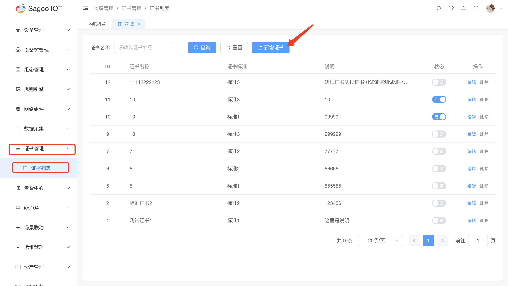

# 概要说明

## 证书管理说明

证书管理是一项关键的安全措施，用于确保设备之间的通信是安全的。

## 创建证书

1. 请确保已登录SagooIOT物联网平台。

2. 在左侧导航栏中，选择物联管理->证书管理->证书列表

3. 创建证书
* 点击“新增证书”按钮。
  
  

* 在弹出的对话框中，输入必填项。
  
* 确定后，系统将创建并显示新的证书。                     

## 修改证书信息

* 如果需要编辑证书的名称或其他信息，可以在证书列表项点击“编辑”按钮进行修改。
  

## 删除证书信息

* 如果需要删除证书的信息，可以在证书列表项点击“删除”按钮进行删除。
  

