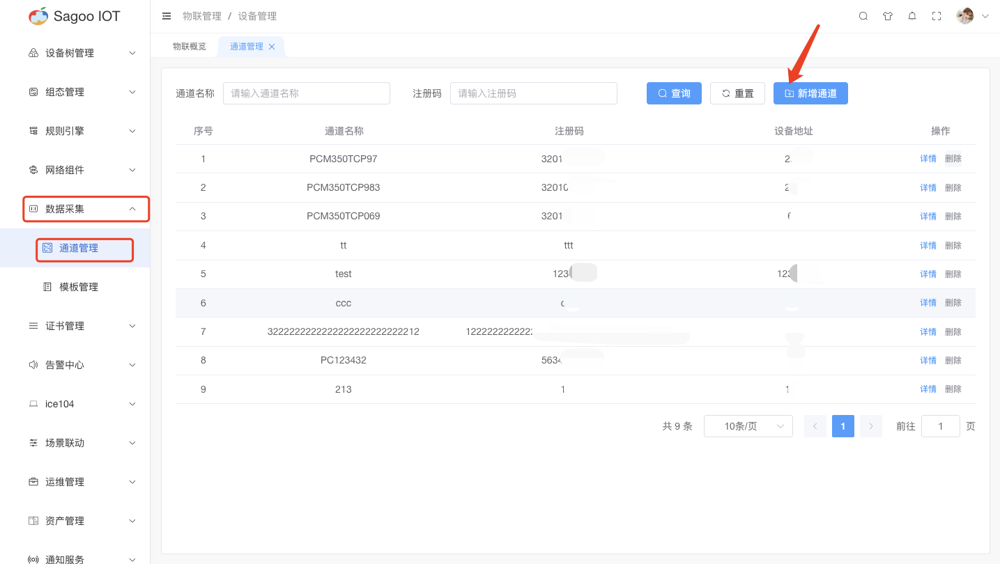
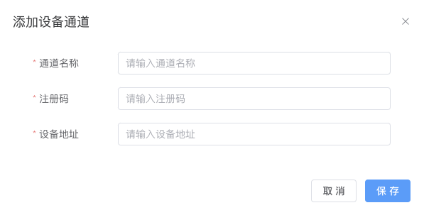
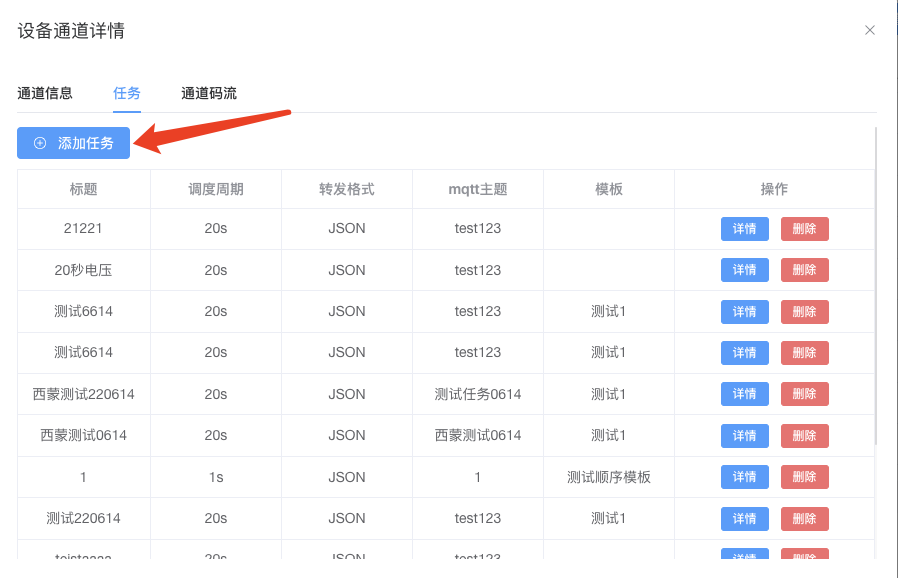
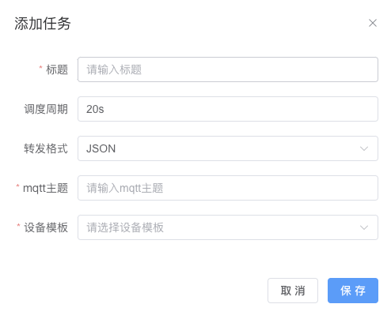
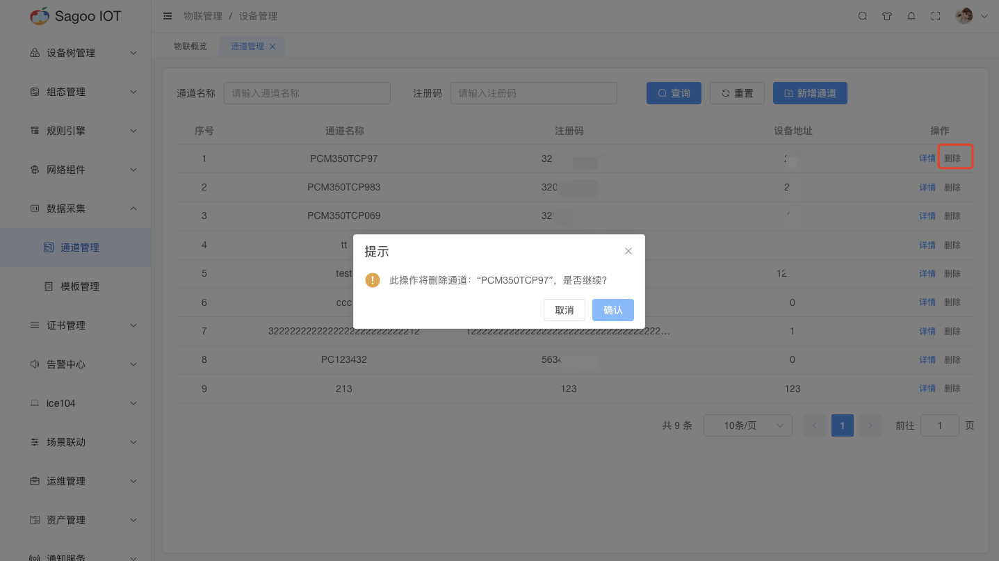

# 通道管理

通道管理主要是由平台端基于客户端的模式对设备端进行定时采集数据，然后将数据转发到云端。通道管理涉及管理设备之间、设备与云端以及系统之间的通信渠道。

## 创建通道

1. 请确保已登录SagooIOT物联网平台。

2. 在左侧导航栏中，选择物联管理->数据采集->通道管理

3. 创建通道
* 点击“新增通道”按钮。
  
* 在弹出的对话框中，输入必填项。
  
* 确定后，系统将创建并显示新的通道。

## 通道信息

* 如果需要查看通道信息，可以在通道列表项点击“详情”按钮进行查看。

## 创建通道任务

1. 请确保已登录SagooIOT物联网平台。

2. 在左侧导航栏中，选择物联管理->数据采集->通道管理->详情

3. 创建任务
点击“添加任务”按钮。
  
在弹出的对话框中，输入必填项。
  
确定后，系统将创建并显示新的通道任务。

| 参数名称   | 描述                    |
|--------|-----------------------|
| 标题     | 必填输入框，是对通道任务进行标题定义。   |
| 调度周期   | 非必填输入框，是对任务的调度周期进行定义。 |
| 转发格式   | 必填下拉框，是对转发格式进行定义。     |
| mqtt主题 | 必填输入框，是对mqtt主题进行定义。   |
| 设备模版   | 必填下拉框，是对设备模版进行定义。     |
注：设备模版创建可参考[设备模版](./template-management.md)

## 通道码流

1. 请确保已登录SagooIOT物联网平台。

2. 在左侧导航栏中，选择物联管理->数据采集->通道管理->详情

3. 通道码流说明

* 通道码流通常指的是通过物联网设备传输的数据流量。

## 删除通道信息

* 如果需要删除通道的信息，可以在通道列表项点击“删除”按钮进行删除。
  

