本次教程使用一个电量查询页面作为示例，展示设计器的使用方法。
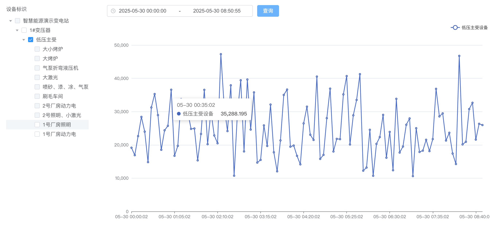

### 设备树组件

本次使用全局数据源进行设备树接口的调用，方便在创建其他页面时也能使用同样的设备树数据。

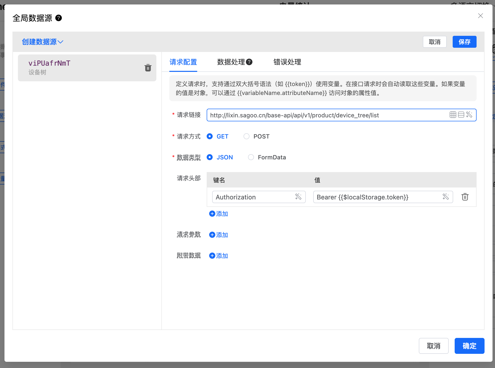

将获取到的设备树组装成 el-tree 组件需要的数据结构

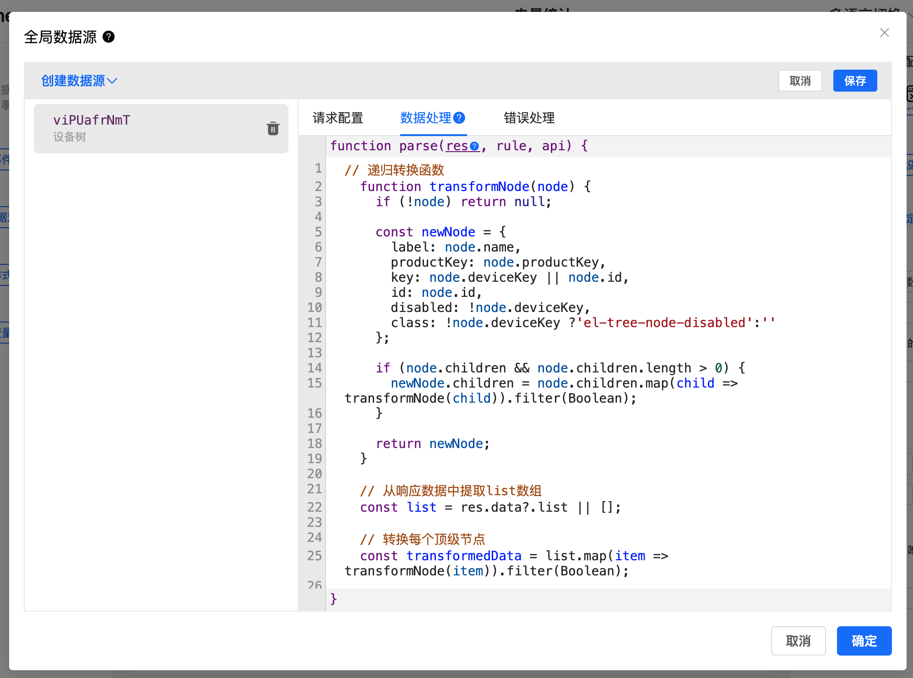

在操作页面拖车如树形控件，选项数据中选择全局数据源，然后在数据源中选择设备树。

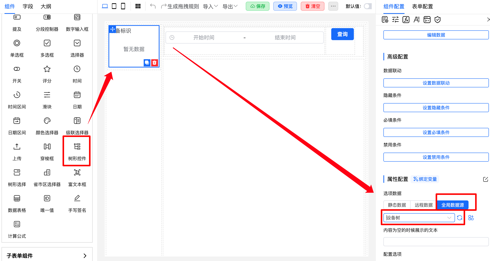

### 时间范围组件

拖入日期区间组件，选择设置事件。点击创建事件，选择`hook_mounted`事件，然后用 js 脚本将时间控件的默认时间进行赋值。

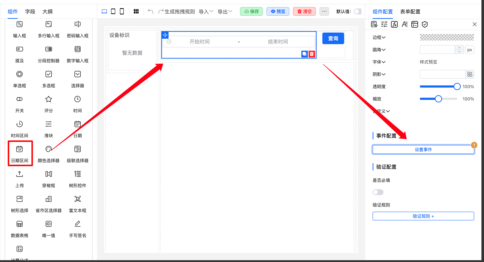
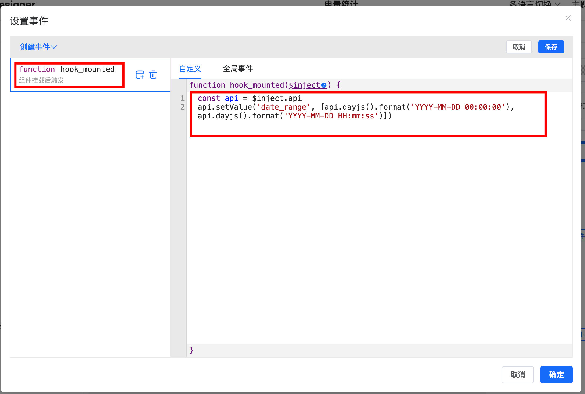

### 查询操作

选择查询操作组件，点击设置事件，选择`click`事件，然后用 js 脚本进行逻辑处理，判断是否已经选择设备，如果然选择设备就触发图形组件的 load 事件。

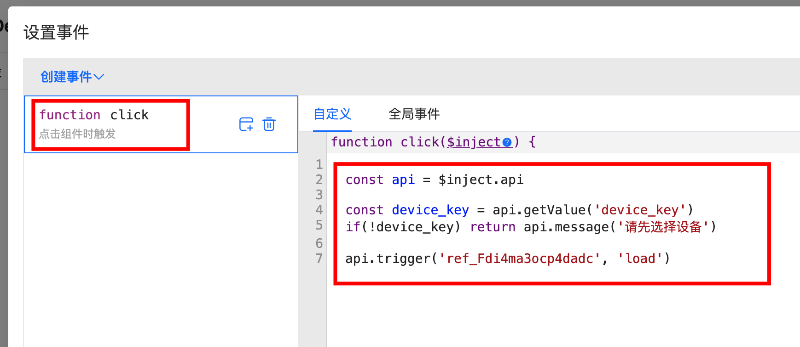

### echarts 图形渲染

选择折线图控件，拖入页面，点击设置事件，创建自定义事件`load`，执行动作选择发送请求，然后编辑这个请求地址及参数，数据处理等，在数据处理中将获取到的数据进行处理，组装成 echarts 线图需要的数据结构，然后赋值给`chart.props.config`进行图形重绘。

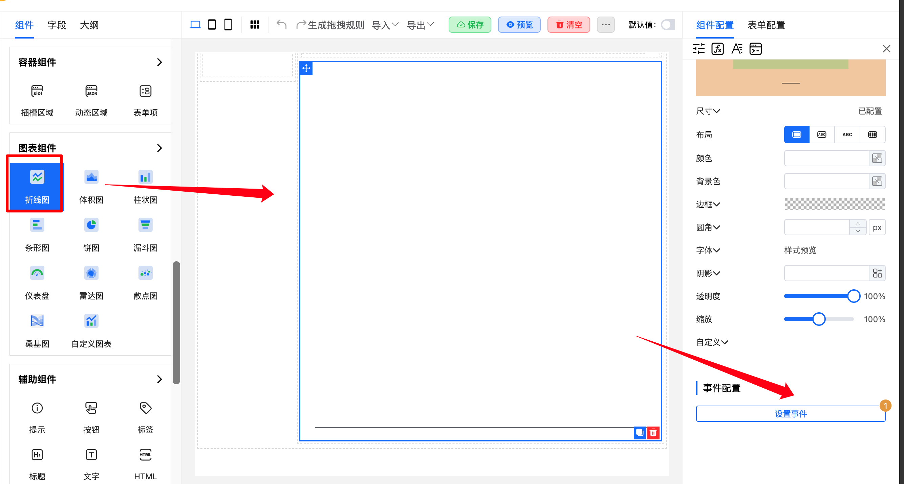
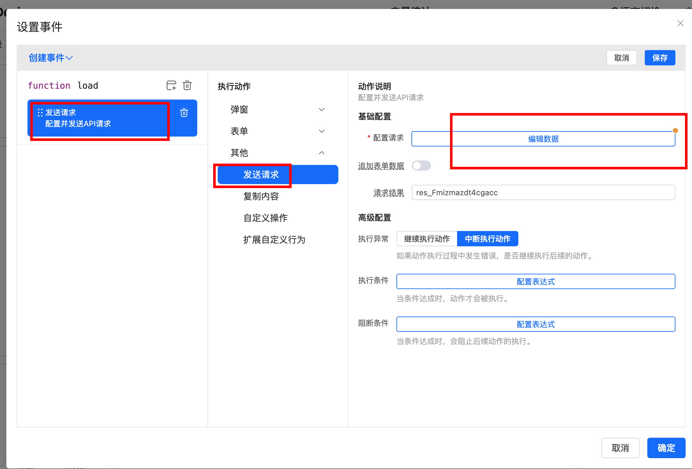
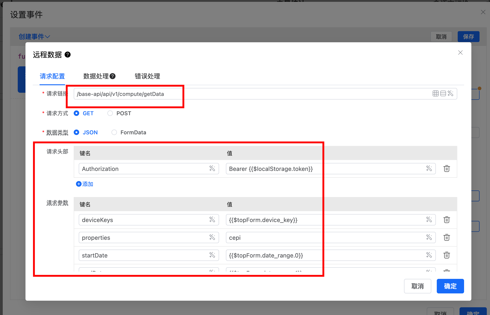
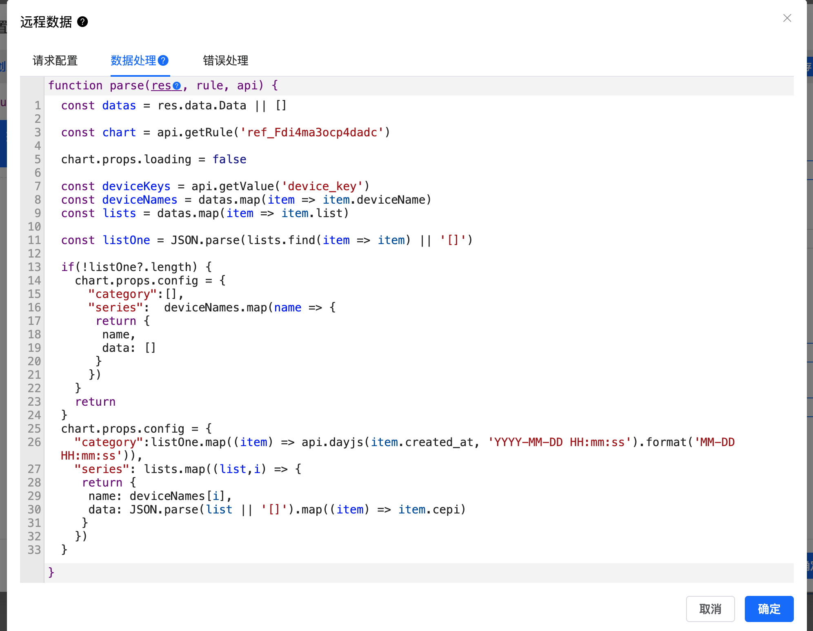
