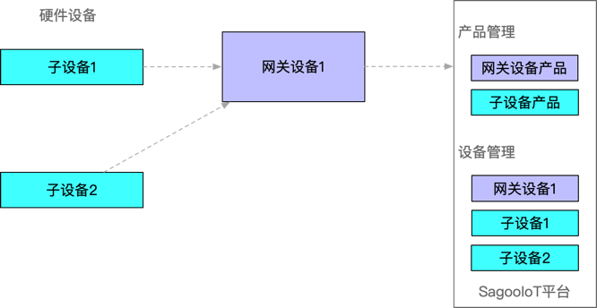

# 说明
设备管理可对设备实例进行全生命周期管理，包括设备基本信息、物模型、运行状态、设备功能、日志管理、设备诊断、物模型映射、数据解析、点位绑定等管理功能。

负责管理接入的设备驱动服务，主要功能包括：

* 协议管理：接收设备服务的注册请求；
* 产品管理：基于特定协议定义产品 & 产品 CRUD；
* 设备管理：基于特定产品定义设备 & 设备 CRUD。

## 注意事项

通过网关接入子设备的时候，网关本身也是一个设备，需要添加产品，设置网关设备的物模型，并在设备管理中添加网关设备，然后在添加子设备。

子设备，即网关下的设备，需要添加产品，设置子设备的物模型，并在设备管理中添加子设备。

