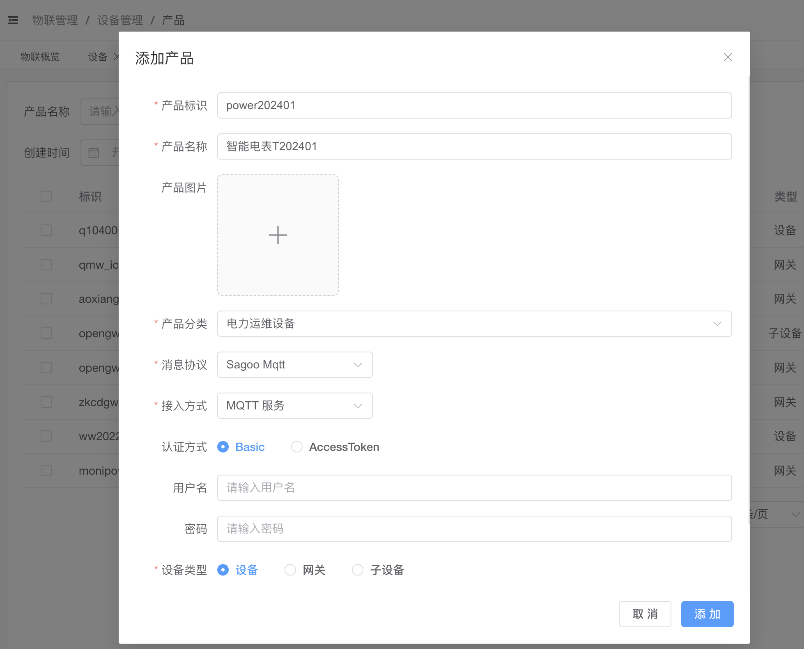
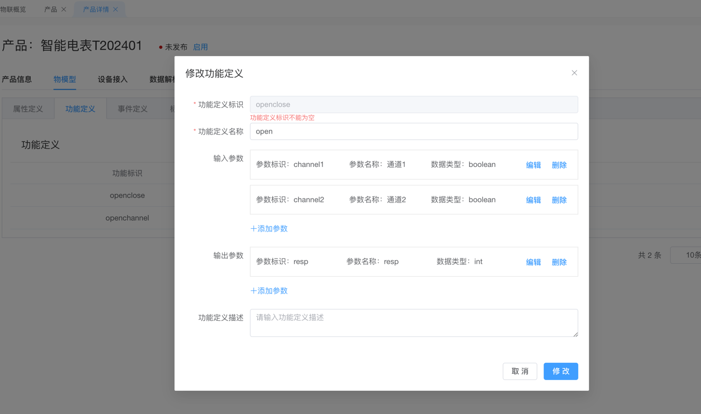
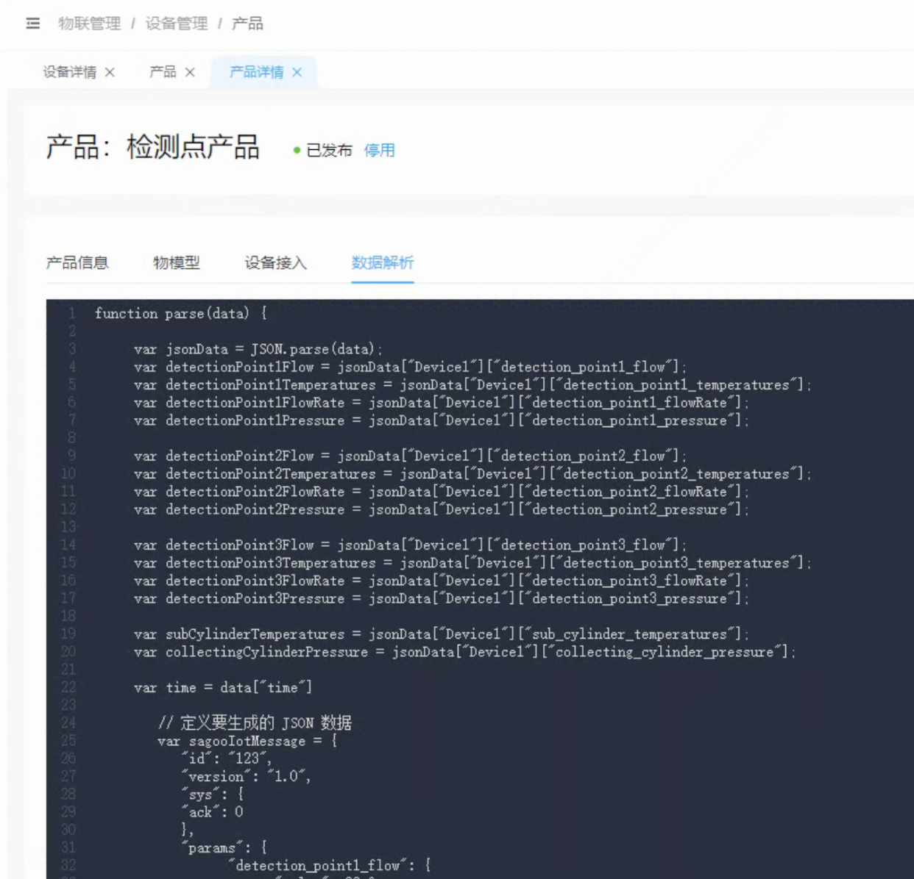

# 产品

在使用物联网平台接入设备前，您需要在物联网平台控制台创建产品。一个产品通常是一组具有相同功能定义的设备的集合，而设备则指的是某一型号的具体单体。产品管理对具有相同功能的设备模型进行统一的维护管理，包括产品的基本信息、物模型、设备接入等功能
本文将介绍如何创建产品的具体操作。

在产品列表中提供产品添加、删除、编辑、发布、导入、导出等功能，您可以根据实际需求对产品进行管理。

## 新增产品


1.登录SagooIOT物联网平台。

2.在左侧导航栏，选择设备管理>产品，点击新增产品。

3.在新建弹框中，根据设备产品的实际情况，按照页面提示填写信息，然后单击确定。




**页面内容说：**

| 参数 | 说明                                                                                                  |
| -------- |-----------------------------------------------------------------------------------------------------|
| 产品标识 | 产品标识就是产品的唯一key值                                                                                     |
| 产品名称 | 限制在20汉字内的产品名称                                                                                       |
| 消息协议 | 选择设备的解决协议 （本系统模拟处理MQTT协议，mqtt设备请选择 Sagoo Mqtt                                                       |
| 传输协议 | 选择设备通讯方式  （如果消息协议使用的是mqtt，这儿里也要选择mqtt）                                                              |
| 设备类型 | 设备：直接通过以太网连接到SagooIOT物联网平台。<br />网关：需要挂载子设备，为多个设备提供数据转换服务的设备。<br />子设备：需要通过网关挂载的设备，能过网关设备进行设备数据上报的。 |


## 产品详情
产品详情页面是针对物理设备的信息中心，通过配置信息、物模型、设备接入和数据解析等信息的录入，详细定义设备特征和功能，为用户提供全面的设备理解和使用指南。

### 物模型管理

物模型是设备在云端的描述，从属性、功能、事件、标签四个维度定义一个真实设备。具体请参考[物模型说明](../../base/concept/tsl/intro)。

在产品列表中，找到刚刚创建的新产品，点击"详情"-》物模型，需要定义产品的“属性”，"事件"和“功能”内容。这些是对设备的统一抽象，如某型号注塑机，某型号空气压缩机等。


### 发布
产品物模型设置完成，需要对产品进行发布。


## 物模型配置
:::tip 提示
任何时候，对于产品或是设备的物模型的修改，都需要重新发布产品，以便于设备端能够获取到最新的物模型信息。
:::

物模型是物理空间中的实体在云端的数字化表示，包括传感器设备、消防装置、园区、工厂等。通过定义物模型的属性、功能、事件和标签四个维度，我们能够更全面地描述该实体的特性和能力，以及提供哪些信息给外部系统。此外，还可以自定义补充一些信息，使其更符合业务需求。物模型的这四个维度涵盖了物体的基本属性、行为、状态和元数据等方面，从而完成了产品功能的定义。通过使用物模型，我们可以更加方便地管理和控制实体的运行状态，实现更高效的物联网应用。

| 类型 | 说明                                                         |
| ---- | ------------------------------------------------------------ |
| 属性 | 用于描述设备在运行时所具有的具体信息和状态。例如，环境监测设备可以通过属性来描述当前环境的温度，智能灯可以通过属性来描述开关状态，电风扇可以通过属性来描述风力等级等。属性通常分为三种类型：读、写和上报。其中，读属性用于获取设备当前的属性值，写属性则用于设置设备的属性值，而上报属性则是设备主动向系统上报属性值的类型。 |
| 功能 | 是指设备可供外部调用的指令或方法。功能服务调用可以设置输入和输出参数，其中输入参数用于指定服务执行时所需的参数，而输出参数则表示服务执行后的结果。相比于属性，功能服务可以实现更为复杂的业务逻辑，例如执行某项特定的任务。服务分为两种调用方式：同步和异步。同步调用是指客户端向设备发送服务请求后，等待设备响应后再继续执行后续操作；而异步调用则是指客户端向设备发送服务请求后，立即返回结果并继续执行后续操作，待设备响应后再执行回调函数。通过服务的定义和调用，我们可以更加灵活地操作设备，实现更多样化的物联网应用。 |
| 事件 | 是指设备在运行时主动上报给云端的信息，通常包括需要被外部感知和处理的信息、告警和故障等。事件可以包含多个输出参数，用于描述事件发生时的具体情况。例如，某项任务完成后的通知信息、设备发生故障时的温度和时间信息、设备告警时的运行状态等。事件可以被订阅和推送，当事件发生时，系统可以向订阅者推送相应的消息。通过事件的定义和使用，我们可以更加及时地了解设备的运行状态。 |
| 标签 | 是指设备跟据业务需要自定义标签信息。                         |

### 支持的数据类型

| 参数      | 说明                                                         | 示例                        |
|---------| ------------------------------------------------------------ |---------------------------|
| int     | 32位整形                                                     | 100                       |
| float   | 单精度浮点型                                                 | 10.4                      |
| double  | 双精度浮点型                                                 | 10.45                     |
| text    | 字符串，对应的数据长度不能超过10240字节。                    | 你好，SagooIOT               |
| date    | 时间戳。默认格式为String类型的UTC时间戳，单位：毫秒。        | 1626738482010             |
| boolean | 布尔型。采用0（false）或1（true）来定义布尔值                | 1表示是、0表示否                 |
| enum    | 枚举型。定义枚举项的参数值和参数描述。                       | `[{key:1,value:1}]`         |
| array   | 数组。需声明数组内的元素类型、数组元素个数。需确保同一个数组元素类型相同。元素个数限制为1~512个。 | [1, 2, 3, 4, 5, 6]        |
| Object  | 结构体数据，支持树形结构化数据。树形数据格式为JSON。 | `[{"name":"开关","value":1}]` |


### 属性定义
物模型的属性，是设备的状态信息，可以是设备的运行状态，也可以是设备的配置信息，也可以是设备的统计信息。属性的值可以是数值、字符串、枚举、布尔值等。

**是否只读：** 属性是否只读，只读属性只能由设备上报，不能由云端下发。如果是读写属性，可以由设备上报，也可以由云端下发。

### 功能定义

物模型的功能（服务）定义，是设备的功能，可以是设备的控制功能，也可以是设备的配置功能，也可以是设备的统计功能。功能的参数可以是数值、字符串、枚举、布尔值等。




对于每个设备端的功能，都需要在云端定义一个功能，以便于云端调用。跟据设备端的功能定义，云端定义功能的参数，以及功能的返回值。

### 事件定义
物模型的事件定义，是设备的事件，可以是设备的告警事件，也可以是设备的统计事件。事件的参数可以是数值、字符串、枚举、布尔值等。
对于每个设备端的事件，都需要在云端定义一个事件，以便于云端调用。跟据设备端的事件定义，云端定义事件的参数。


### 标签定义
物模型的标签定义，是设备的标签，可以是设备的位置信息，也可以是设备的统计信息。标签的值可以是数值、字符串、枚举、布尔值等。

### 物模型导入/导出

进入到物联网平台的产品详情页面，点击物模型，可以看到物模型的定义页面，点击右上角的导入/导出按钮，可以导入/导出物模型的定义。

## 数据解析

SagooIoT 对mqtt设备的支持是采有自己的数据格式，如果您的设备数据格式与SagooIoT的数据格式不一致，您可以通过数据解析功能进行解析。

当前系统支持设备上报数据、向设备下发数据的脚本转换功能。通过此功能可以解决设备个性化数据与平台标准数据不一致的问题。


使用内部函数parse进行解析，其中函数入参data就是原始报文。你可以在这个函数内部通过JavaScript脚本进行处理。

###  内置脚本函数

`parse` 用于处理接收到设备端的数据。入参是`data`，为json格式数据。是设备上报的数据。

`send` 用于处理向设备端下发的数据。入参是`data`，为json格式数据。是向设备下发的数据。

`reply` 用于处理设备端的回复数据。入参是`data`，为json格式数据。是设备回复的数据。

:::tip 向设备下发数据变量替换

当前系统支持向设备下发数据时，可以使用变量替换功能，将变量替换为实际的值。当前只支持 `$deviceKey` 一个变量，可以将设备KEY替换为实际的值。
例如：
在下发数据中，希望将设备key带上，可以这样：

"deviceKey": "$deviceKey"

:::

#### 脚本编写注意事项
* ECMAScript 5.1 兼容性：

  确保代码符合 ECMAScript 5.1 规范。

  使用 `let` 和 `const` 代替 `var`，以获得更严格的块级作用域。

* 错误处理：

  使用 try-catch 语句来捕获和处理 JavaScript 错误。


### 脚本解析说明
当目标设备上传的数据格式与SagooIOT的数据格式不一致时，可使用此功能，通过JavaScript脚本进行解析。



### 示例代码

```javascript
function parse(data) {

    var jsonData = JSON.parse(data);
    var detectionPoint1Flow = jsonData["Device1"]["detection_point1_flow"];
    var detectionPoint1Temperatures = jsonData["Device1"]["detection_point1_temperatures"];
    var detectionPoint1FlowRate = jsonData["Device1"]["detection_point1_flowRate"];
    var detectionPoint1Pressure = jsonData["Device1"]["detection_point1_pressure"];

    var detectionPoint2Flow = jsonData["Device1"]["detection_point2_flow"];
    var detectionPoint2Temperatures = jsonData["Device1"]["detection_point2_temperatures"];
    var detectionPoint2FlowRate = jsonData["Device1"]["detection_point2_flowRate"];
    var detectionPoint2Pressure = jsonData["Device1"]["detection_point2_pressure"];

    var detectionPoint3Flow = jsonData["Device1"]["detection_point3_flow"];
    var detectionPoint3Temperatures = jsonData["Device1"]["detection_point3_temperatures"];
    var detectionPoint3FlowRate = jsonData["Device1"]["detection_point3_flowRate"];
    var detectionPoint3Pressure = jsonData["Device1"]["detection_point3_pressure"];
    
    var subCylinderTemperatures = jsonData["Device1"]["sub_cylinder_temperatures"];
    var collectingCylinderPressure = jsonData["Device1"]["collecting_cylinder_pressure"];

    var time = data["time"]

      // 定义要生成的 JSON 数据
      var sagooIotMessage = {
        "id": "123",
        "version": "1.0",
        "sys": {
        "ack": 0
        },
        "params": {
            "detection_point1_flow": {
                "value": 23.6,
                "time": 1524448722000
            },
            "detection_point1_temperatures": {
                "value": 23.6,
                "time":1524448722000
            },
            "detection_point1_flowRate": {
                "value": 23.6,
                "time":1524448722000
            },
            "detection_point1_pressure": {
                "value": 23.6,
                "time":1524448722000
            },
            "detection_point2_flow": {
                "value": 23.6,
                "time": 1524448722000
            },
            "detection_point2_temperatures": {
                "value": 23.6,
                "time":1524448722000
            },
            "detection_point2_flowRate": {
                "value": 23.6,
                "time":1524448722000
            },
            "detection_point2_pressure": {
                "value": 23.6,
                "time":1524448722000
            },
            "detection_point3_flow": {
                "value": 23.6,
                "time": 1524448722000
            },
            "detection_point3_temperatures": {
                "value": 23.6,
                "time":1524448722000
            },
            "detection_point3_flowRate": {
                "value": 23.6,
                "time":1524448722000
            },
            "detection_point3_pressure": {
                "value": 23.6,
                "time":1524448722000
            },
            "sub_cylinder_temperatures": {
                "value": 23.6,
                "time":1524448722000
            },
            "collecting_cylinder_pressure": {
                "value": 23.6,
                "time":1524448722000
            },
        },
        "method": "thing.event.property.post"
    };

    var chars = "0123456789abcdefghijklmnopqrstuvwxyzABCDEFGHIJKLMNOPQRSTUVWXYZ";
    var idLength = 16;
    var randomId = "";
    for (var i = 0; i < idLength; i++) {
      randomId += chars.charAt(Math.floor(Math.random() * chars.length));
    }
  
    sagooIotMessage["id"] = randomId
    

    sagooIotMessage["params"]["detection_point1_flow"]["value"] = detectionPoint1Flow
    sagooIotMessage["params"]["detection_point1_flow"]["time"] = time
    sagooIotMessage["params"]["detection_point1_temperatures"]["value"] = detectionPoint1Temperatures
    sagooIotMessage["params"]["detection_point1_temperatures"]["time"] = time
    sagooIotMessage["params"]["detection_point1_flowRate"]["value"] = detectionPoint1FlowRate
    sagooIotMessage["params"]["detection_point1_flowRate"]["time"] = time
    sagooIotMessage["params"]["detection_point1_pressure"]["value"] = detectionPoint1Pressure
    sagooIotMessage["params"]["detection_point1_pressure"]["time"] = time

    sagooIotMessage["params"]["detection_point2_flow"]["value"] = detectionPoint2Flow
    sagooIotMessage["params"]["detection_point2_flow"]["time"] = time
    sagooIotMessage["params"]["detection_point2_temperatures"]["value"] = detectionPoint2Temperatures
    sagooIotMessage["params"]["detection_point2_temperatures"]["time"] = time
    sagooIotMessage["params"]["detection_point2_flowRate"]["value"] = detectionPoint2FlowRate
    sagooIotMessage["params"]["detection_point2_flowRate"]["time"] = time
    sagooIotMessage["params"]["detection_point2_pressure"]["value"] = detectionPoint2Pressure
    sagooIotMessage["params"]["detection_point2_pressure"]["time"] = time

    sagooIotMessage["params"]["detection_point3_flow"]["value"] = detectionPoint3Flow
    sagooIotMessage["params"]["detection_point3_flow"]["time"] = time
    sagooIotMessage["params"]["detection_point3_temperatures"]["value"] = detectionPoint3Temperatures
    sagooIotMessage["params"]["detection_point3_temperatures"]["time"] = time
    sagooIotMessage["params"]["detection_point3_flowRate"]["value"] = detectionPoint3FlowRate
    sagooIotMessage["params"]["detection_point3_flowRate"]["time"] = time
    sagooIotMessage["params"]["detection_point3_pressure"]["value"] = detectionPoint3Pressure
    sagooIotMessage["params"]["detection_point3_pressure"]["time"] = time

    sagooIotMessage["params"]["sub_cylinder_temperatures"]["value"] = subCylinderTemperatures
    sagooIotMessage["params"]["sub_cylinder_temperatures"]["time"] = time
    sagooIotMessage["params"]["collecting_cylinder_pressure"]["value"] = collectingCylinderPressure
    sagooIotMessage["params"]["collecting_cylinder_pressure"]["time"] = time

    return JSON.stringify(sagooIotMessage);
}

```

### 脚本调试
