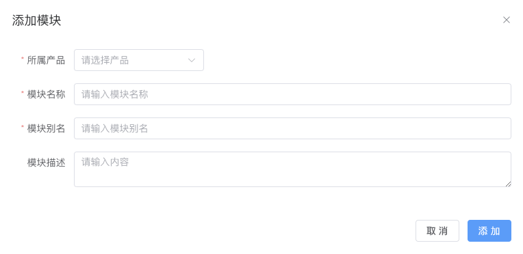
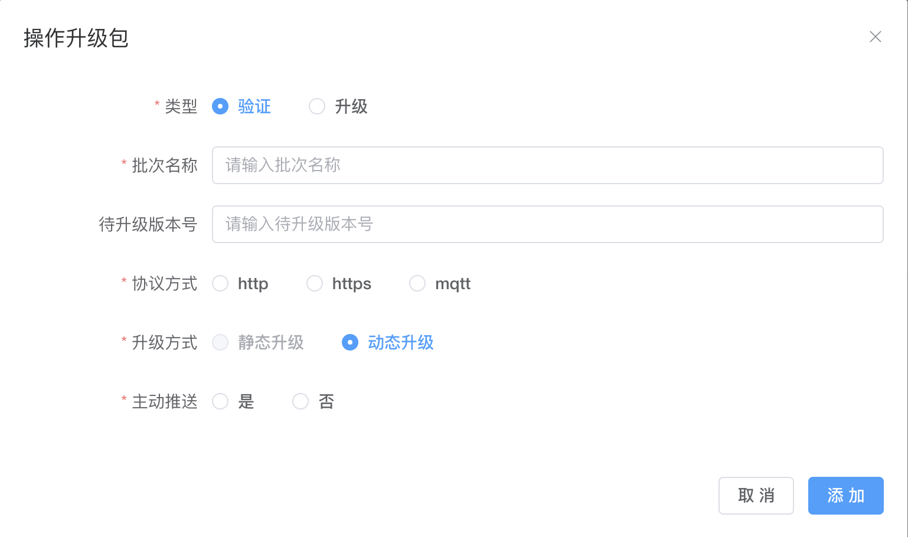
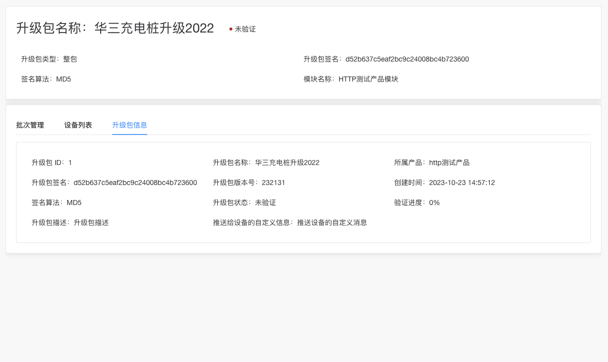
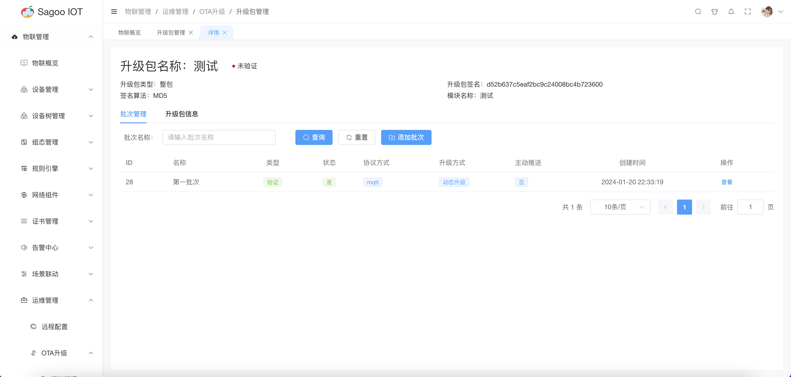
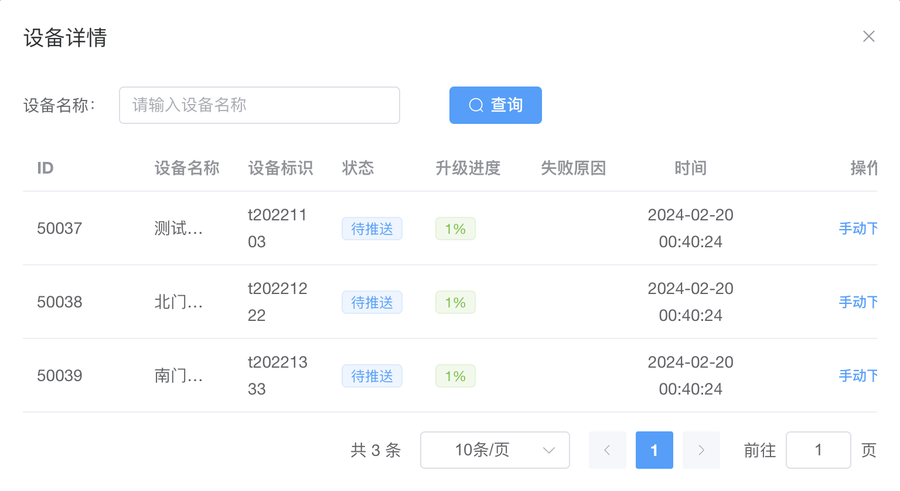

# OTA 升级

## OTA 介绍

OTA（Over-the-Air Technology）空中下载技术，是指通过无线网络对设备进行远程升级的技术。在物联网领域，OTA技术可用于对设备的固件、配置文件、应用程序等进行远程升级，提升设备的性能和安全性。本平台暂时支持两种升级方式：mqtt升级和http升级。详细内容见下文。

## 使用限制
使用OTA功能的设备必须使用MQTT协议接入物联网平台，设备可以选择MQTT协议或HTTPS协议下载升级包。

升级包的数量、大小、格式限制。

HTTPS协议下载：可以包括一个或多个文件，单个文件最大为1,000 MB。仅支持.bin、.dav、.tar、.gz、.zip、.gzip、.apk、.tar.gz、.tar.xz、.pack格式的文件。

以上限制可以在`系统配置--》参数管理`中进行修改。

## 操作步骤

### **添加模块**

点击"添加模块"，打开“添加模块”弹窗。

| 参数名称 | 描述                                           |
| -------- | ---------------------------------------------- |
| 所属产品 | 必填下拉框，是对所属产品进行定义。             |
| 模块名称 | 必填输入框，限制字符为，是对模块名称进行定义。 |
| 模块别名 | 非必填输入框，是对模块别名进行定义。           |
| 模块描述 | 非必填输入框，是对当前新增的升级包进行描述。   |

### **新增升级包**

点击"添加升级包"，打开“添加升级包”弹窗。

| 参数名称       | 描述                                                                                                                                                                                                      |
| -------------- |---------------------------------------------------------------------------------------------------------------------------------------------------------------------------------------------------------|
| 升级包类型     | 必选单选框，是对类型进行定义。目前有整包和差分两种类型。 整包升级包包含完整的升级文件，直接推送给设备进行升级。 差分升级包仅包含新版本与之前版本的不同之处， 仅发送差异部分至设备，设备进行差分还原后再升级，有效减少资源占用和流量消耗。                                                                    |
| 升级包名称     | 必填输入框，是对升级包名称进行定义。                                                                                                                                                                                      |
| 所属产品       | 必填下拉框，是对所属产品进行定义。                                                                                                                                                                                       |
| 升级包模块     | 必选下拉框，是对升级包模块进行定义。                                                                                                                                                                                      |
| 升级包版本号   | 必填输入框，是对升级包版本号进行定义。格式为 xxx.xxx.xxx 其中xxx为数字，第一个为大版本号，第二个为小版本号|
| 算法签名       | 必选下拉框，是对算法签名进行定义，支持MD5和SHA256算法。                                                                                                                                                                        |
| 选择升级包     | 选择上传的升级包，支持的格式有`.bin`、`.dav`、`.tar`、`.gz`、`.zip`、 `.gzip`、`.apk`、`.tar.gz`、`.tar.xz`、`.pack`。                                                                                                       |
| 升级包是否验证 | 必选单选框，是对升级包是否验证进行定义。                                                                                                                                                                                    |
| 升级包描述     | 非必填输入框，是对当前新增的升级包进行描述。                                                                                                                                                                                  |

### **升级包验证**

| 参数名称     | 描述                                                                           |
| ------------ |------------------------------------------------------------------------------|
| 类型         | 必填单选，限制操作升级包为验证或升级，验证只是针对部分设备，升级是针对全量设备                                      |
| 批次名称     | 必填输入框，限制字符为，是对批次名称进行定义。                                                      |
| 协议方式     | 必选单选，是对协议方式进行定义，目前有http、https、mqtt三种方式。设备端收到物联网平台推送的升级包下载信息后，通过此处设置的协议下载升级包。 |
| 升级方式     | 必选单选，是对升级方式进行定义，目前有静态升级与动态升级两种方式。（暂时只支持静态升级）                                 |
| 主动推送     | 不选单选，是对是否主动推送进行定义。                                                           |
| 所属设备     | 必选多选，如选择验证类型时，则必须选择对应设备信息                                                    |

### 执行结果

在升级包列表页签，找到状态为验证中升级包，单击对应的查看按钮。单击升级包信息页签，可查看验证进度。

### 批次管理

在升级包列表页签，单击对应的查看按钮。可查看批次管理列表

### 设备详情

在批次管理中，单击对应的查看按钮。可查看对应的批次的设备详情列表

## 升级方式

### mqtt方式

参考[mqtt协议-OTA相关部分](/develop/protocol/mqtt_ota)

### http方式

参考[http协议-OTA相关部分](/develop/protocol/http)
