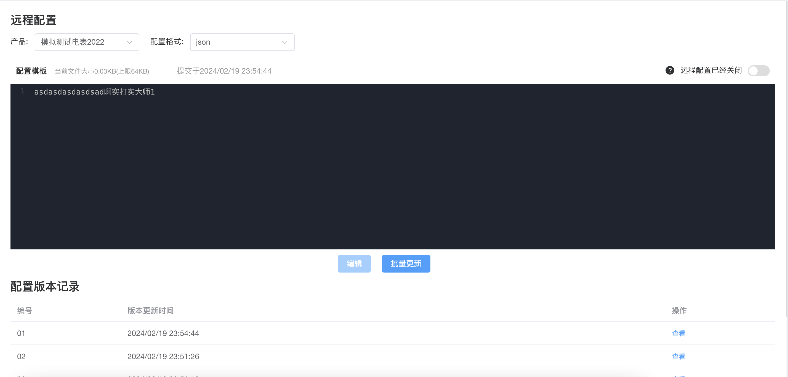
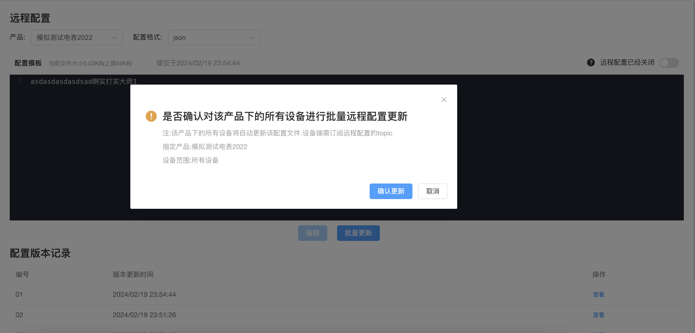
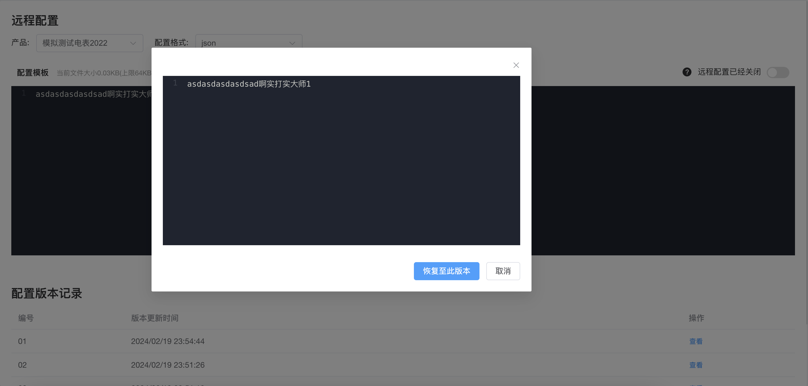

# 远程配置管理

通常来说，开发人员会选择通过向设备推送更新包的方式来进行设备配置信息（包括系统参数、网络参数，以及本地策略等）的更新。然而，这种方式会增加设备固件版本维护的复杂性，并且需要在设备暂停运行的状态下才能完成更新。

为了解决这些问题，SagooIOT平台提供了一种不必让设备重启或暂停运行即可进行在线更新配置信息的能力，即远程配置更新功能。通过此功能，开发者可以在设备持续运行的情况下，实现对设备系统参数、网络参数等配置信息的在线远程更新。

需要注意的是，这种远程配置功能是从产品角度来进行设备配置的修改，也就是说，从物联网平台上传的配置文件会对全部设备生效，而无法指定对单一设备生效。

## 前提条件

设备端已具备远程配置服务的能力。它表现在两方面：设备主动请求配置信息和物联网平台推送配置信息。以下是相关主题（Topic）以及数据格式的详情：

1. **设备主动请求配置信息**
   设备通过特定的Topic主动发送请求，获取其最新的配置信息。这通常在设备启动或刷新配置时发生。

2. **物联网平台推送配置信息**
   SagooIOT平台可以通过特定的Topic向设备推送新的配置信息，设备收到信息后与本地的配置进行比较，如果有差异，则按照平台推送的新配置信息进行更新。

## 功能说明
物联网平台远程配置功能支持：
* 启用或禁用针对产品的远程配置功能。
* 实时在线编辑配置文件，同时也能进行版本控制管理。
* 通过物联网平台，能批量推送配置文件，实现设备配置信息的大范围更新。
* 设备主动发起更新配置信息的请求。
* 查看和管理配置文件版本。
   * 远程配置默认保存最近11次的修改记录。如果重新编辑并提交配置文件成功，上一版的配置信息将显示在下方的配置版本记录中。
   * 您可查看版本更新时间和配置内容，方便追溯。单击查看按钮，在弹出对话框中，查看该版本的配置内容。您可在对话框中，单击恢复至此版本，所选版本的内容会恢复至编辑区中。

## 操作步骤

### **配置列表**

此内容所展示对应“远程配置”中信息

### **批量更新**

输入好配置内容后，点击"批量更新"，显示“批量更新”确认弹窗。

### **版本恢复**

点击对应版本记录查看按钮，显示对应版本内容

## 配置方式

### mqtt方式

参考[mqtt协议-远程配置相关部分](/develop/protocol/mqtt_remote_config)
