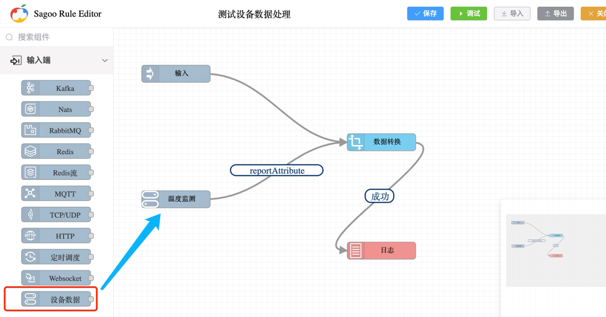

# 接入设备

在SagooIoT平台中，我们可以通过`规则引擎` -> `设备数据节点`来创建设备接入规则，实现设备的接入和管理。

如何配置设备数据节点，可以参考[设备数据节点](input/devicein.md)介绍。

## 数据处理

设备数据节点用于接收设备数据，然后将数据传递给规则链进行处理。如果需要对设备数据进行处理，可以在规则链中添加相应的处理节点。

如上图所示，我们可以在设备数据节点后添加`数据转换`节点，用于将输出的设备数据进行转换处理。

