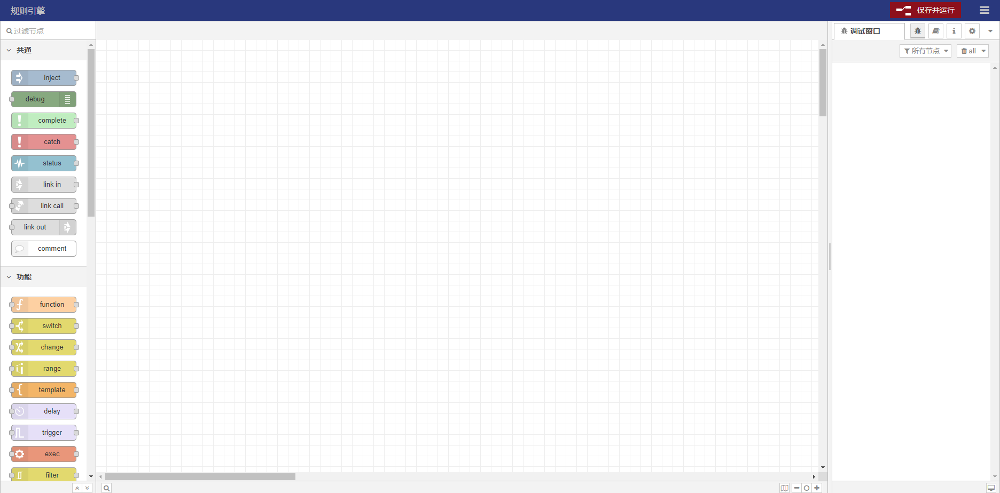

# 数据转发

基于一款可视化的流编程工具，可以非常轻松的实现对设备的数据转发。

## 创建转发规则

**规则引擎** -> **数据转发** -> **创建转发规则**
点击`创建转发规则`按钮，填入自定义的规则名称。

## 编辑

**规则引擎** -> **数据转发** -> **编辑**
创建好规则后，就可以点击`编辑`按钮进入可视化的流编程工具，编辑节点。
如图：

编辑完后不要忘了点击`保存并运行`，否则规则不会生效。

## 启动/暂停

**规则引擎** -> **数据转发** -> **启动**/**暂停**
当我们在流编程工具中编辑好一个规则并保存后，就可以直接在系统中`启动`/`暂停`了，无需再打开流编程工具。
