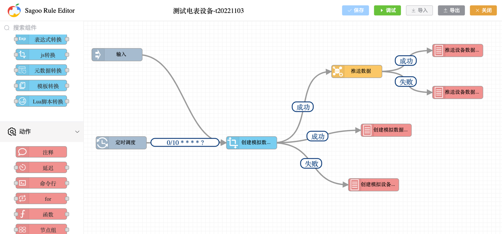
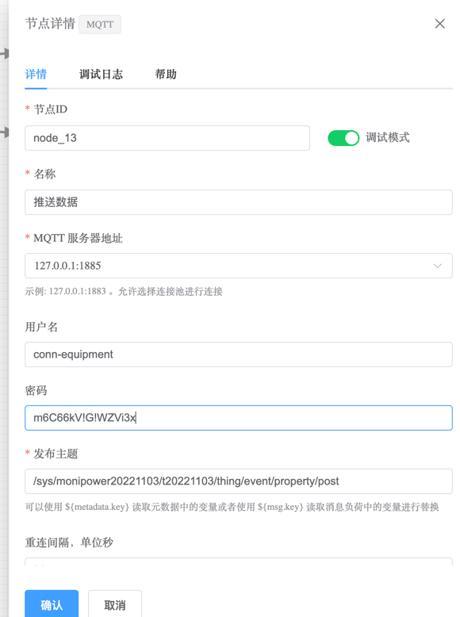

通过本文档，您可以了解如何使用SagooIoT平台的设备接入规则配置功能，通过可视化流编程工具实现一个模拟设备向平台上报数据。

在这个实例中我们将用到以下节点：
* 定时器节点
* 数据转换节点
* MQTT客户端节点
* 日志节点

如图：



## 定时器节点
先放置一个定时器节点，用于定时触发规则链。

通过节点详情中的`路由设置`配置项，设置定时器的触发时间间隔（cron表达式）。

cron表达式的格式为：`秒 分 时 日 月 周`，例如：`0/10 * * * * ?`表示每10秒触发一次。

更多的cron表达式可以参考：[Cron表达式生成器](https://cron.qqe2.com/)

## 数据转换节点
数据转换节点用于模拟创建平台可识别的数据格式的数据。 请按下面的代码放入：
    
```javascript

// 生成随机字符串作为id
function generateRandomId(length) {
  var characters = 'abcdefghijklmnopqrstuvwxyzABCDEFGHIJKLMNOPQRSTUVWXYZ0123456789';
  var id = '';
  for (var i = 0; i < length; i++) {
    id += characters.charAt(Math.floor(Math.random() * characters.length));
  }
  return id;
}
var currentTime = Date.now();

function fullClose(n, m) {
  var result = Math.random() * (m + 1 - n) + n;
  while (result > m) {
    result = Math.random() * (m + 1 - n) + n;
  }
  return result;
}

function toLocaleString() {
  let timestamp = Date.now();
  var date = new Date(timestamp);
  var Y = date.getFullYear() + '-';
  var M = (date.getMonth() + 1 < 10 ? '0' + (date.getMonth() + 1) : date.getMonth() + 1) + '-';
  var D = (date.getDate() < 10 ? '0' + date.getDate() : date.getDate()) + ' ';
  var h = (date.getHours() < 10 ? '0' + date.getHours() : date.getHours()) + ':';
  var m = (date.getMinutes() < 10 ? '0' + date.getMinutes() : date.getMinutes()) + ':';
  var s = date.getSeconds() < 10 ? '0' + date.getSeconds() : date.getSeconds();
  return Y + M + D + h + m + s;
}

var id = generateRandomId(10); // 生成长度为10的随机字符串作为id
var version = "1.0";
var ack = 1;
var method = "thing.event.property.post";

var pyload = {
  "id": id,
  "version": version,
  "sys": {
    "ack": ack
  },
  "params": {
    "va": {
      "time": currentTime,
      "value": fullClose(100, 225.5)
    },
    "vb": {
      "time": currentTime,
      "value": fullClose(100, 225.5)
    },
    "vc": {
      "time": currentTime,
      "value": fullClose(100, 225.5)
    },
    "ia": {
      "time": currentTime,
      "value": fullClose(100, 225.5)
    },
    "ib": {
      "time": currentTime,
      "value": fullClose(100, 225.5)
    },
    "ic": {
      "time": currentTime,
      "value": fullClose(100, 225.5)
    },
    "vab": {
      "time": currentTime,
      "value": fullClose(100, 225.5)
    },
    "vbc": {
      "time": currentTime,
      "value": fullClose(100, 225.5)
    },
    "vca": {
      "time": currentTime,
      "value": fullClose(100, 225.5)
    },
    "pa": {
      "time": currentTime,
      "value": fullClose(10, 60.5)
    },
    "pb": {
      "time": currentTime,
      "value": fullClose(10, 60.5)
    },
    "pc": {
      "time": currentTime,
      "value": fullClose(10, 60.5)
    }
  },
  "method": method,
  "return_time": toLocaleString()
};


return {
  'msg': pyload,
  'metadata': metadata,
  'msgType': msgType
};

```

## MQTT客户端节点
在数据转换节点后放置一个MQTT客户端节点，用于将数据发送到MQTT Broker。
注意你的MQTT Broker的配置信息，如：`MQTT服务的IP与端口`、`用户名`、`密码`、`主题`等。

这里主题可以使用：`/sys/monipower20221103/t20221103/thing/event/property/post` 跟据你的实际情况修改。

如下图所示：




## 日志节点
最后放置一个日志节点，用于查看数据发送的结果。
