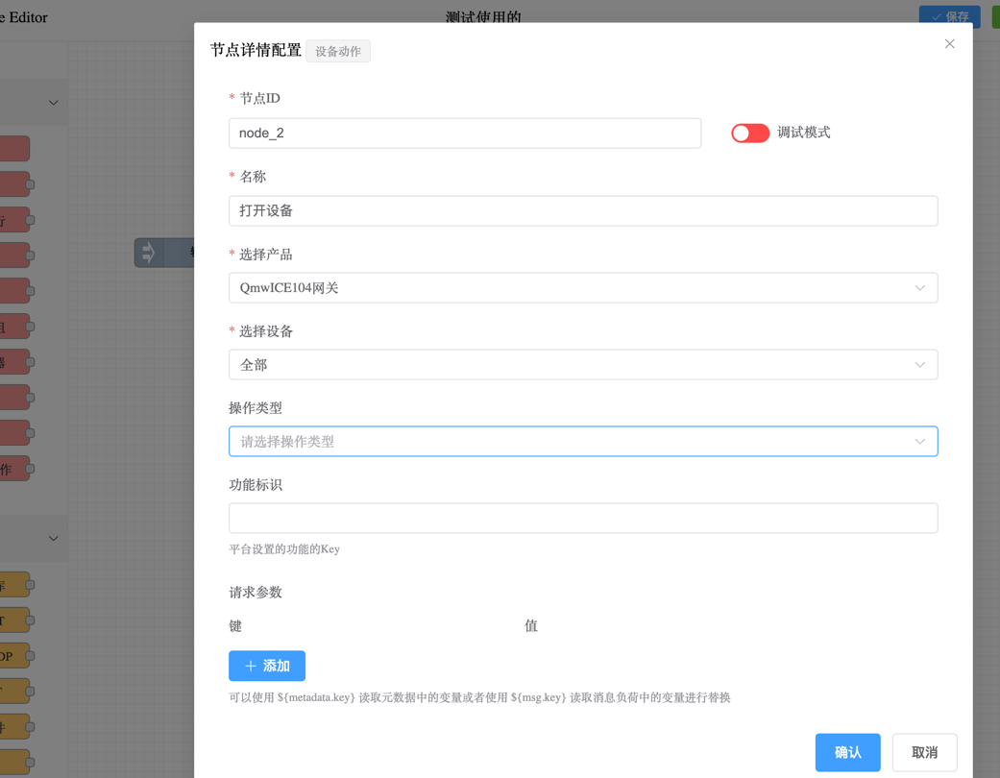

## 介绍
设备动作节点用于执行设备动作节点，通过触发设置的数据进行设备响应。

## 配置设备动作
拖入`设备动作节点`，会显示节点详情设置页面。

## 选择设备

首先要选择产品，然后选择设备。可以选择具体的设备，或是选择全部。当选择全部的时候，这个节点处理所有的设备的动作执行。

## 选择动作

选择设备动作，可以选择设备的功能调用，设置属性等。

### 设置功能标识
当选择设备的功能调用的时候，需要设置功能标识，功能标识是设备的功能调用的唯一标识。请对照平台中设备的功能调用标识定义进行设置。

### 设置参数
当进行功能调用的时候，需要设置参数，参数的设置根据设备的功能调用而定。请对照设备的功能调用参数进行设置。
