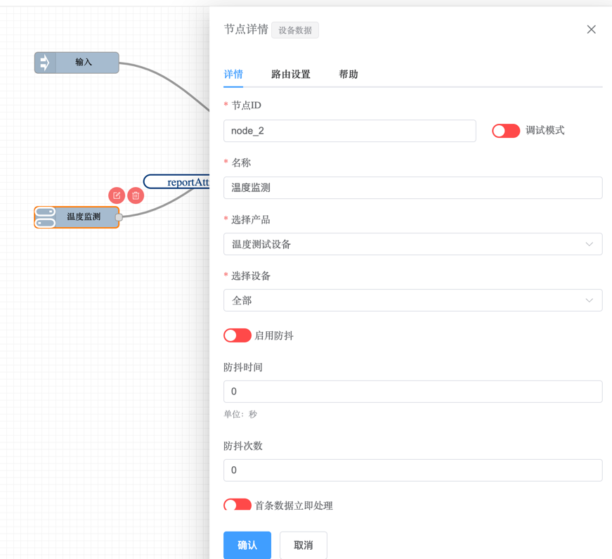

## 介绍

这个节点用于接收设备数据，然后将数据传递给规则链进行处理。将设备数据节点拖放到工作区，然后进行设备数据节点的配置。

## 配置设备数据

拖入`设备数据节点`，会显示节点详情设置页面。

1，选择产品：选择产品，然后选择设备。
2，选择设备：选择具体的设备，或是选择全部。当选择全部的时候，这个节点会接收所有的设备数据。

## 启用防抖
如果启用防抖，那么这个节点会在接收到数据后，跟据防抖时间的设置，在这个时间内数据小于这个次数，将不处理数据。等待一段时间，然后再将数据传递给规则链。

## 首条数据立即处理
如果启用首条数据立即处理，那么这个节点会在接收到第一条数据后，立即将数据传递给规则链。

## 路由设置
路由设置用于监听哪一种设备上报数据，然后将数据传递给规则链。

- 属性上报
- 事件上报
