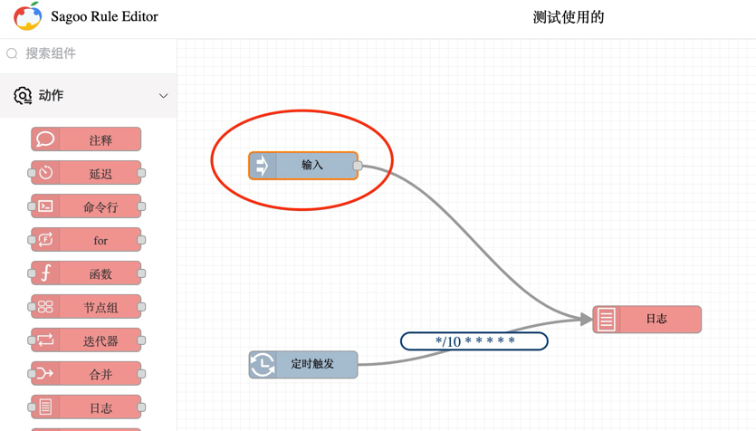

系统中提供了一个默认的输入节点，用于接收外部数据，然后将数据传递给规则链进行处理。当我们创建一个规则链时，系统会自动创建一个默认的输入节点，用于接收外部数据。
当我们点工具栏中的“调试”按钮的时候会有一个弹窗，这个弹窗中会有一个输入框，我们可以在这个输入框中输入数据，然后点击“发送”按钮，这个数据就会传递给默认的输入节点。

测试规则的时候，只要在请求Body中输入数据，然后点击“发送”按钮，这个数据就会传递给默认的输入节点。

## 业务集成

当我们希望规则引擎能被第三业务应用调用的时候，可以通过下面的接口执行规则链：

### 同步接口	
关注规则链处理结果
* 请求方式：POST
* 请求地址：/api/v1/rules/规则ID/execute/$msgType

### 异步接口
不关注规则链处理结果
* 请求方式：POST
* 请求地址：/api/v1/rules/规则ID/notify/$msgType
