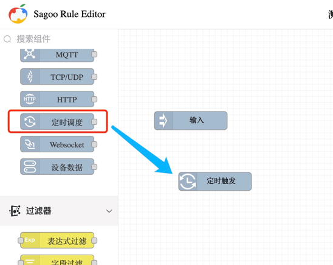

# 使用说明

SagooIoT Rule 是一个基于流的规则开发工具，用于连接硬件设备、API 和在线服务。它提供了一个浏览器编辑器，允许你通过拖放节点来编写事件驱动的逻辑，无需编写代码。非常适合于快速原型开发、事件处理、物联网项目和连接各种不同的系统。

规则引擎是物联网平台的一个极其重要的功能模块，是处理复杂逻辑的引擎,它按照用户设定的条件，在设备和物联网平台之间进行消息的处理和传递。

SagooIoT Rule 提供了强大的可视化规则设计器.

规则引擎的设计是基于节点的，每个节点代表一个功能，用户可以通过拖拽节点到编辑器中，然后将节点连接起来，形成一个规则链。

组件库分为以下几种类型：

* 输入端： 用于接收消息。
* 过滤器： 对消息进行过滤或者路由。
* 转换器： 对消息进行转换或者增强。
* 动作： 执行某些动作。
* 外部的： 和第三方系统/协议进行集成，例如：调用kafka、第三方api、第三方系统等。
* 子规则链： 子规则链。

## 添加注入节点

注入节点允许您将消息注入流中，在左侧的节点中找到`输入端`节点，把它拖动到编辑器中。如图所示：

## 添加日志节点

`日志`节点会在将上一个节点的信息进行输出，在左侧的节点中找到`日志`节点，把它拖动到编辑器中。

## 将两者连接在一起

通过在一个节点的输出端口与另一个节点的输入端口之间拖动来将 Inject 节点和 Debug 节点连接在一起。
效果如图：

## 保存

此时，节点仅存在于编辑器中，必须保存到服务器中才能生效。
点击右上角的"保存"按钮。

:::info
如果想要启动规则，需要在规则列表中点击`启动`按钮。
:::

## 查看调试信息

每个节点组件都有一个`调试模式`的开关。双击节点打开节点详情面板后，将`调试模式`打开。在调试日志栏中我们会看到输出的信息。

