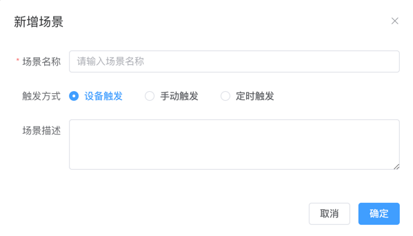

# 添加场景

SagooIOT的场景联动启用方式支持三种：设备触发、手动触发、定时触发。

## 设备触发
适用场景：指定设备的事件或属性变化事件发生时，关联的其他设备执行指定动作或是其它的动作。

## 手动触发
适用场景：第三方平台通过SagooIOT的OpenAPIs或是北向接口向物联网平台下发指令控制设备完成预置动作。

## 定时触发
适用场景：设置定时任务，定时执行预先定义好的规定动作，支持按周、按月、按Corn表达式3种方式配置频率。

