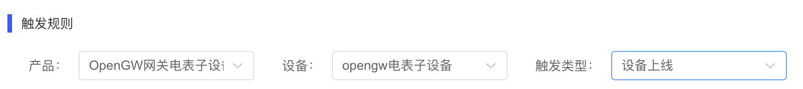
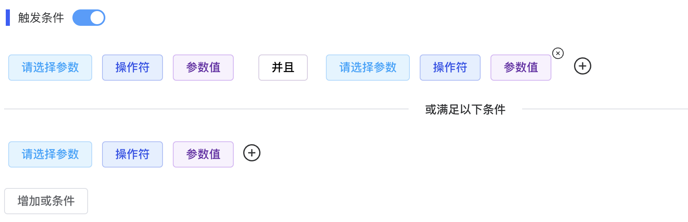
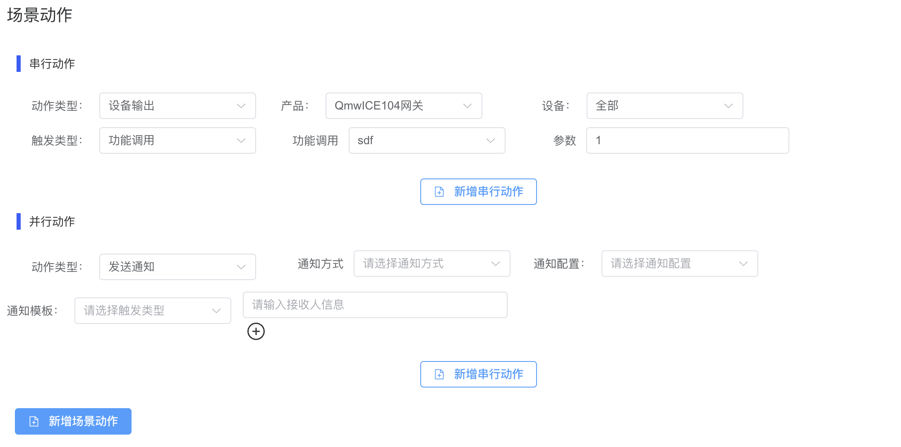
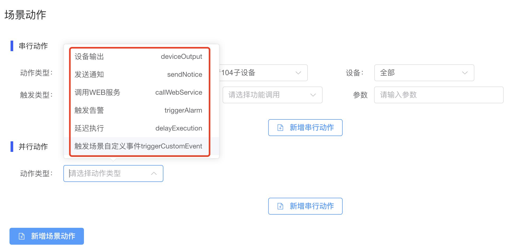
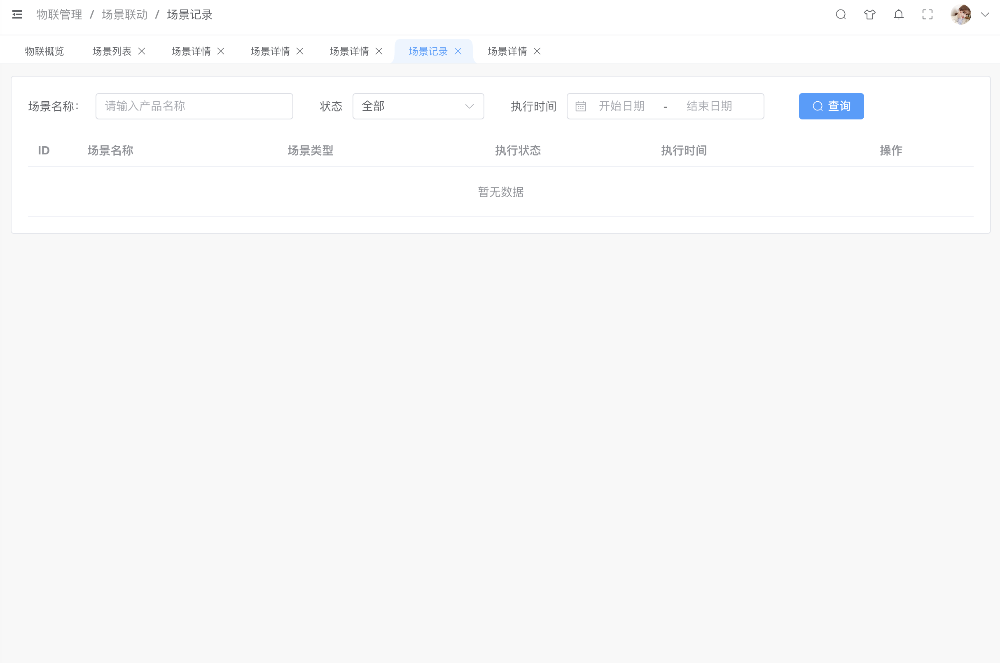

# 场景编辑

点击"编辑”按钮，打开“编辑场景”弹窗。可对场景名称、触发方式、场景描述进行修改。

## 配置触发规则

触发规则步骤 选择产品->选择设备->选择触发类型

| 参数名称 | 描述                                                         |
| -------- | ------------------------------------------------------------ |
| 选择产品 | 可选择产品页面展示当前账号数据权限范围内的所有产品。         |
| 选择设备 | 根据选择的产品，对设备进行选择。                             |
| 触发类型 | 最后对触发类型进行定义，可选择根据产品物模型提供可配置的功能权限，包括设备上线、设备离线、读取属性、修改属性、属性上报、功能调用、事件上报。 |

## 配置触发条件

| 参数名称   | 描述                                                         |
| ---------- | ------------------------------------------------------------ |
| 请选择参数 | 必填，是对参数进行定义。                                     |
| 操作符     | 必填，未选择参数时，下拉为空；根据参数的数据类型显示对应的操作符。 |
| 参数值     | 必填输入框，根据参数数据类型输入对应参数值。                 |

## 配置场景动作

| 参数名称 | 描述                                                         |
| -------- | ------------------------------------------------------------ |
| 串行动作 | 首先，在选择产品后，根据产品选定相应的设备。随后，对触发类型进行定义，包括设备上线、设备离线、读取属性、修改属性、属性上报、事件上报以及功能调用。 |
| 并行动作 | 根据选择的触发类型，明确相应的触发条件，并输入相关的参数、操作符以及参数值。 |

## 配置动作类型

| 参数名称           | 描述                                                         |
| ------------------ | ------------------------------------------------------------ |
| 设备输出           | 用于配置设备功能调用、获取属性、设置属性。                   |
| 发送通知           | 用于配置发送通知，包含钉钉、微信、邮件等通知方式。           |
| 调用WEB服务        | 用于定义调用WEB服务，包含请求的方式、编码、服务地址、设置请求头、参数编写。 |
| 触发告警           | 用于定义触发告警，包括告警级别、告警信息填写。               |
| 延迟执行           | 用于定义延迟执行时间。                                       |
| 触发场景自定义事件 | 用于自定义场景，进行场景联动设置。                           |

## 场景记录

您可以查看该场景运行的日志。

