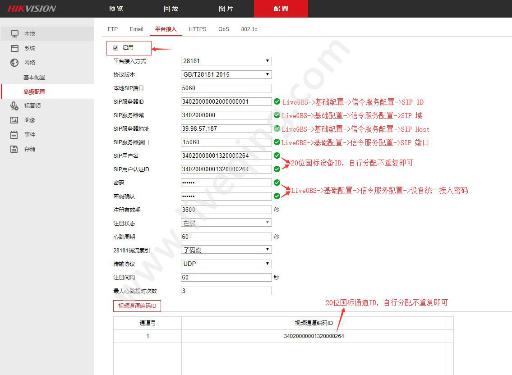
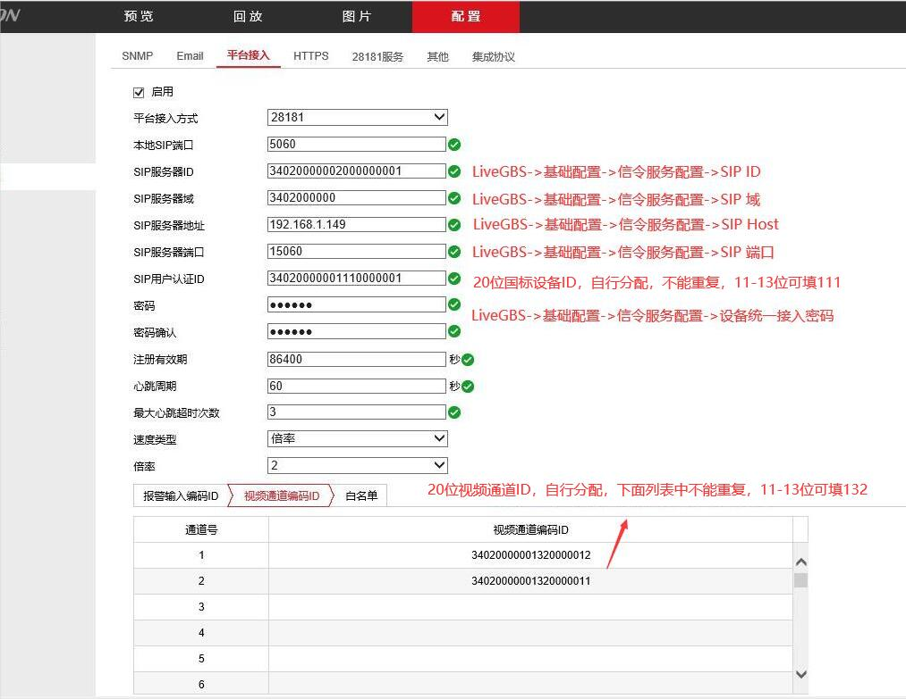
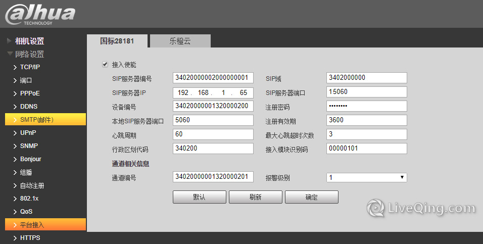
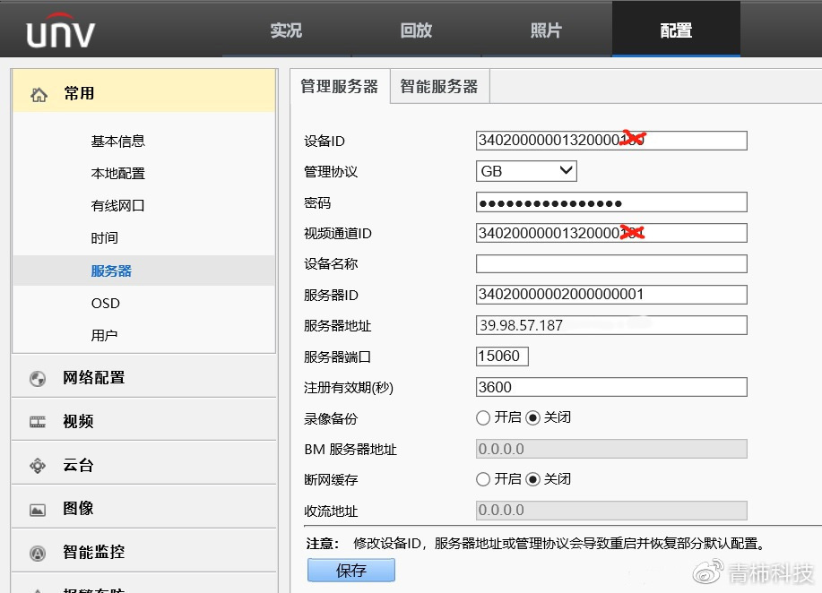
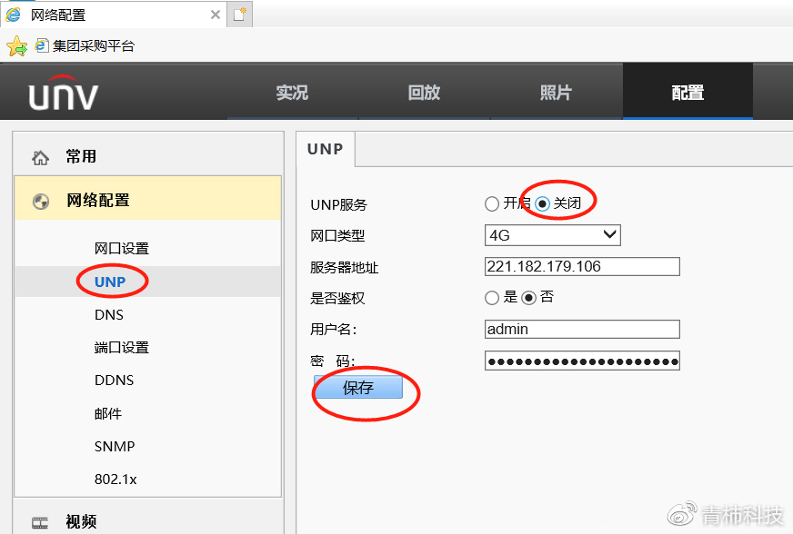
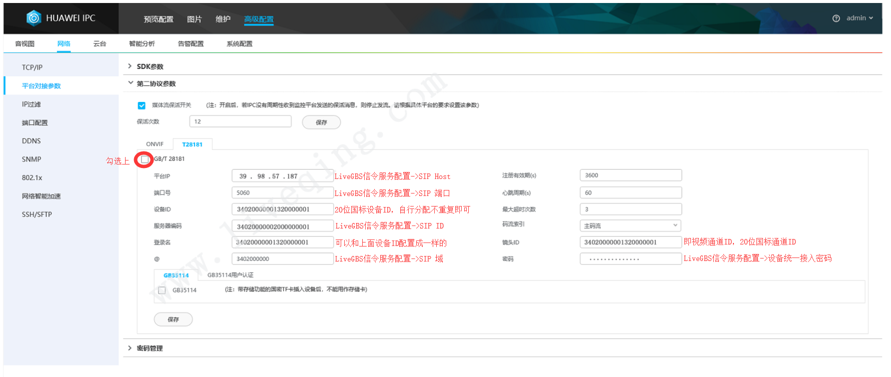

# GB28181接入

**使用SIP协议接受NVR或其他GB28181设备的注册**

- 服务器启动时自动监听SIP协议端口，当有设备注册时，会记录该设备信息，可以从UI的列表中看到设备
- 定时发送Catalog命令查询设备的目录信息，可获得通道数据或者子设备
- 发送RecordInfo命令查询设备对录像数据
- 发送Invite命令获取设备的实时视频或者录像视频
- 发送PTZ命令来控制摄像头云台

**作为GB28281的流媒体服务器接受设备的媒体流**

- 当invite设备的**实时**视频流时，会在SagooMedia中创建对应的流，StreamPath由设备编号和通道编号组成，即[设备编号]/[通道编号],如果有多个层级，通道编号是最后一个层级的编号
- 当invite设备的**录像**视频流时，StreamPath由设备编号和通道编号以及录像的起止时间拼接而成即[设备编号]/[通道编号]/[开始时间]-[结束时间]


**注意：**

1，只支持264码流

2，不可以进行合流

##  流媒体config.yaml插件配置

```
gb28181:
  enable: true
  invitemode:     1 #0、手动invite 1、表示自动发起invite，当Server（SIP）接收到设备信息时，立即向设备发送invite命令获取流,2、按需拉流，既等待订阅者触发
  position:
    autosubposition: false #是否自动订阅定位
    expires: 3600s #订阅周期(单位：秒)，默认3600
    interval: 6s #订阅间隔（单位：秒），默认6
  sip:          "" #sip服务器地址 默认 自动适配设备网段
  serial:         "34020000002000000001"
  realm:          "3402000000"
  username:       ""
  password:       ""
  registervalidity:  60s #注册有效期
  mediaip:          "" #媒体服务器地址 默认 自动适配设备网段
  port:
    sip: udp:5060 #sip服务器端口
    media: tcp:58200-59200 #媒体服务器端口，用于接收设备的流
    fdm: false #端口复用,单端口默认多路复用,多端口多路复用根据这个

  removebaninterval: 10m #定时移除注册失败的设备黑名单，单位秒，默认10分钟（600秒）
  loglevel:         error

ps:
  enable: true
  http: # 格式参考全局配置
  publish: # 格式参考全局配置
  subscribe: # 格式参考全局配置
  relaymode: 2 # 0:纯转发 1:转协议，不转发 2:转发并且转协议
```
### 关键配置项解释

1. **enable**: 启用GB28181功能，设置为`true`表示启用。
2. **invitemode**: 邀请模式，决定如何获取流。`0`为手动邀请，`1`为自动邀请，`2`为按需拉流。
3. **position**:
   - **autosubposition**: 是否自动订阅定位。
   - **expires**: 订阅周期，单位为秒，默认值为3600秒。
   - **interval**: 订阅间隔，单位为秒，默认值为6秒。
4. **sip**: SIP服务器地址，默认为自动适配设备所在网段。
5. **serial**: SIP ID，唯一标识设备。
6. **realm**: SIP域，通常为设备的网络域。
7. **username** 和 **password**: 用于设备注册的凭证。
8. **registervalidity**: 注册有效期，单位为秒。
9. **mediaip**: 媒体服务器地址，默认为自动适配设备所在网段。
10. **port**:
    - **sip**: SIP服务器监听的UDP端口。
    - **media**: 媒体服务器的TCP端口范围，用于接收设备流。
    - **fdm**: 端口复用设置，控制流的复用策略。
11. **removebaninterval**: 定时移除注册失败设备的黑名单，默认10分钟。
12. **loglevel**: 日志记录的级别，通常为`info`。

## 各型号摄像头配置

## 海康GB28181接入示例



### 输入项与config.yaml配置项对应关系

| 输入项                | config.yaml 配置项          | 说明                                   |
|----------------------|----------------------------|----------------------------------------|
| SIP服务器ID          | `gb28181.serial`           | 设备的SIP ID，需与图中设备ID一致。   |
| SIP域                | `gb28181.realm`            | SIP域，需与图中设备的域一致。         |
| SIP服务器地址        |              |流媒体所在服务器IP地址(按具体环境配置) |
| SIP服务器端口        | `gb28181.port.sip`         | SIP服务器监听的端口，需与图中配置一致。 |
| 密码与确认密码        | `gb28181.password`         | 流媒体服务密码，用于设备注册鉴权 |

:::tip 提示
海康设备密码为必填项，config.yaml配置文件中密码参数值不能为空
:::
    
以上信息填写完成之后，点击启用按钮并且保存即可。

## NVR硬件GB28181接入示例

说明：视频通道编码ID，如果配置为空表示不作为通道接入到LiveGBS。如下图所示，只有通道1和通道2会接入到LiveGBS。



### 输入项与config.yaml配置项对应关系

| 输入项                | config.yaml 配置项          | 说明                                   |
|----------------------|----------------------------|----------------------------------------|
| SIP服务器ID          | `gb28181.serial`           | 设备的SIP ID，需与图中设备ID一致。   |
| SIP域                | `gb28181.realm`            | SIP域，需与图中设备的域一致。         |
| SIP服务器地址        |              |流媒体所在服务器IP地址(按具体环境配置) |
| SIP服务器端口        | `gb28181.port.sip`         | SIP服务器监听的端口，需与图中配置一致。 |
| 密码与确认密码        | `gb28181.password`         | 流媒体服务密码，用于设备注册鉴权 |

## 大华GB28181接入示例



### 输入项与config.yaml配置项对应关系

| 输入项                | config.yaml 配置项          | 说明                                   |
|----------------------|----------------------------|----------------------------------------|
| SIP服务器编号          | `gb28181.serial`           | 设备的SIP ID，需与图中设备ID一致。   |
| SIP域                | `gb28181.realm`            | SIP域，需与图中设备的域一致。         |
| SIP服务器地址        |              |流媒体所在服务器IP地址(按具体环境配置) |
| SIP服务器端口        | `gb28181.port.sip`         | SIP服务器监听的端口，需与图中配置一致。 |
| 注册密码        | `gb28181.password`         | 流媒体服务密码，用于设备注册鉴权 |

以上信息填写完成之后，点击接入使能按钮并且确认即可。

## 宇视4G GB28181接入示例



### 输入项与config.yaml配置项对应关系

| 输入项                | config.yaml 配置项          | 说明                                   |
|----------------------|----------------------------|----------------------------------------|
| 服务器ID          | `gb28181.serial`           | 设备的SIP ID，需与图中设备ID一致。   |
| 服务器端口        | `gb28181.port.sip`         | SIP服务器监听的端口，需与图中配置一致。 |
| 注册密码        | `gb28181.password`         | 流媒体服务密码，用于设备注册鉴权 |




| 输入项                | config.yaml 配置项          | 说明                                   |
|----------------------|----------------------------|----------------------------------------|
| 服务器地址        |              |流媒体所在服务器IP地址(按具体环境配置) |
| 用户名          | `gb28181.username`           | 流媒体服务用户名   |
| 注册密码        | `gb28181.password`         | 流媒体服务密码，用于设备注册鉴权 |

## 华为IPC GB28181接入示例



### 输入项与config.yaml配置项对应关系

| 输入项                | config.yaml 配置项          | 说明                                   |
|----------------------|----------------------------|----------------------------------------|
| 平台IP        |              |流媒体所在服务器IP地址(按具体环境配置) |
| 端口号        | `gb28181.port.sip`         | SIP服务器监听的端口，需与图中配置一致。 |
| 服务器编号          | `gb28181.serial`           | 设备的SIP ID，需与图中设备ID一致。   |
| @                | `gb28181.realm`            | SIP域，需与图中设备的域一致。         |
| 登录名        | `gb28181.username`         | 流媒体服务用户名，用于设备注册鉴权 |
| 密码        | `gb28181.password`         | 流媒体服务密码，用于设备注册鉴权 |

