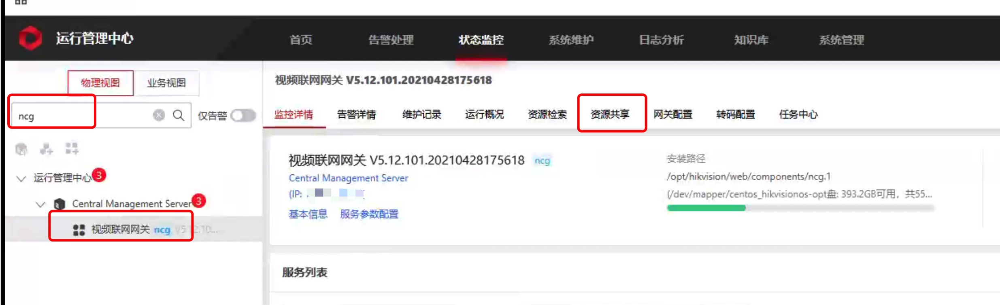
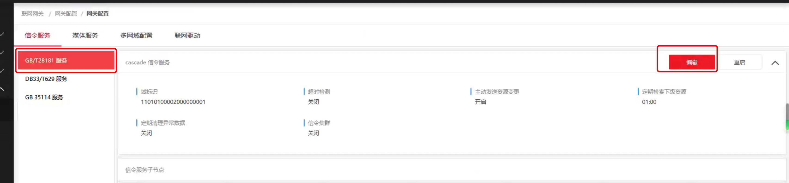
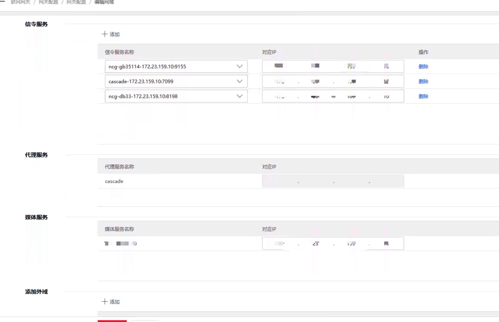
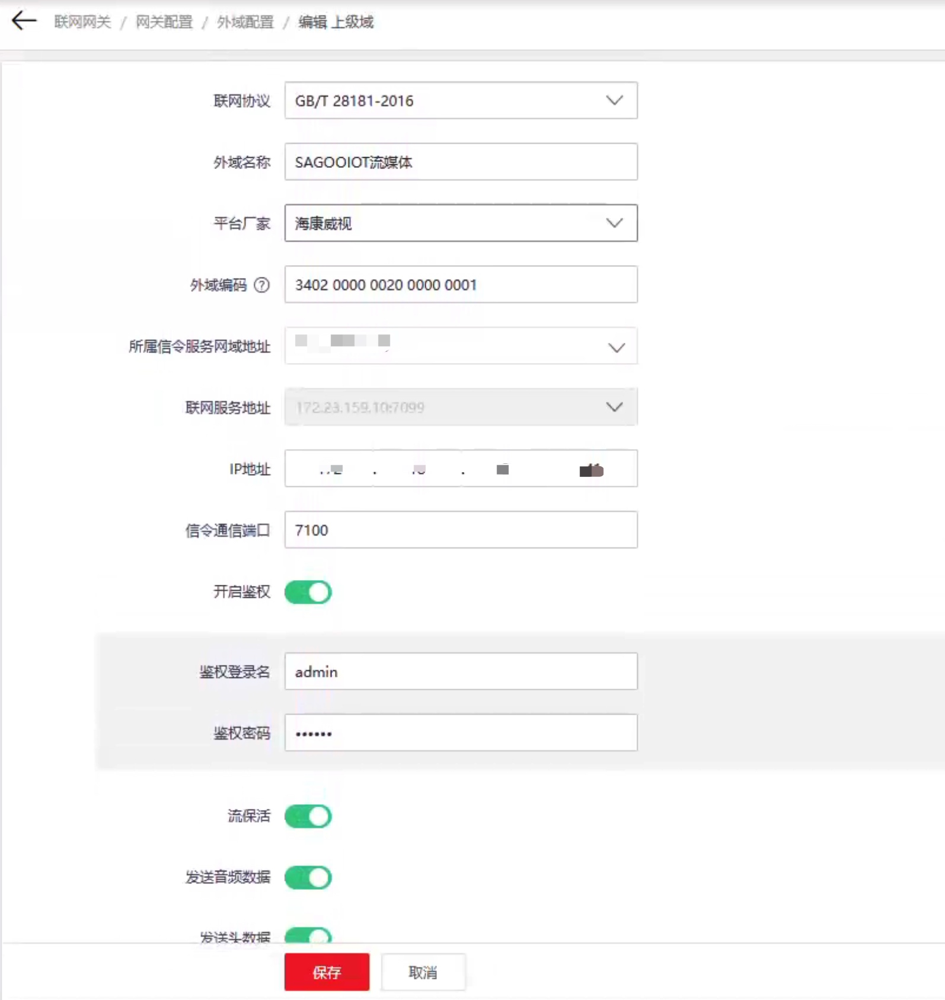
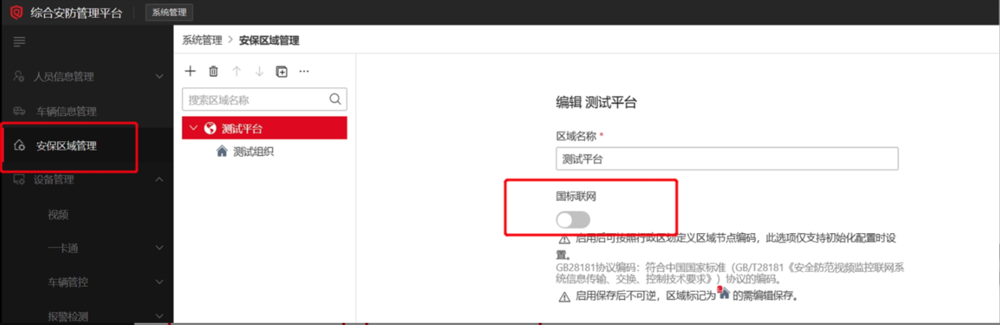
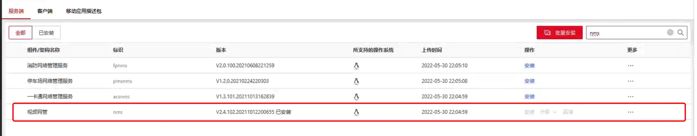
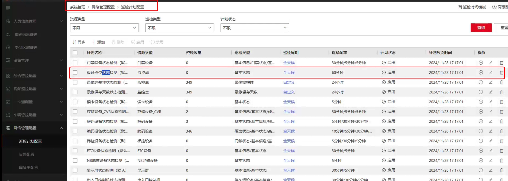
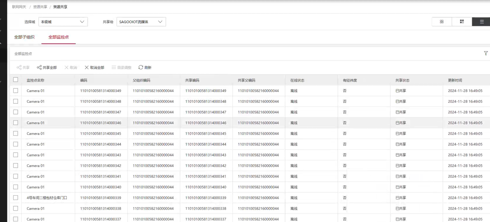
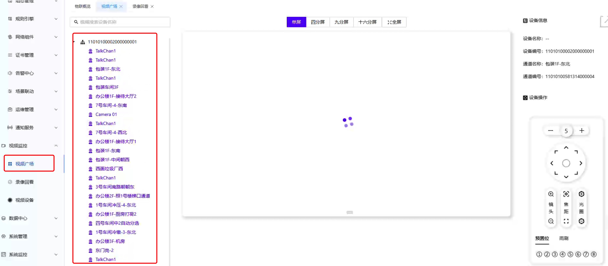

# 海康ISC视频联网网关

## 级联网关配置

1. 进入运行管理中心状态监控搜索 `ncg`，点击 `ncg`，点击右边维护记录后边的任意一个按键，进入视频联网网关维护页面
   

2. 信令网关配置
   - a. 编辑本级的域标识；打开网关配置，信令服务，点击右上角的编辑，编辑本机的域标识信息
     
   - b. 最重要把下级域信息提供给上级，并让上级域添加下级域信息；索要上级域信息并在本级添加上级域信息。

     需要提供给上级的信息：
      - i. 域标识 `15010000002000000001`（本案例中）
      - ii. IP地址（和上级通的）`10.194.42.204`（本案例中）
      - iii. SIP通信端口：`7100`（默认）

   - c. 如果与上级通信的IP地址并不是初始部署平台的IP地址，需要进行多网域配置，点击多网域配置，点击添加，编辑名称后添加信令服务，挨个添加，此页面需要填写的IP地址都是与上级通信的IP地址，添加完成后保存。
     
     

   - d. 进入外域配置添加上级域
     

     添加完成后点击对应的上级域或下级域，现在域网络和域在线状态都显示在线即可。域网络状态不在线一般是网络不通，域在线状态不在线一般是端口不通。
     

3. 资源共享
   - a. 开启国标联网
     进入安防管理平台->安保区域管理进行开启
     
   - b. 安装 `nms` 和 `paf` 安装
     进入运行管理中心->系统维护->安装部署->软件包管理搜索 `nms` 和 `paf` 进行安装
     
     
   - c. 打开级联点位状态检测
     进入安防管理平台->系统管理->网络管理配置->巡检计划配置找到级联点位状态检测点击启用
     

   - d. 返回视频网关资源共享进行资源共享
     

   - e. 查看监控点位共享状态
     

## 流媒体服务配置

1. 打开流媒体服务 `gb28181` 和 `ps` 插件，以下是配置示例
   ```bash
   gb28181:
     enable: true
     invitemode: 1 # 0、手动invite 1、表示自动发起invite，当Server（SIP）接收到设备信息时，立即向设备发送invite命令获取流, 2、按需拉流，既等待订阅者触发
     position:
       autosubposition: false # 是否自动订阅定位
       expires: 3600s # 订阅周期(单位：秒)，默认3600
       interval: 6s # 订阅间隔（单位：秒），默认6
     sip: "" # sip服务器地址 默认 自动适配设备网段
     serial: "34020000002000000001"
     realm: "3402000000"
     username: "admin"
     password: "123456"
     registervalidity: 60s # 注册有效期
     mediaip: "" # 媒体服务器地址 默认 自动适配设备网段
     port:
       sip: udp:5060 # sip服务器端口
       media: tcp:58200-59200 # 媒体服务器端口，用于接收设备的流
       fdm: false # 端口复用,单端口默认多路复用,多端口多路复用根据这个

     removebaninterval: 10m # 定时移除注册失败的设备黑名单，单位秒，默认10分钟（600秒）
     loglevel: error

   ps:
     enable: true
     http: # 格式参考全局配置
     publish: # 格式参考全局配置
     subscribe: # 格式参考全局配置
     relaymode: 2 # 0:纯转发 1:转协议，不转发 2:转发并且转协议
   ```
2. 启动流媒体服务
```bash
 ./curl.sh start
```
3. 进入到IOT管理平台视频广场查看
   