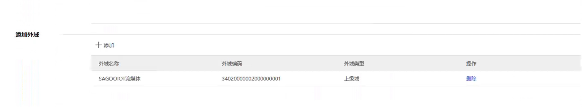
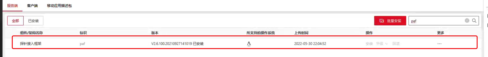
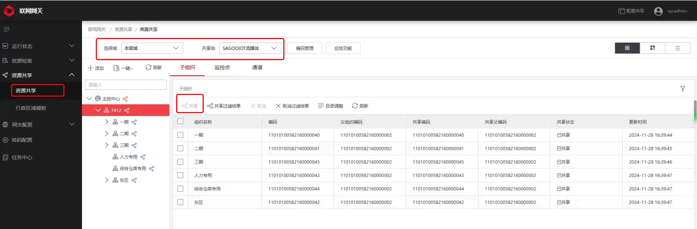

## 1. 级联网关配置

### 1.1 进入网关维护页面

1. 在运行管理中心状态监控中搜索 `ncg`
2. 点击 `ncg`，选择右侧维护记录的任意按键
3. 进入视频联网网关维护页面


### 1.2 信令网关配置

#### a) 配置本级域标识
1. 打开网关配置，选择信令服务
2. 点击右上角的编辑按钮
3. 编辑本机的域标识信息


#### b) 域信息交换

需要提供给上级的信息：

| 信息项 | 示例值 | 说明 |
|--------|--------|------|
| 域标识 | 15010000002000000001 | 本级域标识 |
| IP地址 | 10.194.42.204 | 与上级通信的IP |
| SIP通信端口 | 7100 | 默认端口 |

#### c) 多网域配置
如果与上级通信的IP地址与初始部署平台IP不同，需要进行以下配置：

1. 点击多网域配置
2. 点击添加按钮
3. 编辑名称并添加信令服务
4. 填写与上级通信的IP地址
5. 保存配置




#### d) 外域配置

1. 进入外域配置界面
2. 添加上级域信息


:::tip 配置验证
添加完成后检查：
- 域网络状态：显示"在线"（不在线通常是网络问题）
- 域在线状态：显示"在线"（不在线通常是端口问题）
:::


### 1.3 资源共享配置

#### a) 开启国标联网
路径：安防管理平台 -> 安保区域管理


#### b) 安装必要组件
在运行管理中心 -> 系统维护 -> 安装部署 -> 软件包管理中安装：
- `nms` 组件
- `paf` 组件




#### c) 启用级联点位状态检测
路径：安防管理平台 -> 系统管理 -> 网络管理配置 -> 巡检计划配置


#### d) 配置资源共享
在视频网关中配置资源共享设置



#### e) 查看共享状态
检查监控点位共享状态


## 2. 流媒体服务配置

### 2.1 插件配置

启用并配置流媒体服务的 `gb28181` 和 `ps` 插件：

```yaml
gb28181:
  enable: true
  invitemode: 1                    # 邀请模式：0-手动，1-自动，2-按需
  position:
    autosubposition: false         # 是否自动订阅定位
    expires: 3600s                # 订阅周期
    interval: 6s                  # 订阅间隔
  sip: ""                         # SIP服务器地址（自动适配）
  serial: "34020000002000000001"  # 设备SIP ID
  realm: "3402000000"             # SIP域
  username: "admin"               # 用户名
  password: "123456"              # 密码
  registervalidity: 60s           # 注册有效期
  mediaip: ""                     # 媒体服务器地址（自动适配）
  port:
    sip: udp:5060                # SIP服务器端口
    media: tcp:58200-59200       # 媒体服务器端口范围
    fdm: false                   # 端口复用设置
  removebaninterval: 10m          # 黑名单清理间隔
  loglevel: error                # 日志级别

ps:
  enable: true
  http: {}                       # 参考全局配置
  publish: {}                    # 参考全局配置
  subscribe: {}                  # 参考全局配置
  relaymode: 2                   # 转发模式：0-纯转发，1-仅转协议，2-转发并转协议
```

### 2.2 启动服务

```bash
./curl.sh start
```

### 2.3 验证配置

登录IOT管理平台，在视频广场中查看配置结果：

