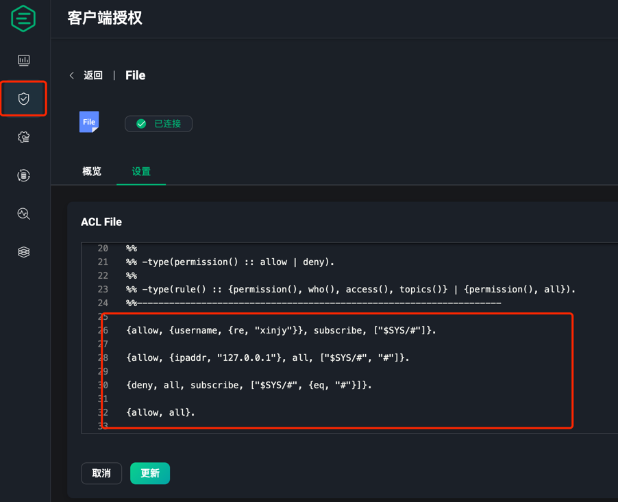

# mqtt 相关设置

## 启用系统订阅

如果想要mqtt的设备能即时感知上线与离线，需要你的mqtt服务器支持系统订阅功能。`emqx`支持系统订阅，但是默认是关闭的，需要在配置文件中开启。

进入`emqx`的管理端，客户端授权--》数据源--》File （启用）--》设置




ACL配置示例：

```shell

%% 允许用户名是 dashboard 的客户端订阅 "$SYS/#" 这个主题
{allow, {user, "dashboard"}, subscribe, ["$SYS/#"]}.

%% 允许来自127.0.0.1 的用户发布和订阅 "$SYS/#" 以及 "#"
{allow, {ipaddr, "127.0.0.1"}, all, ["$SYS/#", "#"]}.

%% 拒绝其他所有用户订阅 `$SYS/#`，`#` 和 `+/#` 主题
{deny, all, subscribe, ["$SYS/#", {eq, "#"}, {eq, "+/#"}]}.

%% 如果前面的规则都没有匹配到，则允许所有操作
%% 注意：在生产环境中，最后一条规则应该设置为 `{deny, all}`，并且配置 `authorization.no_match = deny`
{allow, all}.

```

详细说明请参考[emqx官方文档](https://docs.emqx.com/zh/emqx/latest/access-control/authz/file.html#acl-%E6%96%87%E4%BB%B6)
