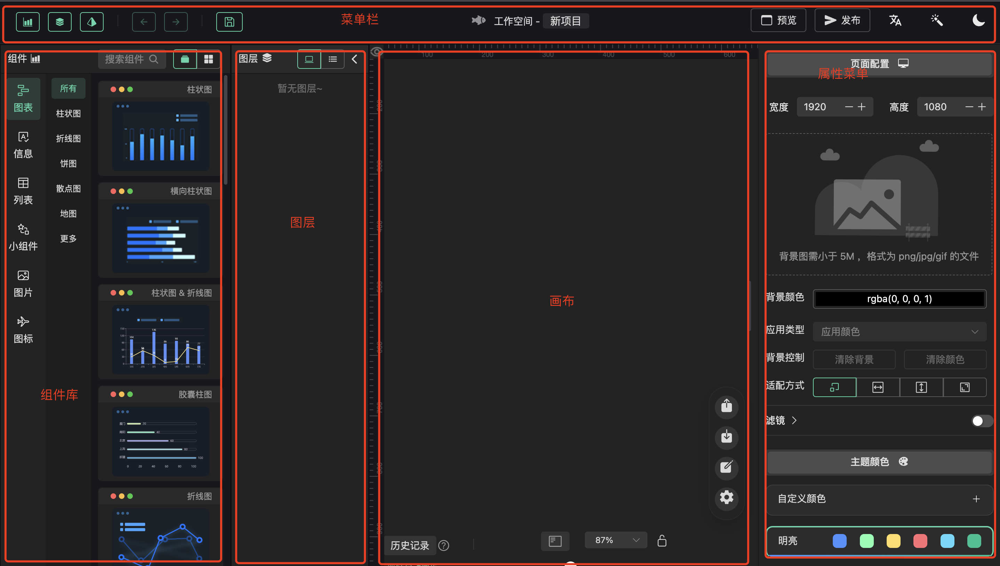

# 界面说明

大屏是由菜单栏、组件库、画布、属性菜单四部分组成。

## 菜单栏

在大屏中，菜单栏是一个包含各种功能和工具的区域，用户可以通过菜单栏执行各种操作来管理和编辑大屏。以下是一些常见的菜单栏工具及其应用，由左及右进行说明：

| 名称    | 描述                                |
|-------|-----------------------------------|
| 图表组件  | 用于控制图表组件展示和隐藏。                    |
| 图层控制  | 用于控制图层组件展示和隐藏。                    |
| 详情设置  | 用于控制属性菜单的展示和隐藏。                   |
| 前进后退  | 前进和后退功能允许用户在设计过程中进行撤销和重做操作，以便调整和修改已经进行的操作。                   |
| 保存    | 用户可以保存当前的大屏设计工作，以便将来继续编辑和修改。 |
| 预览    | 预览功能允许用户在设计过程中查看大屏的实际效果，以便及时调整和优化布局和样式。       |
| 发布    | 用户可以将设计完成的大屏发布到目标平台或显示设备上，以供实际使用和展示。               |
| 中英文切换 | 用户可以选择在界面上切换显示语言，以满足不同用户的语言偏好和需求。                  |
| 主题颜色选择  | 用户可以选择预定义的主题颜色或自定义主题颜色，以匹配大屏设计的整体风格和品牌形象。                |
| 主题切换  | 用户可以在设计过程中随时切换不同的主题样式。              |

  [菜单栏展示](img/menu-bar.png)

## 组件库

组件库是用于创建、管理和重用用户界面组件和元素。包括图表、信息、列表、小组件、图片、图标等，可以帮助用户快速构建和定制界面。

[组件库展示](img/component-library.png)

## 画布

在大屏中，画布是指一个可视化的工作区域，用于创建、编辑和展示大屏。画布提供了一个空间，让用户可以在其中拖拽放置图表等内容。
[画布展示](img/canvas.png)

## 属性菜单

在大屏设计中，属性菜单是一个关键的工具，用于定制和管理大屏中各个元素的属性和设置。以下是大屏中属性菜单包含的主要部分：

定制：定制部分允许用户对大屏中的各个元素进行个性化定制。这包括调整元素的尺寸、位置、颜色、字体、边框样式等，以满足特定的设计需求和风格要求。

动画：动画部分允许用户为大屏中的元素添加动画效果，以增强用户体验和视觉吸引力。用户可以选择预定义的动画效果，如淡入淡出、滑动、旋转等，或者自定义动画效果，以创建更生动和吸引人的界面。

数据：数据部分用于配置大屏中与数据相关的属性和设置。这包括连接数据源、选择数据类型、定义数据展示方式等，以确保大屏能够实时显示和更新所需的数据信息。

事件：事件部分允许用户为大屏中的元素定义交互事件和行为。用户可以设置元素的点击、悬停、拖放等事件，并为每个事件添加相应的动作或逻辑处理，以实现用户与大屏的交互功能。

